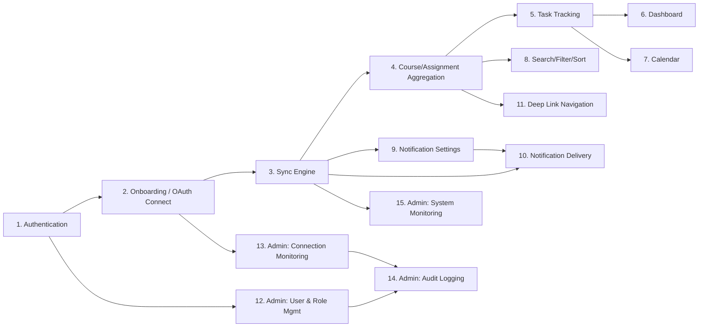

# Feature Architecture — Overview & Cross-Feature Dependency
### ระบบติดตามงานและแจ้งเตือนการเรียนจากหลายแพลตฟอร์ม (MultiPlatform Assignment Tracking)

ไฟล์นี้เป็นดัชนีรวมของฟีเจอร์ทั้งหมด (แยกไฟล์ตามฟีเจอร์ด้านล่าง) พร้อมแผนภาพความสัมพันธ์ระหว่างฟีเจอร์

| # | ไฟล์ | ฟีเจอร์ | Module |
|---|---|---|---|
| 1 | 01_authentication_and_session.md | Authentication & Session | M1 |
| 2 | 02_onboarding_platform_integration.md | Onboarding & Platform Integration (OAuth) | M3 |
| 3 | 03_sync_engine.md | Sync Engine / Background Sync | M4 |
| 4 | 04_course_assignment_aggregation.md | Course & Assignment Aggregation | M5 |
| 5 | 05_task_tracking.md | Task Tracking | M6 |
| 6 | 06_dashboard_widgets.md | Dashboard Widgets | M7 |
| 7 | 07_calendar.md | Calendar | M8 |
| 8 | 08_search_filter_sort.md | Search & Filter & Sort | M9 |
| 9 | 09_notification_settings.md | Notification Settings | M10 |
| 10 | 10_notification_delivery.md | Notification Delivery | M10 |
| 11 | 11_deep_link_navigation.md | Deep Link Navigation | M11 |
| 12 | 12_admin_user_role_management.md | Admin: User & Role Management | M12 |
| 13 | 13_admin_connection_monitoring.md | Admin: Connection Monitoring | M13 |
| 14 | 14_admin_audit_logging.md | Admin: Audit Logging | M14 |
| 15 | 15_admin_system_monitoring.md | Admin: System Monitoring | M15 |
| 16 | 16_admin_completion_addendum.md | Admin: Gap Analysis & Completion (implemented endpoints, data model, bug fixes) | M12–M15 |
| 17 | 17_system_design_refinement_and_conceptual_model.md | System Design Refinement & Conceptual Model (CDM, Task Separation, Multi-tier Notif, Recovery, Admin) | Cross-Cutting |

---

## Cross-Feature Dependency Diagram

