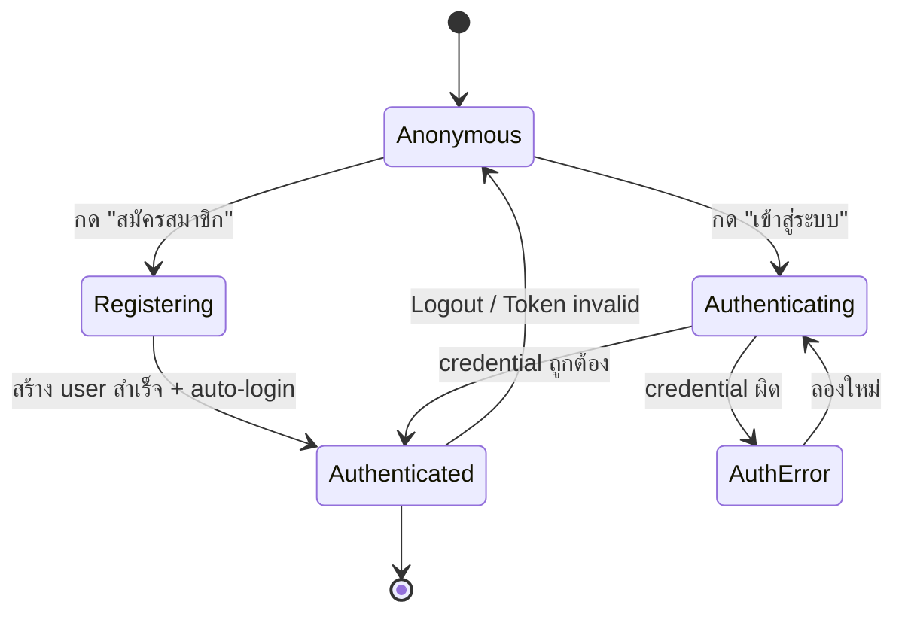
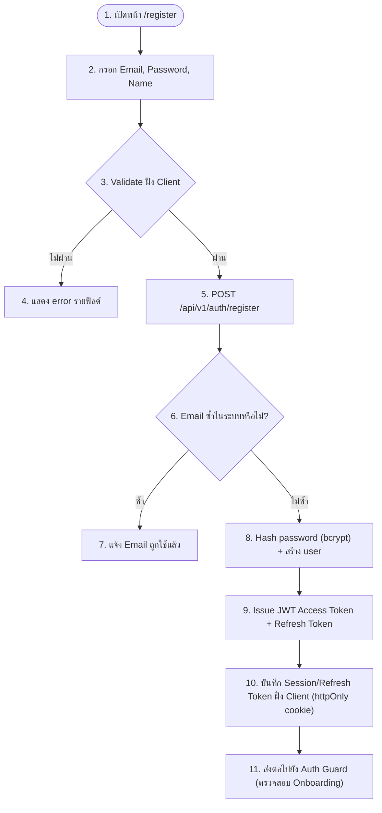
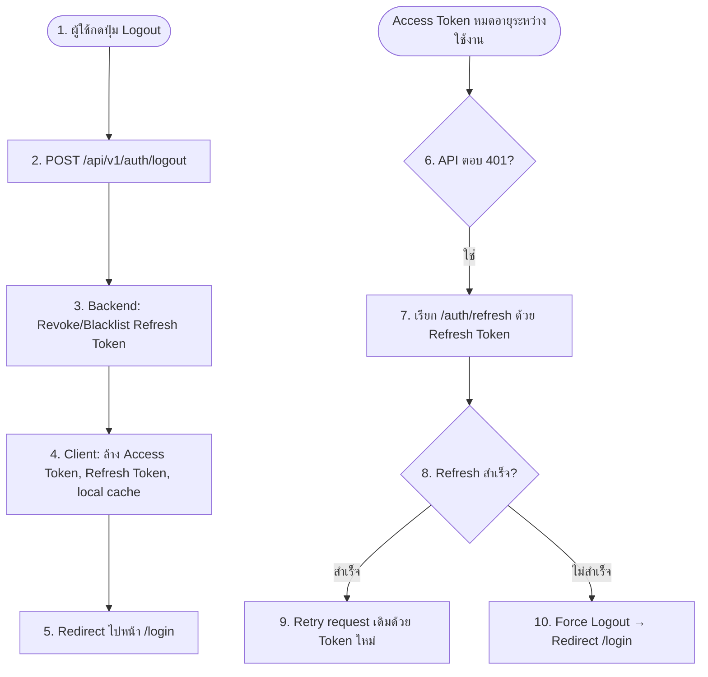

# Feature 1: Authentication & Session (M1)
*อ้างอิง: FR-001, FR-002, FR-003*

## 1.1 State Machine

```mermaid
stateDiagram-v2
    [*] --> Anonymous
    Anonymous --> Registering: กด "สมัครสมาชิก"
    Anonymous --> Authenticating: กด "เข้าสู่ระบบ"
    Registering --> Authenticated: สร้าง user สำเร็จ + auto-login
    Authenticating --> AuthError: credential ผิด
    AuthError --> Authenticating: ลองใหม่
    Authenticating --> Authenticated: credential ถูกต้อง
    Authenticated --> Anonymous: Logout / Token invalid
    Authenticated --> [*]
```

## 1.2 Flow: Register → Login → Session

```mermaid
graph TD
    Start([1. เปิดหน้า /register]) --> Fill["2. กรอก Email, Password, Name"]
    Fill --> Validate{3. Validate ฝั่ง Client}
    Validate -->|ไม่ผ่าน| ShowFieldErr["4. แสดง error รายฟิลด์"]
    Validate -->|ผ่าน| SubmitReg["5. POST /api/v1/auth/register"]
    SubmitReg --> CheckDup{6. Email ซ้ำในระบบหรือไม่?}
    CheckDup -->|ซ้ำ| ShowDupErr["7. แจ้ง Email ถูกใช้แล้ว"]
    CheckDup -->|ไม่ซ้ำ| HashPw["8. Hash password (bcrypt) + สร้าง user"]
    HashPw --> IssueJWT["9. Issue JWT Access Token + Refresh Token"]
    IssueJWT --> StoreSession["10. บันทึก Session/Refresh Token ฝั่ง Client (httpOnly cookie)"]
    StoreSession --> RedirectAuthGuard["11. ส่งต่อไปยัง Auth Guard (ตรวจสอบ Onboarding)"]
```

## 1.3 Flow: Logout & Session Invalidation

```mermaid
graph TD
    Start([1. ผู้ใช้กดปุ่ม Logout]) --> CallLogout["2. POST /api/v1/auth/logout"]
    CallLogout --> RevokeToken["3. Backend: Revoke/Blacklist Refresh Token"]
    RevokeToken --> ClearClient["4. Client: ล้าง Access Token, Refresh Token, local cache"]
    ClearClient --> Redirect["5. Redirect ไปหน้า /login"]

    Timeout([Access Token หมดอายุระหว่างใช้งาน]) --> Try401{6. API ตอบ 401?}
    Try401 -->|ใช่| TryRefresh["7. เรียก /auth/refresh ด้วย Refresh Token"]
    TryRefresh --> RefreshOK{8. Refresh สำเร็จ?}
    RefreshOK -->|สำเร็จ| Retry["9. Retry request เดิมด้วย Token ใหม่"]
    RefreshOK -->|ไม่สำเร็จ| ForceLogout["10. Force Logout → Redirect /login"]
```
