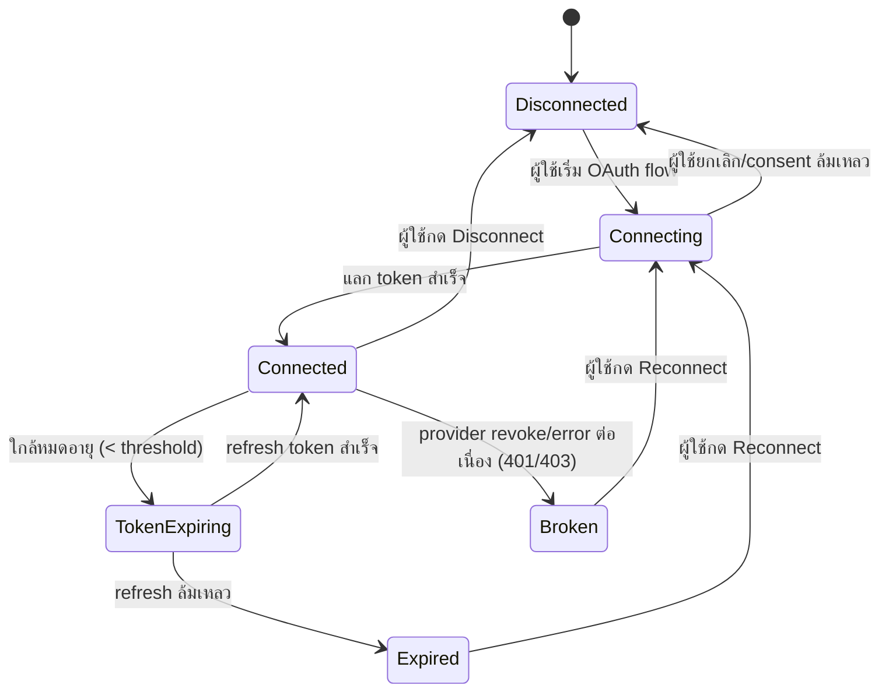
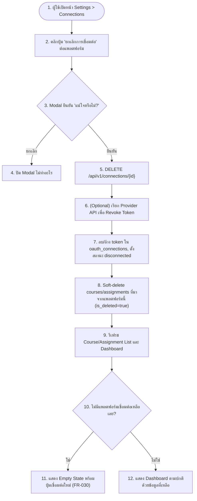
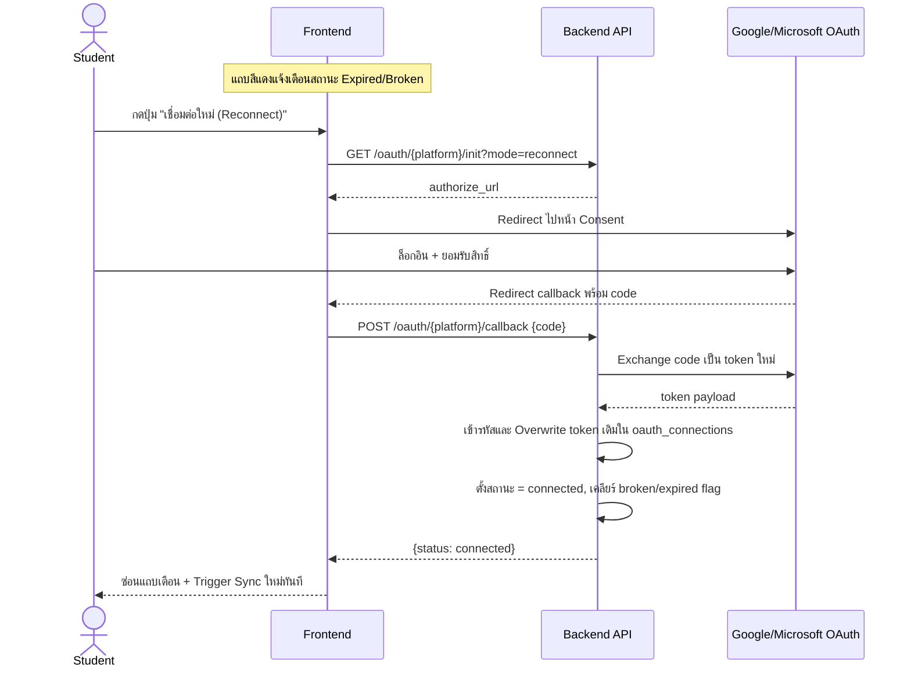

# Feature 2: Onboarding & Platform Integration / OAuth Connect (M3)
*อ้างอิง: FR-004, FR-005, FR-006, FR-007, FR-030, FR-031, FR-034*

## 2.1 State Machine: Connection Status ต่อแพลตฟอร์ม



## 2.2 Flow: Connect Google Classroom / Microsoft Teams (ครั้งแรก)

```mermaid
graph TD
    Start([1. หน้า Onboarding: ยังไม่มีการเชื่อมต่อ]) --> Choose["2. เลือกปุ่ม Connect Google Classroom หรือ Microsoft Teams"]
    Choose --> Init["3. GET /oauth/{platform}/init"]
    Init --> GetURL["4. Backend สร้าง authorize_url + state (CSRF token)"]
    GetURL --> Redirect["5. Redirect ผู้ใช้ไปหน้า OAuth Consent ของ Google/Microsoft"]
    Redirect --> Consent{6. ผู้ใช้ยินยอมสิทธิ์หรือไม่?}
    Consent -->|ปฏิเสธ| Cancelled["7. กลับสู่ระบบ พร้อมข้อความ 'ยกเลิกการเชื่อมต่อ'"]
    Consent -->|ยินยอม| Callback["8. Provider Redirect callback พร้อม auth code + state"]
    Callback --> VerifyState{9. ตรวจสอบ state ตรงกัน (ป้องกัน CSRF)?}
    VerifyState -->|ไม่ตรง| RejectCallback["10. ปฏิเสธ callback, แสดง error"]
    VerifyState -->|ตรง| Exchange["11. POST /oauth/{platform}/callback {code}"]
    Exchange --> ExchangeToken["12. Backend แลก code เป็น access/refresh token กับ Provider"]
    ExchangeToken --> ExchangeOK{13. แลก token สำเร็จ?}
    ExchangeOK -->|ไม่สำเร็จ| ShowExchErr["14. แสดง error พร้อมปุ่มลองใหม่"]
    ExchangeOK -->|สำเร็จ| Encrypt["15. เข้ารหัส (AES-256) และบันทึกลง oauth_connections"]
    Encrypt --> MarkConnected["16. ตั้งสถานะ = connected"]
    MarkConnected --> TriggerFirstSync["17. Enqueue Sync Job ครั้งแรก"]
    TriggerFirstSync --> CheckUnlock{18. เชื่อมต่อสำเร็จอย่างน้อย 1 แพลตฟอร์ม?}
    CheckUnlock -->|ใช่| UnlockStart["19. ปลดล็อกปุ่ม 'เริ่มใช้งานระบบ'"]
    UnlockStart --> GoDashboard["20. ไปหน้า Dashboard"]
```

## 2.3 Flow: Disconnect Platform



## 2.4 Sequence: Reconnect เมื่อ Token หมดอายุ/Broken


