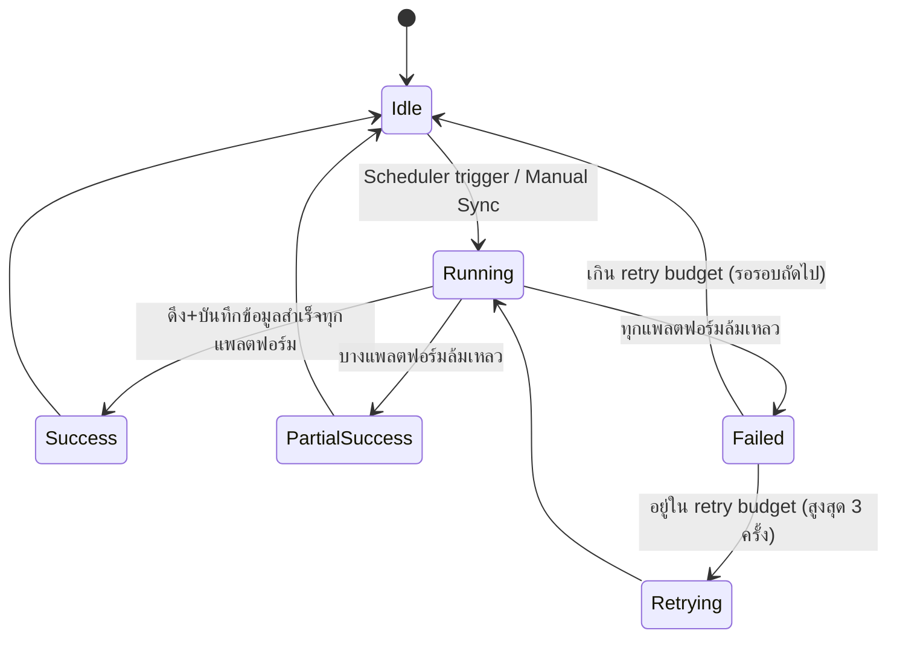
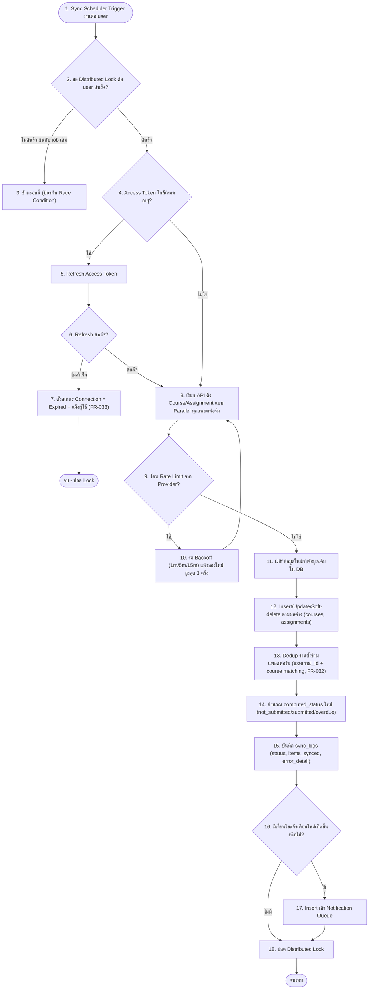
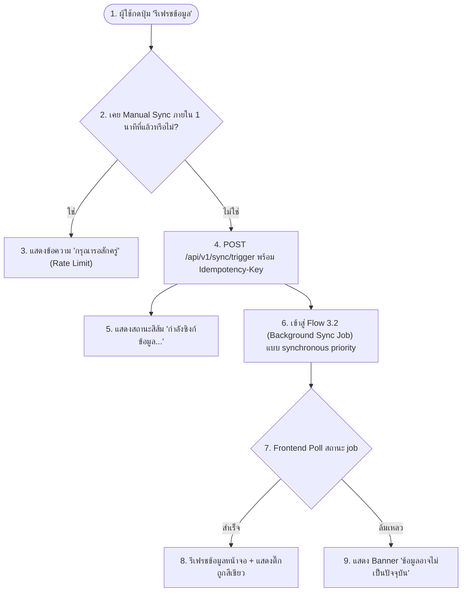
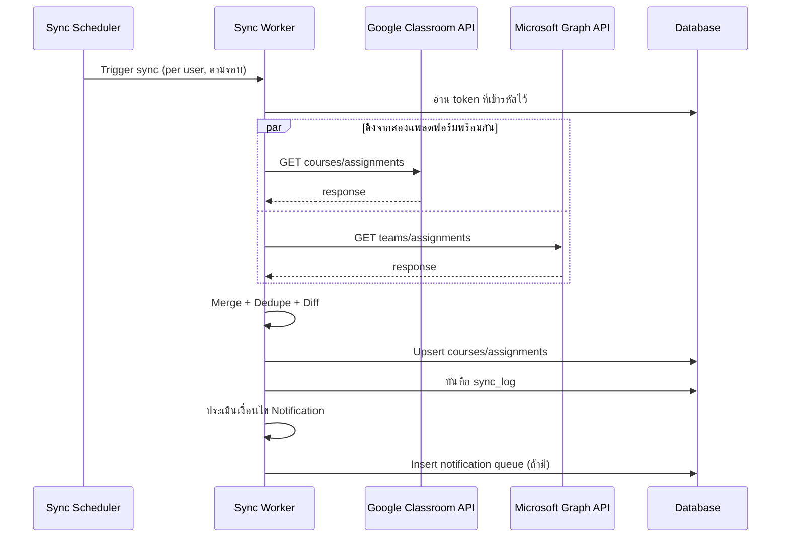

# Feature 3: Sync Engine / Background Sync (M4)
*อ้างอิง: FR-023, FR-024, FR-031, FR-032, FR-035, FR-039*

## 3.1 State Machine: Sync Job Status

## 3.2 Flow: Background Sync Job (ต่อผู้ใช้ 1 คน)

## 3.3 Flow: Manual Sync (ผู้ใช้กด Refresh เอง)

## 3.4 Sequence: Sync Engine ดึงข้อมูลจากสองแพลตฟอร์มพร้อมกัน

