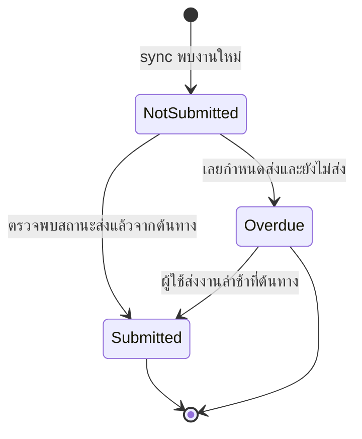
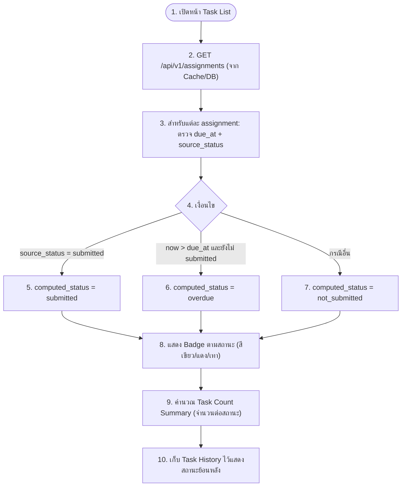

# Feature 5: Task Tracking (M6)
*อ้างอิง: FR-012, FR-013*

## 5.1 State Machine: Assignment Status

```mermaid
stateDiagram-v2
  [*] --> NotSubmitted: sync พบงานใหม่
  NotSubmitted --> Submitted: ตรวจพบสถานะส่งแล้วจากต้นทาง
  NotSubmitted --> Overdue: เลยกำหนดส่งและยังไม่ส่ง
  Overdue --> Submitted: ผู้ใช้ส่งงานล่าช้าที่ต้นทาง
  Submitted --> [*]
  Overdue --> [*]
```

## 5.2 Flow: Task List Rendering & Status Compute

```mermaid
graph TD
    Start([1. เปิดหน้า Task List]) --> Fetch["2. GET /api/v1/assignments (จาก Cache/DB)"]
    Fetch --> Loop["3. สำหรับแต่ละ assignment: ตรวจ due_at + source_status"]
    Loop --> Rule{4. เงื่อนไข}
    Rule -->|source_status = submitted| SetSubmitted["5. computed_status = submitted"]
    Rule -->|now > due_at และยังไม่ submitted| SetOverdue["6. computed_status = overdue"]
    Rule -->|กรณีอื่น| SetNotSubmitted["7. computed_status = not_submitted"]
    SetSubmitted --> Badge["8. แสดง Badge ตามสถานะ (สีเขียว/แดง/เทา)"]
    SetOverdue --> Badge
    SetNotSubmitted --> Badge
    Badge --> Summary["9. คำนวณ Task Count Summary (จำนวนต่อสถานะ)"]
    Summary --> History["10. เก็บ Task History ไว้แสดงสถานะย้อนหลัง"]
```
