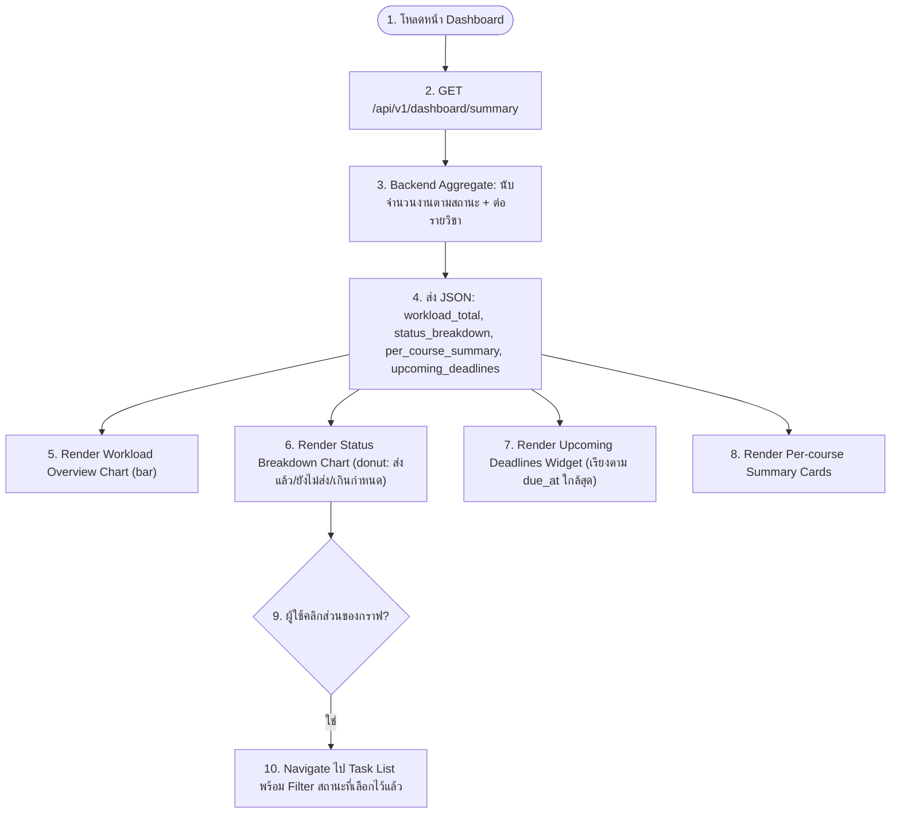

# Feature 6: Dashboard Widgets (M7)
*อ้างอิง: FR-014 — (ดู state machine หลักของหน้า Dashboard ในไฟล์ dashboard_flow.md)*

```mermaid
graph TD
    Start([1. โหลดหน้า Dashboard]) --> CallSummary["2. GET /api/v1/dashboard/summary"]
    CallSummary --> Aggregate["3. Backend Aggregate: นับจำนวนงานตามสถานะ + ต่อรายวิชา"]
    Aggregate --> Respond["4. ส่ง JSON: workload_total, status_breakdown, per_course_summary, upcoming_deadlines"]
    Respond --> RenderWorkload["5. Render Workload Overview Chart (bar)"]
    Respond --> RenderBreakdown["6. Render Status Breakdown Chart (donut: ส่งแล้ว/ยังไม่ส่ง/เกินกำหนด)"]
    Respond --> RenderUpcoming["7. Render Upcoming Deadlines Widget (เรียงตาม due_at ใกล้สุด)"]
    Respond --> RenderPerCourse["8. Render Per-course Summary Cards"]
    RenderBreakdown --> DrillDown{9. ผู้ใช้คลิกส่วนของกราฟ?}
    DrillDown -->|ใช่| FilteredList["10. Navigate ไป Task List พร้อม Filter สถานะที่เลือกไว้แล้ว"]
```
