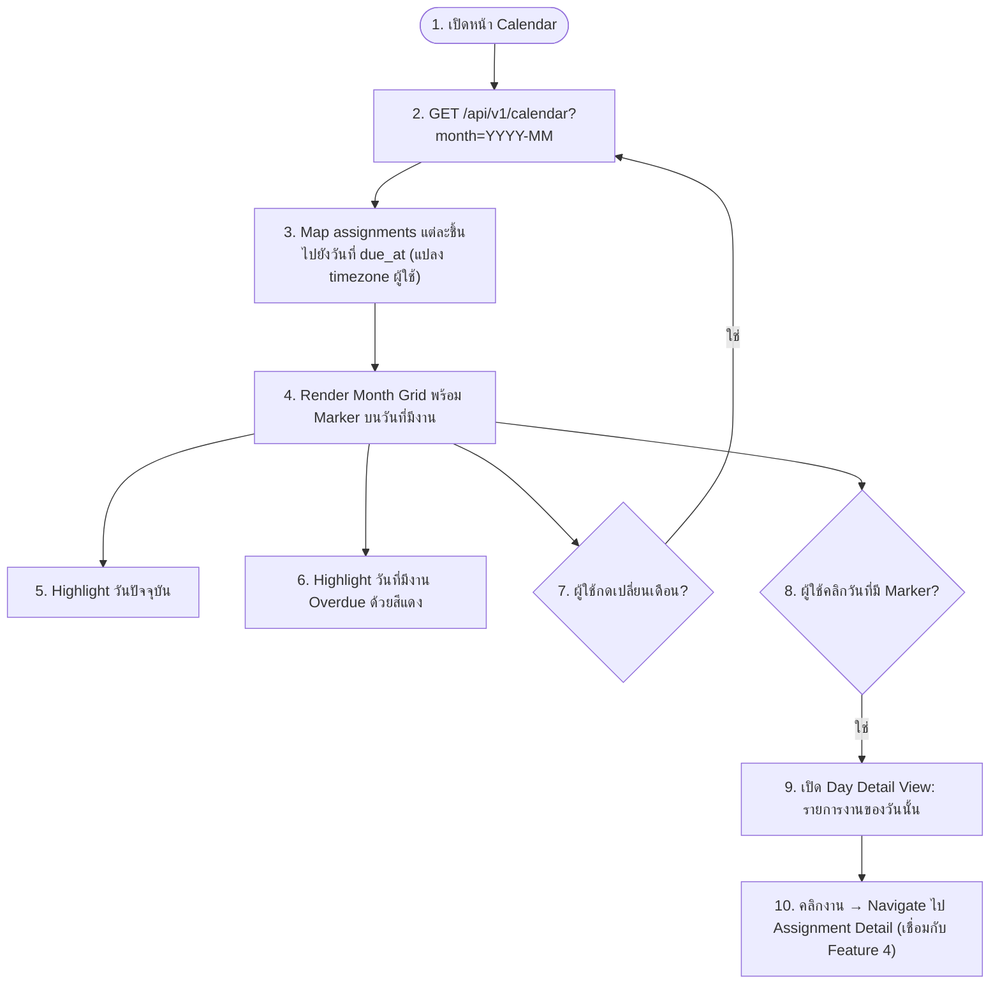

# Feature 7: Calendar (M8)
*อ้างอิง: FR-015*

```mermaid
graph TD
    Start([1. เปิดหน้า Calendar]) --> CallAPI["2. GET /api/v1/calendar?month=YYYY-MM"]
    CallAPI --> MapDates["3. Map assignments แต่ละชิ้นไปยังวันที่ due_at (แปลง timezone ผู้ใช้)"]
    MapDates --> RenderGrid["4. Render Month Grid พร้อม Marker บนวันที่มีงาน"]
    RenderGrid --> HighlightToday["5. Highlight วันปัจจุบัน"]
    RenderGrid --> HighlightOverdue["6. Highlight วันที่มีงาน Overdue ด้วยสีแดง"]
    RenderGrid --> Navigate{7. ผู้ใช้กดเปลี่ยนเดือน?}
    Navigate -->|ใช่| CallAPI
    RenderGrid --> ClickDate{8. ผู้ใช้คลิกวันที่มี Marker?}
    ClickDate -->|ใช่| DayDetail["9. เปิด Day Detail View: รายการงานของวันนั้น"]
    DayDetail --> ClickAssignment["10. คลิกงาน → Navigate ไป Assignment Detail (เชื่อมกับ Feature 4)"]
```
