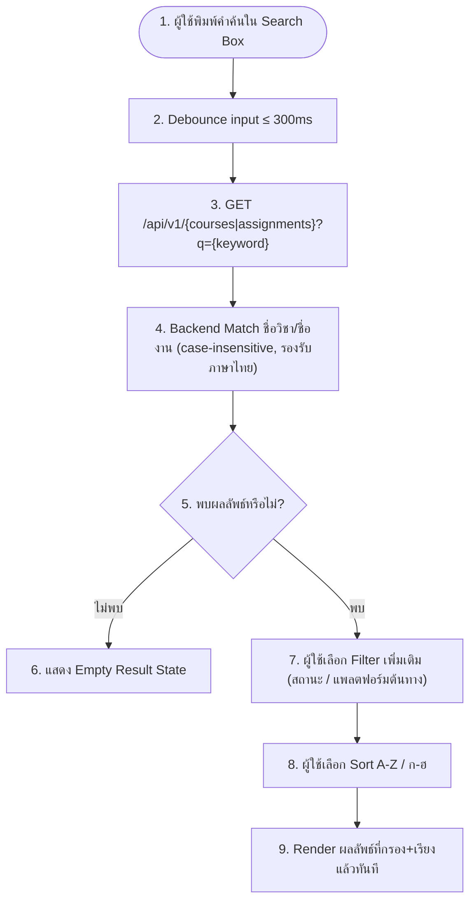

# Feature 8: Search & Filter & Sort (M9)
*อ้างอิง: FR-016, FR-017*

```mermaid
graph TD
    Start([1. ผู้ใช้พิมพ์คำค้นใน Search Box]) --> Debounce["2. Debounce input ≤ 300ms"]
    Debounce --> CallSearch["3. GET /api/v1/{courses|assignments}?q={keyword}"]
    CallSearch --> MatchName["4. Backend Match ชื่อวิชา/ชื่องาน (case-insensitive, รองรับภาษาไทย)"]
    MatchName --> HasResult{5. พบผลลัพธ์หรือไม่?}
    HasResult -->|ไม่พบ| EmptyResult["6. แสดง Empty Result State"]
    HasResult -->|พบ| ApplyFilter["7. ผู้ใช้เลือก Filter เพิ่มเติม (สถานะ / แพลตฟอร์มต้นทาง)"]
    ApplyFilter --> ApplySort["8. ผู้ใช้เลือก Sort A-Z / ก-ฮ"]
    ApplySort --> RenderResult["9. Render ผลลัพธ์ที่กรอง+เรียงแล้วทันที"]
```
