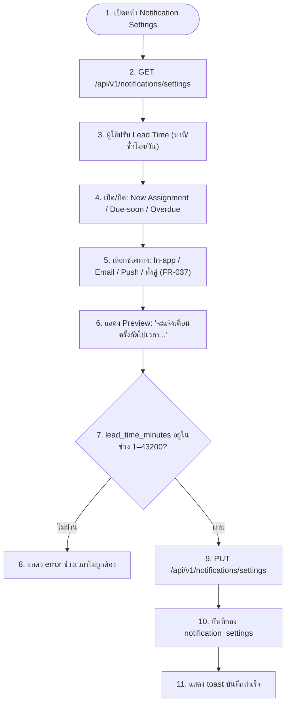

# Feature 9: Notification Settings (M10)
*อ้างอิง: FR-018, FR-037, FR-038*

```mermaid
graph TD
    Start([1. เปิดหน้า Notification Settings]) --> ShowCurrent["2. GET /api/v1/notifications/settings"]
    ShowCurrent --> Edit["3. ผู้ใช้ปรับ Lead Time (นาที/ชั่วโมง/วัน)"]
    Edit --> ToggleType["4. เปิด/ปิด: New Assignment / Due-soon / Overdue"]
    ToggleType --> ChooseChannel["5. เลือกช่องทาง: In-app / Email / Push / ทั้งคู่ (FR-037)"]
    ChooseChannel --> Preview["6. แสดง Preview: 'จะแจ้งเตือนครั้งถัดไปเวลา...'"]
    Preview --> Validate{7. lead_time_minutes อยู่ในช่วง 1–43200?}
    Validate -->|ไม่ผ่าน| ShowValidErr["8. แสดง error ช่วงเวลาไม่ถูกต้อง"]
    Validate -->|ผ่าน| Save["9. PUT /api/v1/notifications/settings"]
    Save --> Persist["10. บันทึกลง notification_settings"]
    Persist --> Confirm["11. แสดง toast บันทึกสำเร็จ"]
```
