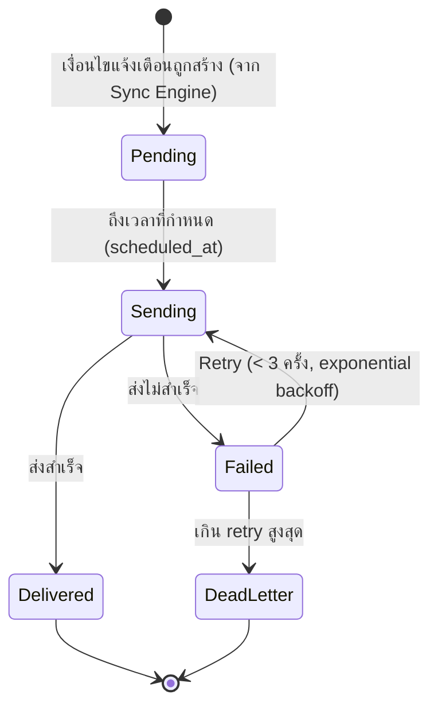
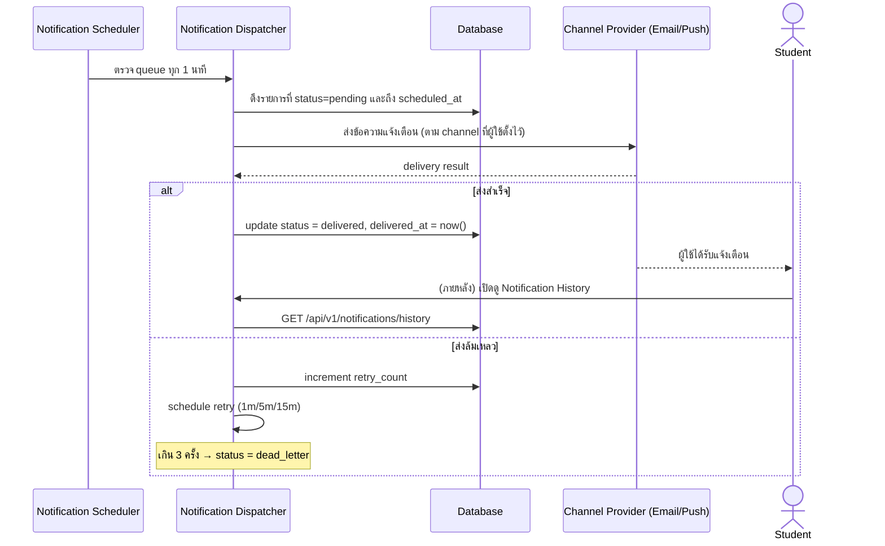

# Feature 10: Notification Delivery (M10)
*อ้างอิง: FR-019, FR-020, FR-021*

## 10.1 State Machine

```mermaid
stateDiagram-v2
  [*] --> Pending: เงื่อนไขแจ้งเตือนถูกสร้าง (จาก Sync Engine)
  Pending --> Sending: ถึงเวลาที่กำหนด (scheduled_at)
  Sending --> Delivered: ส่งสำเร็จ
  Sending --> Failed: ส่งไม่สำเร็จ
  Failed --> Sending: Retry (< 3 ครั้ง, exponential backoff)
  Failed --> DeadLetter: เกิน retry สูงสุด
  Delivered --> [*]
  DeadLetter --> [*]
```

## 10.2 Sequence: Notification Dispatch

```mermaid
sequenceDiagram
  participant SCH as Notification Scheduler
  participant ND as Notification Dispatcher
  participant DB as Database
  participant CH as Channel Provider (Email/Push)
  actor S as Student

  SCH->>ND: ตรวจ queue ทุก 1 นาที
  ND->>DB: ดึงรายการที่ status=pending และถึง scheduled_at
  ND->>CH: ส่งข้อความแจ้งเตือน (ตาม channel ที่ผู้ใช้ตั้งไว้)
  CH-->>ND: delivery result
  alt ส่งสำเร็จ
    ND->>DB: update status = delivered, delivered_at = now()
    CH-->>S: ผู้ใช้ได้รับแจ้งเตือน
    S->>ND: (ภายหลัง) เปิดดู Notification History
    ND->>DB: GET /api/v1/notifications/history
  else ส่งล้มเหลว
    ND->>DB: increment retry_count
    ND->>ND: schedule retry (1m/5m/15m)
    Note over ND: เกิน 3 ครั้ง → status = dead_letter
  end
```
