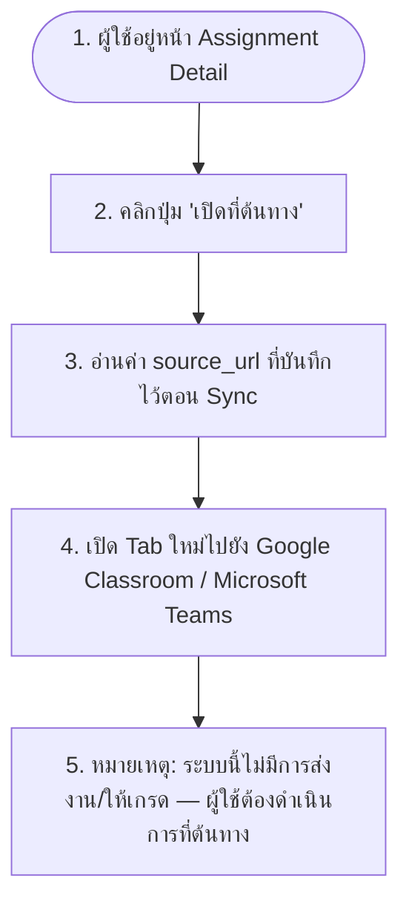

# Feature 11: Deep Link Navigation (M11)
*อ้างอิง: FR-022*

```mermaid
graph TD
    Start([1. ผู้ใช้อยู่หน้า Assignment Detail]) --> ClickDeepLink["2. คลิกปุ่ม 'เปิดที่ต้นทาง'"]
    ClickDeepLink --> ReadURL["3. อ่านค่า source_url ที่บันทึกไว้ตอน Sync"]
    ReadURL --> OpenNewTab["4. เปิด Tab ใหม่ไปยัง Google Classroom / Microsoft Teams"]
    OpenNewTab --> Note["5. หมายเหตุ: ระบบนี้ไม่มีการส่งงาน/ให้เกรด — ผู้ใช้ต้องดำเนินการที่ต้นทาง"]
```
