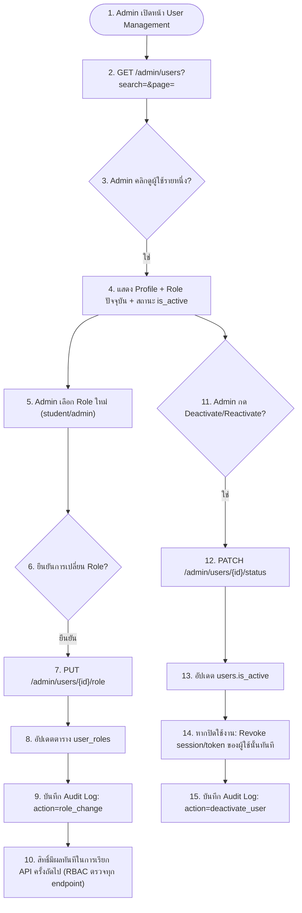

# Feature 12: Admin — User & Role Management (M12)
*อ้างอิง: FR-025, FR-026, FR-036*

```mermaid
graph TD
    Start([1. Admin เปิดหน้า User Management]) --> ListUsers["2. GET /admin/users?search=&page="]
    ListUsers --> ViewDetail{3. Admin คลิกดูผู้ใช้รายหนึ่ง?}
    ViewDetail -->|ใช่| ShowDetail["4. แสดง Profile + Role ปัจจุบัน + สถานะ is_active"]
    ShowDetail --> ChangeRole["5. Admin เลือก Role ใหม่ (student/admin)"]
    ChangeRole --> ConfirmRole{6. ยืนยันการเปลี่ยน Role?}
    ConfirmRole -->|ยืนยัน| CallRoleAPI["7. PUT /admin/users/{id}/role"]
    CallRoleAPI --> UpdateUserRoles["8. อัปเดตตาราง user_roles"]
    UpdateUserRoles --> WriteAudit1["9. บันทึก Audit Log: action=role_change"]
    WriteAudit1 --> ApplyImmediately["10. สิทธิ์มีผลทันทีในการเรียก API ครั้งถัดไป (RBAC ตรวจทุก endpoint)"]

    ShowDetail --> ToggleActive{11. Admin กด Deactivate/Reactivate?}
    ToggleActive -->|ใช่| CallDeactivate["12. PATCH /admin/users/{id}/status"]
    CallDeactivate --> UpdateFlag["13. อัปเดต users.is_active"]
    UpdateFlag --> ForceLogoutUser["14. หากปิดใช้งาน: Revoke session/token ของผู้ใช้นั้นทันที"]
    ForceLogoutUser --> WriteAudit2["15. บันทึก Audit Log: action=deactivate_user"]
```
