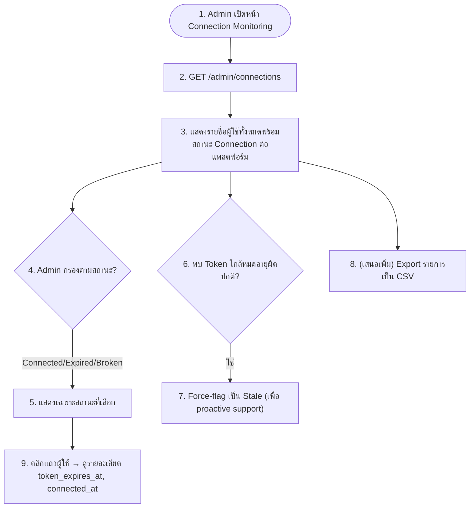

# Feature 13: Admin — Connection Monitoring (M13)
*อ้างอิง: FR-027, FR-033*

```mermaid
graph TD
    Start([1. Admin เปิดหน้า Connection Monitoring]) --> Call["2. GET /admin/connections"]
    Call --> ListAll["3. แสดงรายชื่อผู้ใช้ทั้งหมดพร้อมสถานะ Connection ต่อแพลตฟอร์ม"]
    ListAll --> Filter{4. Admin กรองตามสถานะ?}
    Filter -->|Connected/Expired/Broken| FilteredView["5. แสดงเฉพาะสถานะที่เลือก"]
    ListAll --> FlagStale{6. พบ Token ใกล้หมดอายุผิดปกติ?}
    FlagStale -->|ใช่| ForceFlag["7. Force-flag เป็น Stale (เพื่อ proactive support)"]
    ListAll --> ExportBtn["8. (เสนอเพิ่ม) Export รายการเป็น CSV"]
    FilteredView --> DetailRow["9. คลิกแถวผู้ใช้ → ดูรายละเอียด token_expires_at, connected_at"]
```
