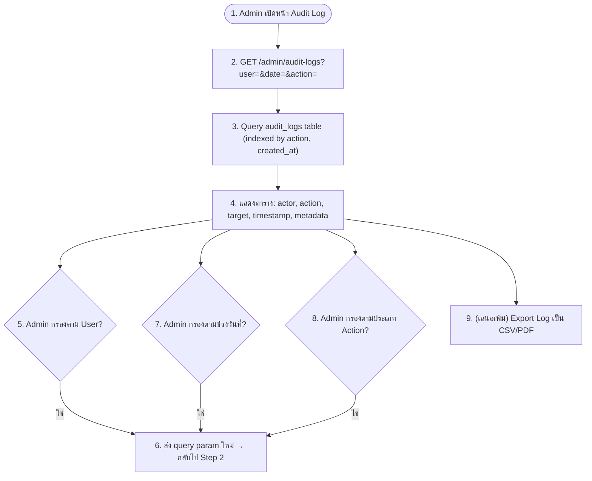

# Feature 14: Admin — Audit Logging (M14)
*อ้างอิง: FR-028*

**Actions ที่ถูกบันทึกลง audit_logs**: login/logout, connect/disconnect platform, admin role change, deactivate/reactivate user (ตาม §26 Log Type ของเอกสาร System Capability Analysis)
