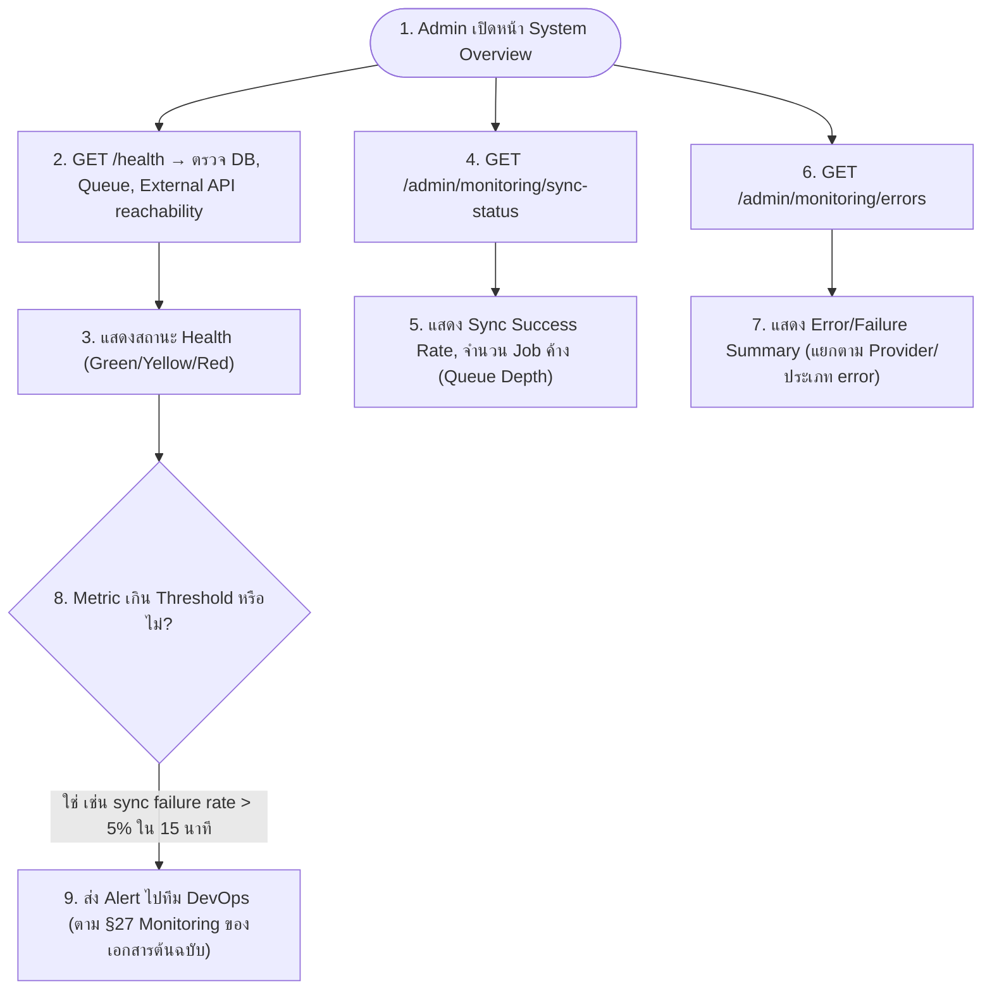

# Feature 15: Admin — System Monitoring (M15)
*อ้างอิง: FR-029*

```mermaid
graph TD
    Start([1. Admin เปิดหน้า System Overview]) --> HealthCheck["2. GET /health → ตรวจ DB, Queue, External API reachability"]
    HealthCheck --> ShowHealth["3. แสดงสถานะ Health (Green/Yellow/Red)"]
    Start --> SyncOverview["4. GET /admin/monitoring/sync-status"]
    SyncOverview --> ShowSyncRate["5. แสดง Sync Success Rate, จำนวน Job ค้าง (Queue Depth)"]
    Start --> ErrorSummary["6. GET /admin/monitoring/errors"]
    ErrorSummary --> ShowErrors["7. แสดง Error/Failure Summary (แยกตาม Provider/ประเภท error)"]
    ShowHealth --> AlertCheck{8. Metric เกิน Threshold หรือไม่?}
    AlertCheck -->|ใช่ เช่น sync failure rate > 5% ใน 15 นาที| TriggerAlert["9. ส่ง Alert ไปทีม DevOps (ตาม §27 Monitoring ของเอกสารต้นฉบับ)"]
```
