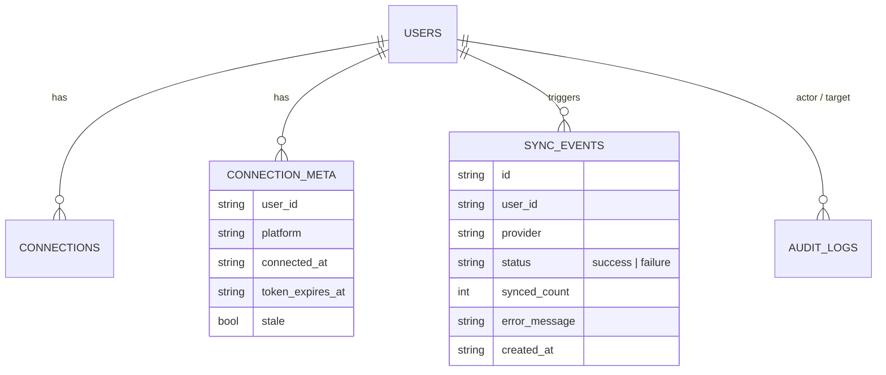
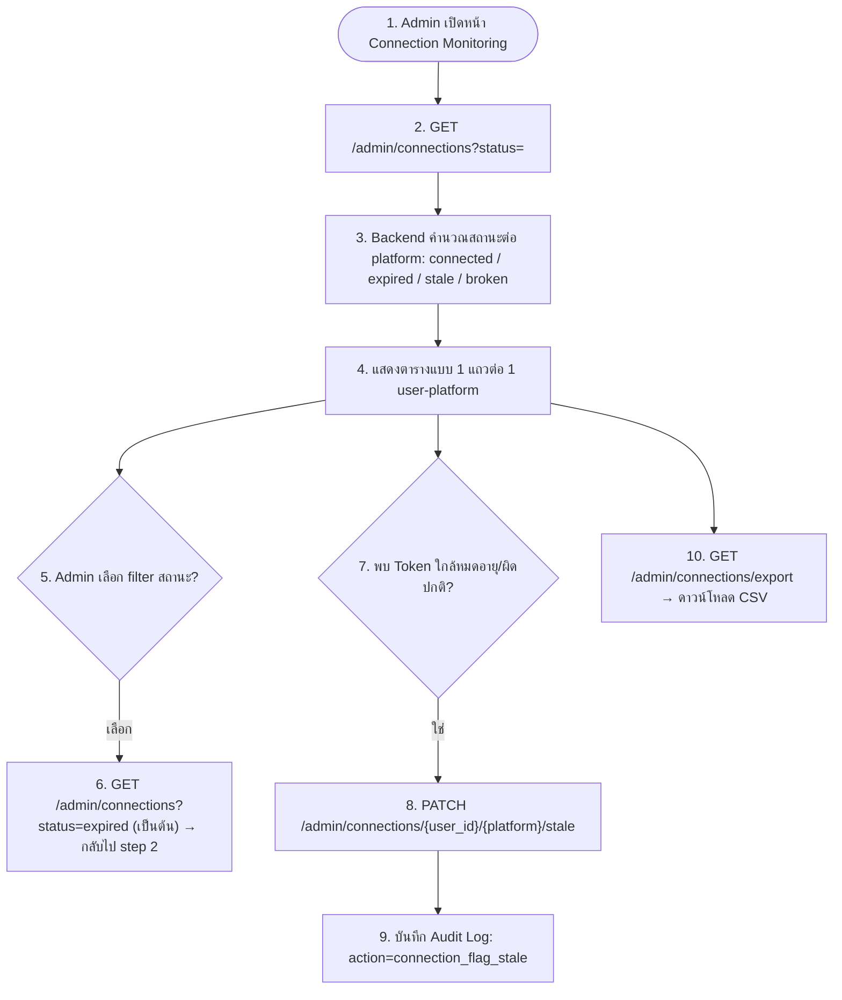
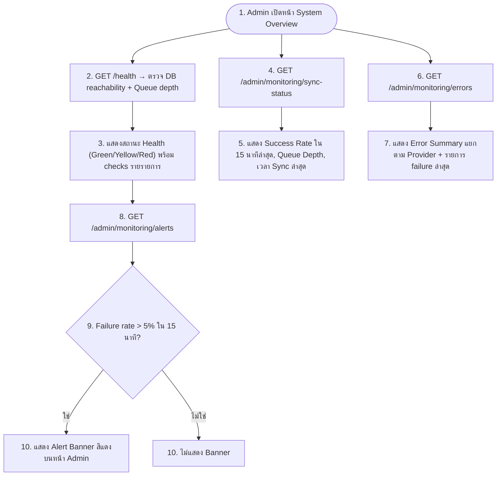

# Admin Feature Completion Addendum (M12–M15)
*ปรับปรุงต่อจากเอกสาร 12–15 เดิม หลังตรวจสอบกับ backend/app.py และ backend/db.py จริง*

เอกสารนี้สรุปช่องว่าง (gap) ที่พบระหว่างเอกสารออกแบบเดิมกับโค้ดที่มีอยู่ และปิดช่องว่างเหล่านั้นให้ครบตาม FR-025–FR-029, FR-033, FR-036 พร้อมระบุ endpoint/ไฟล์ที่ implement จริงแล้ว

---

## 1. สรุปช่องว่างที่พบ (Gap Analysis)

| Gap | ระดับ | รายละเอียด | สถานะหลังแก้ |
|---|---|---|---|
| `require_admin()` ไม่มี definition | 🔴 Critical | ทุก endpoint ใน M12–M14 เรียก `self.require_admin()` แต่ไม่มี method นี้อยู่จริง → ทุก request จะ throw `AttributeError` (500) | ✅ เพิ่ม method แล้ว (ตรวจ session + role == admin, ตอบ 403 ถ้าไม่ใช่ admin) |
| ไม่มี `do_PUT` / `do_PATCH` | 🔴 Critical | Server รับเฉพาะ GET/POST/OPTIONS ทำให้ `PUT /admin/users/{id}/role` และ `PATCH /admin/users/{id}/status` (และ endpoint อื่นที่ควรเป็น PATCH) **เรียกไม่ได้เลย** (501 Unsupported method) | ✅ เพิ่ม `do_PUT`, `do_PATCH` |
| ไม่มี Frontend สำหรับ Admin เลย | 🟠 High | ปุ่ม "Admin Console" ใน dashboard เปิดแค่ modal placeholder ข้อความ "ใช้ backend tools แทน" | ✅ สร้าง `pages/admin.html` + `js/admin.js` + `css/admin.css` ครบ 4 แท็บ |
| M13 ไม่มี filter/stale-flag/export ตามที่ diagram ระบุ | 🟠 High | `get_all_connections()` เดิม return แค่ boolean google/microsoft ต่อ user ไม่มี `connected_at`, `token_expires_at`, ไม่มีสถานะ Stale/Expired ให้ filter | ✅ เพิ่ม `connection_meta`, คำนวณสถานะ `connected/expired/stale/broken`, filter ผ่าน query param, endpoint flag-stale, CSV export |
| M14 ไม่มี export ตามที่ diagram เสนอ | 🟡 Medium | Step 9 ของ diagram เสนอ "Export Log เป็น CSV/PDF" แต่ไม่มี endpoint | ✅ เพิ่ม `GET /admin/audit-logs/export` (CSV; PDF ไม่ implement เพราะ scope เกินความจำเป็นของระบบขนาดนี้ — ดูหมายเหตุท้ายเอกสาร) |
| M15 มีแค่ `/health` | 🔴 High | ไม่มี `/admin/monitoring/sync-status`, `/admin/monitoring/errors`, และไม่มี alert logic ตาม step 8–9 | ✅ เพิ่มทั้งสาม endpoint + `sync_events` log (บันทึกอัตโนมัติทุกครั้งที่ sync สำเร็จ/ล้มเหลวจาก OAuth callback หรือ mock toggle) |
| Google OAuth secret ฝังในซอร์สโค้ด | 🔴 Security | `GOOGLE_CLIENT_ID`/`GOOGLE_CLIENT_SECRET` เดิมเป็นค่าจริงที่ hardcode ไว้ในไฟล์ที่ push ขึ้น public GitHub repo | ✅ ย้ายไปใช้ environment variable (`KMAPS_GOOGLE_CLIENT_ID`, `KMAPS_GOOGLE_CLIENT_SECRET`) ตามรูปแบบเดียวกับ Microsoft — **ต้อง revoke/rotate ค่าที่เคยฝังไว้ทันที เพราะหลุดสู่ history ของ public repo แล้ว** |

---

## 2. Data Model ที่เพิ่ม



`connection_meta` แยกจาก `connections` (boolean เดิมที่ onboarding ใช้) โดยเจตนา เพื่อไม่ให้กระทบ contract เดิมของหน้า Onboarding/Dashboard ที่ยัง `Boolean(connections[provider])` อยู่

---

## 3. Feature 12 — User & Role Management (M12): Completed Flow

Flow เดิมถูกต้องแล้ว สิ่งที่แก้คือทำให้ endpoint เรียกได้จริง (bug fix ข้อ 1–2) ไม่มีการเปลี่ยน flow

**Endpoint ที่ใช้งานได้แล้ว**
- `GET /admin/users?search=&page=`
- `PUT /admin/users/{id}/role` — body `{ "role": "admin" | "user" }`
- `PATCH /admin/users/{id}/status` — body `{ "is_active": true|false }` → เมื่อ `false` จะ `revoke_user_sessions()` ทันที (force logout ตาม step 14 เดิม)

---

## 4. Feature 13 — Connection Monitoring (M13): Completed Flow



**กติกาการคำนวณสถานะ** (`db.py::_connection_status`):
1. ยังไม่เคยเชื่อมต่อ (`connected=false`) → `broken`
2. เชื่อมต่ออยู่ + ถูก force-flag → `stale`
3. เชื่อมต่ออยู่ + `token_expires_at` ผ่านไปแล้ว → `expired`
4. เชื่อมต่ออยู่ + ยังไม่หมดอายุ + ไม่ถูก flag → `connected`

`token_expires_at` ถูกตั้งอัตโนมัติเป็น `connected_at + 30 วัน` ทุกครั้งที่ connect (มาตรฐาน mock สำหรับ dev — เมื่อเชื่อม provider จริงควรอ่านค่า `expires_in` จาก token response แทน)

---

## 5. Feature 14 — Audit Logging (M14): Completed Flow

Flow เดิมถูกต้อง เพิ่มเฉพาะ export endpoint:

- `GET /admin/audit-logs/export?user=&action=&date=` → ส่งไฟล์ CSV (`id, created_at, actor_email, action, target_email, metadata`)
- **หมายเหตุเรื่อง PDF**: เอกสารเดิมเสนอ "Export เป็น CSV/PDF" — ทีมออกแบบเลือกทำเฉพาะ CSV ในเวอร์ชันนี้ เนื่องจาก CSV เปิดต่อใน Excel/Sheets ได้ทันทีและครอบคลุมการใช้งานตรวจสอบ (compliance) ส่วนใหญ่ ส่วน PDF (ต้องมี layout/branding) จัดเป็น future enhancement หากมีความต้องการใช้เป็นเอกสารส่งภายนอกองค์กร

---

## 6. Feature 15 — System Monitoring (M15): Completed Flow



**แหล่งข้อมูล**: ทุกครั้งที่มีการ sync (ทั้งจาก OAuth callback จริง และ mock toggle ใน onboarding) ระบบจะเรียก `database.record_sync_event(user_id, provider, status, synced_count, error_message)` เพื่อสะสมข้อมูลลง `sync_events` — จุดนี้คือ hook เดียวที่ทีมพัฒนา Sync Engine (M4) ในอนาคตต้องเรียกใช้เมื่อ implement scheduled/background sync จริง แทนที่ mock ปัจจุบัน

**Alert threshold**: `check_sync_alert()` ใช้ threshold 5% ภายในหน้าต่าง 15 นาที ตรงกับ §27 ของเอกสารต้นฉบับ — ปัจจุบัน endpoint คืนค่า alert object ให้ frontend แสดงผลเป็น banner เท่านั้น (ยังไม่ได้ต่อ webhook ไปทีม DevOps จริง ซึ่งต้องเพิ่ม integration เช่น Slack/PagerDuty webhook ในเฟสถัดไป)

---

## 7. Endpoint Reference (ทั้งหมดที่ใช้งานได้จริงแล้ว)

| Method | Path | Feature | Auth |
|---|---|---|---|
| GET | `/admin/users?search=&page=` | M12 | admin |
| PUT | `/admin/users/{id}/role` | M12 | admin |
| PATCH | `/admin/users/{id}/status` | M12 | admin |
| GET | `/admin/connections?status=` | M13 | admin |
| PATCH | `/admin/connections/{user_id}/{platform}/stale` | M13 | admin |
| GET | `/admin/connections/export` | M13 | admin |
| GET | `/admin/audit-logs?user=&action=&date=&page=` | M14 | admin |
| GET | `/admin/audit-logs/export?user=&action=&date=` | M14 | admin |
| GET | `/admin/monitoring/sync-status` | M15 | admin |
| GET | `/admin/monitoring/errors` | M15 | admin |
| GET | `/admin/monitoring/alerts` | M15 | admin |
| GET | `/health` | M15 | public |

---

## 8. Frontend ที่เพิ่ม

```
pages/admin.html   # หน้า Admin Console (4 แท็บ: Users & Roles / Connections / Audit Log / Monitoring)
js/admin.js        # Logic ทั้งหมดของหน้า admin เรียก endpoint ด้านบน
css/admin.css      # ส่วนขยายของ design system เดิมใน auth.css (ใช้ CSS variable ชุดเดียวกัน)
```

ปุ่ม "Admin Console" บน `pages/dashboard.html` (แสดงเฉพาะ `role === 'admin'`) เปลี่ยนจาก modal placeholder เป็นลิงก์ไปหน้า `admin.html` จริง

---

## 9. สิ่งที่ยังอยู่นอกขอบเขตของเอกสารนี้ (Explicitly Out of Scope)

- PDF export ของ Audit Log (ดูเหตุผลใน §5)
- การส่ง Alert จริงไปยัง Slack/PagerDuty/Email (ปัจจุบันเป็น banner ในหน้า UI เท่านั้น)
- Sync Engine เต็มรูปแบบ (M4) ที่รัน background job จริงแทน mock — เอกสารนี้เตรียม hook (`record_sync_event`) ไว้ให้แล้ว
- Role granularity เกินกว่า `admin` / `user` สองระดับ (ตรงตามเอกสารเดิมที่ไม่ได้ระบุ role เพิ่มเติม)
