# เอกสารปรับปรุงสถาปัตยกรรมและการออกแบบระบบระดับแนวคิด
## (System Architecture Refinement, Conceptual Data Model & Technical Analysis)
### โครงการ: ระบบติดตามงานและแจ้งเตือนการเรียนจากหลายแพลตฟอร์ม (MultiPlatform Assignment Tracking)

---

## 1. บทนำและสรุปการตรวจสอบความสมบูรณ์ (Executive Audit Summary)

เอกสารฉบับนี้จัดทำขึ้นเพื่อปรับปรุงและอุดช่องโหว่ความสมบูรณ์ของระบบตามข้อเสนอแนะเชิงลึก โดยมุ่งเน้นการยกระดับโครงสร้างสถาปัตยกรรม (System Architecture), แบบจำลองข้อมูลระดับแนวคิด (Conceptual Data Model), กระบวนการทำงาน (Workflows), และการชี้แจงความจำเป็นของระบบส่วนสนับสนุนผู้ดูแลระบบ (Admin Subsystems)

| หัวข้อตรวจสอบ | สถานะเดิม | การปรับปรุง / ข้อสรุป |
|---|---|---|
| **1. Conceptual Data Model** | มีเฉพาะ Physical Schema (ตารางและคอลัมน์) | เพิ่มแผนภาพ Conceptual ERD เน้นความสัมพันธ์เชิงธุรกิจและ Multiplicity |
| **2. Notification Interval Attribute** | มีเฉพาะ `lead_time_minutes: int` ค่าเดียว | ปรับเป็นโครงสร้าง Multi-Interval Schedule รองรับการแจ้งเตือนหลายระดับ |
| **3. Notification Stage Tracking** | ไม่มีตัวระบุว่าส่งแจ้งเตือนรอบใดไปแล้ว | ออกแบบฟิลด์ `notification_tier` / `stage` พร้อม Deduplication Matrix |
| **4. Core Pain Points & Flow** | ขาดการเจาะลึกที่ตรงจุดและ Flow ยังรวบรัด | ปรับ Pain Points 5 มิติ และแจกแจง Flow ละเอียดแบบ Step-by-Step |
| **5. Course Entity** | มีเฉพาะ `name` ไม่มี `description` | เพิ่ม `description`, `section_code`, `instructor_name` |
| **6. Assignment vs User Task** | รวมข้อมูลงานและสถานะผู้ใช้ไว้ในตารางเดียว | แยกชั้นระหว่าง **Assignment Definition (ส่วนกลาง)** และ **User Task State (รายบุคคล)** |
| **7. User Recovery System** | ยังไม่มีการออกแบบ Flow การลืมรหัสผ่าน | เพิ่มระบบ Password Reset & Account Recovery อย่างสมบูรณ์ |
| **8. Admin: Connection Monitoring** | ระบุเป็นฟังก์ชันเสริม | ชี้แจงบทบาท Proactive Support & Token Health Visibility |
| **9. Admin: System Monitoring** | ระบุเป็นเพียงเมตริกทั่วไป | ชี้แจงเหตุผลว่า **จำเป็นต้องมี** เพื่อป้องกัน System Blindness |
| **10. Server / Audit Log** | มีเฉพาะตาราง log กว้างๆ | จำแนกประโยชน์ 4 ด้าน: RCA, Security, Compliance (PDPA), Performance |

---

## 2. การวิเคราะห์ปัญหาหลัก (Refined Core Pain Points)

เพื่อให้ระบบตอบโจทย์ผู้ใช้อย่างตรงจุด จึงจำแนก Pain Point ของผู้เรียนและผู้ดูแลระบบออกเป็น 5 ประการหลัก:

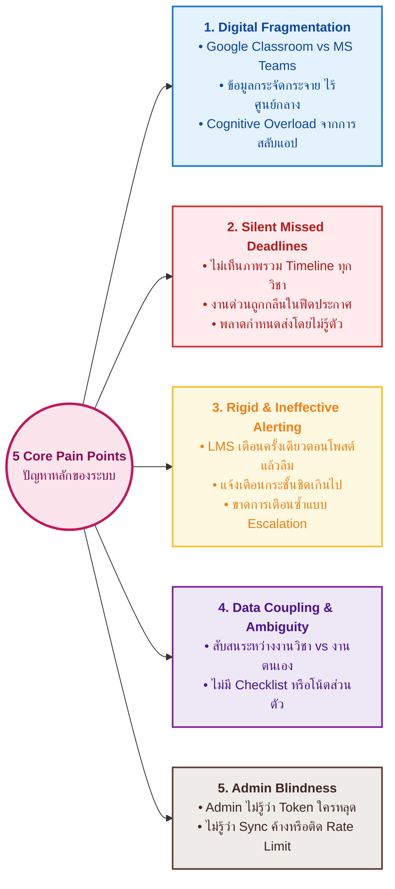

1. **Digital Fragmentation & Context Switching Fatigue**: ผู้เรียนต้องเข้าใช้งานทั้ง Google Classroom และ Microsoft Teams สลับกันในแต่ละวัน ทำให้สูญเสียสมาธิและเกิดภาวะข้อมูลล้นเกิน (Cognitive Overload)
2. **Silent Missed Deadlines**: ผู้เรียนพลาดการส่งงานไม่ใช่เพราะไม่ตั้งใจ แต่เพราะไม่เห็นภาพรวมเส้นตาย (Aggregated Timeline) งานในวิชาหนึ่งถูกบดบังด้วยประกาศของอีกวิชาหนึ่ง
3. **Rigid & Ineffective Notification**: การแจ้งเตือนของแพลตฟอร์มต้นทางมักส่งครั้งเดียวตอนอาจารย์โพสต์งาน ซึ่งมักเกิดขึ้นล่วงหน้านานจนผู้เรียนลืม หรือแจ้งเตือนกระชั้นชิดเกินไปจนทำงานไม่ทัน ระบบต้องการการเตือนแบบ **Multi-tier Escalation (เตือนล่วงหน้าหลายระยะ)**
4. **Data Coupling Ambiguity**: ข้อมูลชิ้นงาน (Assignment) จากต้นทางกับความคืบหน้ารายบุคคล (Personal Task State) ปะปนกัน ทำให้ยากต่อการจัดการสถานะงานของผู้เรียนแต่ละคน
5. **Operational Blindness (Admin)**: ผู้ดูแลระบบไม่สามารถทราบได้เลยว่าระบบการเชื่อมต่อ API ของนักศึกษาคนใดล้มเหลว จนกระทั่งนักศึกษาไม่ได้รับแจ้งเตือนและส่งงานสาย

---

## 3. แบบจำลองข้อมูลระดับแนวคิด (Conceptual Data Model - CDM)

ระดับแนวคิด (Conceptual Level) มุ่งเน้นการอธิบาย **สิ่งที่ระบบจัดเก็บ (Entities)** และ **ความสัมพันธ์เชิงความหมาย (Business Relationships & Multiplicity)** โดยแยกย่อยออกเป็น **5 โดเมนหลัก** เพื่อให้อ่านเข้าใจง่าย เส้นไม่ทับซ้อนกัน

---

### 3.1 แบบจำลองแนวคิดภาพรวมทั้งระบบ (Unified Conceptual Data Model - CDM)

แผนภาพนี้รวบรวมทุก Entity ในระดับแนวคิดเชิงธุรกิจของทั้งระบบไว้ในแผนภาพเดียว โดยจัดวางลำดับเลย์เอาต์จากซ้ายไปขวาเพื่อให้อ่านง่าย เส้นไม่ไขว้กัน:

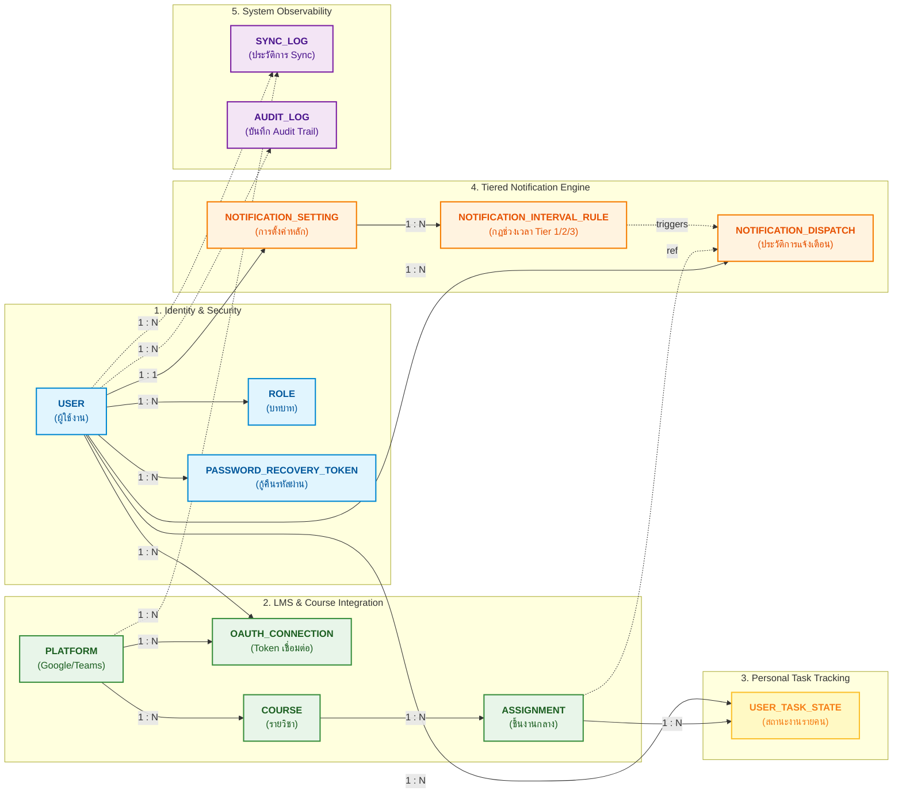

---


### 3.2 แผนภาพความสัมพันธ์แยกตามโดเมน (Focused Conceptual Models)

#### โดเมนที่ 1: ระบบจัดการผู้ใช้และความปลอดภัย (Identity, Roles & Recovery)
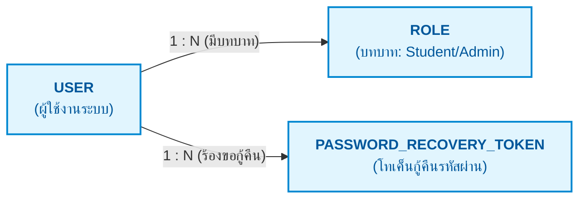

---

#### โดเมนที่ 2: ระบบเชื่อมต่อ LMS และการรวมงาน (Platform Integration & Course Aggregation)
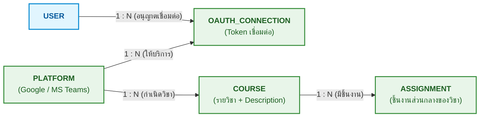

---

#### โดเมนที่ 3: ระบบติดตามงานรายบุคคล (Personal Task State Tracking)
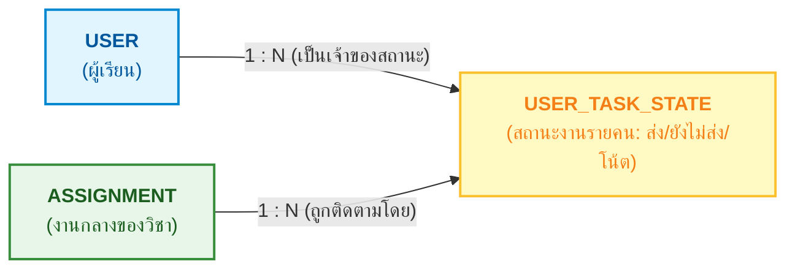

---

#### โดเมนที่ 4: ระบบการตั้งค่าและการแจ้งเตือนหลายระยะ (Tiered Notification Engine)
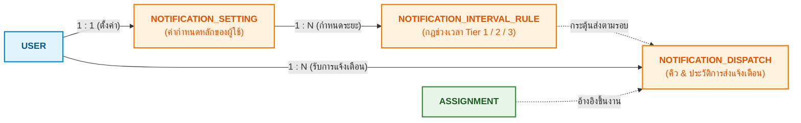

---

#### โดเมนที่ 5: ระบบบันทึกประวัติและการทำงาน (Observability & Logs)
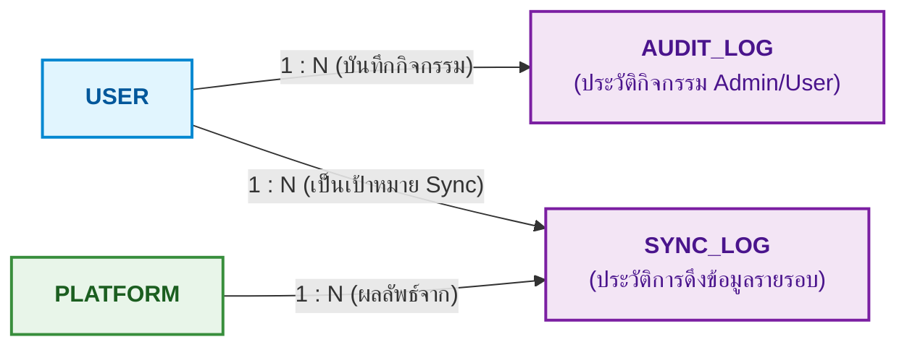

---

### 3.3 ตารางสรุปความสัมพันธ์และความหมายทางธุรกิจ (Business Relationship Matrix)

| Entity ต้นทาง | Multiplicity | Entity ปลายทาง | ความหมายเชิงธุรกิจ |
|---|:---:|---|---|
| `USER` | **1 : N** | `ROLE` | ผู้ใช้ 1 คนสามารถมีได้หลายบทบาท (เช่น เป็นทั้ง Student และ Admin) |
| `USER` | **1 : N** | `PASSWORD_RECOVERY_TOKEN` | ผู้ใช้สามารถร้องขอโทเค็นรีเซ็ตรหัสผ่านได้หลายครั้ง แต่ละโทเค็นมีอายุ 15 นาที |
| `USER` | **1 : N** | `OAUTH_CONNECTION` | ผู้ใช้ 1 คนสามารถเชื่อมต่อได้หลายแพลตฟอร์ม (Google Classroom, MS Teams) |
| `PLATFORM` | **1 : N** | `COURSE` | แพลตฟอร์มต้นทาง 1 แห่ง เป็นแหล่งที่มาของหลายรายวิชา |
| `COURSE` | **1 : N** | `ASSIGNMENT` | 1 รายวิชาประกอบด้วยงานที่มอบหมายหลายชิ้นงาน (ชิ้นงานเป็นของวิชา) |
| `ASSIGNMENT` | **1 : N** | `USER_TASK_STATE` | งาน 1 ชิ้น จะมีรายการติดตามสถานะการส่งแยกตามนักศึกษาแต่ละคนที่เรียนวิชานั้น |
| `USER` | **1 : N** | `USER_TASK_STATE` | นักศึกษา 1 คน มีรายการสถานะงานของตนเองสำหรับทุกชิ้นงาน |
| `USER` | **1 : 1** | `NOTIFICATION_SETTING` | ผู้ใช้แต่ละคนมีโปรไฟล์การตั้งค่าแจ้งเตือนหลัก 1 ชุด |
| `NOTIFICATION_SETTING` | **1 : N** | `NOTIFICATION_INTERVAL_RULE` | 1 การตั้งค่า สามารถกำหนดช่วงเวลาเตือนล่วงหน้าได้หลายระยะ (Tier 1, Tier 2, Tier 3) |
| `ASSIGNMENT` | **1 : N** | `NOTIFICATION_DISPATCH` | งาน 1 ชิ้น สามารถเกิดการส่งแจ้งเตือนได้หลายรอบตาม Tier ที่ตั้งไว้ |
| `USER` | **1 : N** | `AUDIT_LOG` | บันทึกประวัติกิจกรรมสำคัญที่ผู้ใช้กระทำในระบบ |
| `USER` | **1 : N** | `SYNC_LOG` | บันทึกผลการดึงข้อมูลจากภายนอกของผู้ใช้แต่ละราย |

---


## 4. การแยกความซับซ้อนของ Assignment: ระดับชิ้นงานส่วนกลาง vs สถานะรายบุคคล

### 4.1 ปัญหาของโครงสร้างเดิม (Tightly Coupled Schema)
เดิมการนำ `user_id` มาผูกตรงไว้กับ `Assignment` ทำให้เกิดปัญหา:
- หากนักศึกษา 50 คนอยู่ในวิชาเดียวกัน ระบบต้องจัดเก็บข้อมูลชื่องานและคำอธิบายซ้ำซ้อน 50 แถว
- เมื่ออาจารย์แก้วันส่งหรือแก้คำอธิบายงาน Sync Engine ต้องตามอัปเดต 50 แถว
- ไม่สามารถรองรับการที่นักศึกษาแต่ละคนมีโน้ตส่วนตัว (Personal Notes) หรือสถานะย่อย (e.g. In Progress, Drafted) ได้

### 4.2 โครงสร้างใหม่ที่แยกความรับผิดชอบ (Separation of Concerns)

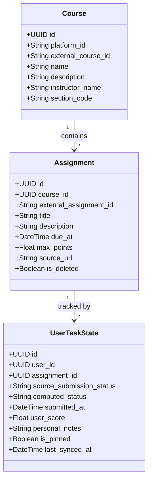

**ประโยชน์ของการแยก**:
1. **Assignment (Global Entity)**: เก็บข้อมูลวัตถุงานจริงที่อาจารย์สั่ง เช่น ชื่องาน, รายละเอียด (description), กำหนดส่งกลาง (due_at), คะแนนเต็ม, ลิงก์ต้นทาง
2. **UserTaskState (Personal Entity)**: เก็บข้อมูลสถานะของนักศึกษาคนนั้นๆ เช่น ส่งหรือยัง (`submitted`), ส่งเวลาใด (`submitted_at`), เลยกำหนดหรือไม่ (`overdue`), โน้ตส่วนตัวที่นักศึกษาจดไว้เอง

---

## 5. การปรับปรุง Course Entity: เพิ่มรายละเอียดรายวิชา (Course Description)

ใน Entity `Course` ได้รับการเพิ่มคุณลักษณะให้ครบถ้วนเพื่อรองรับการแสดงผลหน้า Course Detail:
- **`description` (Text, Nullable)**: คำอธิบายรายวิชา / ข้อมูลสังเขปเกี่ยวกับวิชา
- **`instructor_name` (VARCHAR(150), Nullable)**: ชื่ออาจารย์ผู้สอนประจำวิชา
- **`section_code` (VARCHAR(50), Nullable)**: กลุ่มเรียน / ตอนเรียน (Section)

---

## 6. การแก้ไขคุณลักษณะช่วงเวลาแจ้งเตือน (Custom Notification Intervals)

### 6.1 ปัญหาของคุณลักษณะเดิม
เดิมกำหนดให้ `lead_time_minutes: Integer` เป็นค่าเดี่ยว (เช่น 60 นาที) ทำให้:
- ผู้ใช้ไม่สามารถตั้งการเตือนหลายระยะได้ (เช่น ต้องการให้เตือนทั้ง **3 วันล่วงหน้า** เพื่อเตรียมตัว และ **2 ชั่วโมงล่วงหน้า** เพื่อตรวจความเรียบร้อย)
- ไม่มีความยืดหยุ่นสำหรับวิชาที่มีภาระงานใหญ่ที่ต้องใช้เวลาทำหลายวัน

### 6.2 การปรับปรุงเป็น Multi-Interval / Tiered Notification

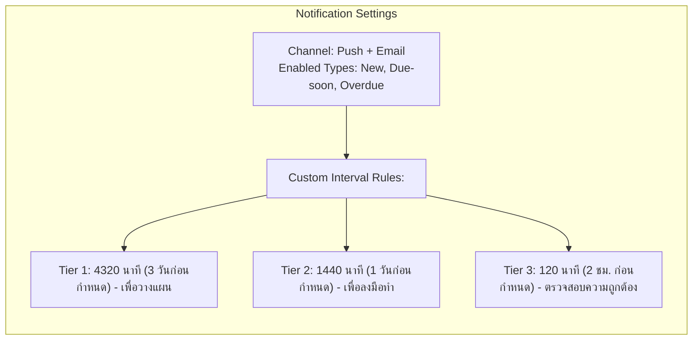

**โครงสร้างข้อมูลที่ถูกต้อง (JSON / Relational Structure)**:
```json
{
  "user_id": "uuid-1234",
  "channel": "both",
  "new_assignment_enabled": true,
  "overdue_enabled": true,
  "due_soon_enabled": true,
  "reminder_intervals": [
    { "tier": 1, "lead_time_minutes": 4320, "label": "3 วันล่วงหน้า (Early Planning)" },
    { "tier": 2, "lead_time_minutes": 1440, "label": "1 วันล่วงหน้า (Action Reminder)" },
    { "tier": 3, "lead_time_minutes": 120,  "label": "2 ชั่วโมงล่วงหน้า (Urgent Final Check)" }
  ]
}
```

---

## 7. กลไกการแจ้งเตือนหลายระดับ: "จะรู้ได้อย่างไรว่าคนนี้ต้องแจ้งเตือนครั้งที่สอง/สาม?"

นี่คือหัวใจสำคัญของ **Notification Dispatch Engine**: ระบบจะป้องกันการส่งซ้ำ (Deduplication) และรู้ได้อย่างไรว่าต้องส่งการแจ้งเตือน Tier 2 หรือ Tier 3

### 7.1 Data Structure สำหรับ State Tracking
ในตาราง `notifications` (หรือ `notification_dispatches`) มีการระบุ **`tier`** หรือ **`stage`** ควบคู่กับ Composite Unique Key:

| Field | Type | คำอธิบาย |
|---|---|---|
| `id` | UUID | Primary Key |
| `user_id` | UUID | ผู้รับการแจ้งเตือน |
| `assignment_id` | UUID | งานที่เกี่ยวข้อง |
| `notification_type` | VARCHAR | `new_assignment`, `due_soon`, `overdue` |
| **`tier`** | SMALLINT | ระดับการเตือน (1 = เตือนครั้งแรก 3 วัน, 2 = เตือนครั้งที่สอง 1 วัน, 3 = เตือนครั้งที่สาม 2 ชม.) |
| `trigger_time` | TIMESTAMPTZ | เวลาที่กำหนดส่ง (`due_at - lead_time_minutes`) |
| `status` | VARCHAR | `pending`, `sending`, `delivered`, `failed` |
| **Unique Constraint** | - | **`UNIQUE(user_id, assignment_id, notification_type, tier)`** |

### 7.2 กระบวนการตัดสินใจ (Notification Dispatch Algorithm)

```mermaid
flowchart TD
    Start([Cron Dispatcher ทำงานทุก 1 นาที]) --> FetchDue["1. ดึงงานที่ยังไม่ส่ง (computed_status = not_submitted)"]
    FetchDue --> LoopUser["2. สำหรับแต่ละ User + Assignment: คำนวณเวลาที่เหลือก่อน Due Date"]
    
    LoopUser --> CheckTiers["3. เปรียบเทียบเวลาที่เหลือกับ Reminder Intervals ของ User"]
    
    CheckTiers --> T1{เวลาที่เหลือ <= Tier 1 (3 วัน)?}
    T1 -- ใช่ --> CheckSent1{เคยส่ง Tier 1 แล้วหรือยัง?<br/>(Check DB: user_id + ass_id + due_soon + tier 1)}
    CheckSent1 -- ยังไม่เคย --> QueueT1["สร้าง & ส่ง Notification Tier 1<br/>บันทึก status=delivered, tier=1"]
    CheckSent1 -- ส่งแล้ว --> T2
    
    T1 -- ยังไม่ถึงเวลา --> NextItem([ข้ามไปรายการถัดไป])
    
    T2{เวลาที่เหลือ <= Tier 2 (1 วัน)?}
    T2 -- ใช่ --> CheckSent2{เคยส่ง Tier 2 แล้วหรือยัง?<br/>(Check DB: tier 2)}
    CheckSent2 -- ยังไม่เคย --> QueueT2["สร้าง & ส่ง Notification Tier 2 (ครั้งที่สอง)<br/>บันทึก status=delivered, tier=2"]
    CheckSent2 -- ส่งแล้ว --> T3
    
    T2 -- ยังไม่ถึงเวลา --> NextItem
    
    T3{เวลาที่เหลือ <= Tier 3 (2 ชม.)?}
    T3 -- ใช่ --> CheckSent3{เคยส่ง Tier 3 แล้วหรือยัง?<br/>(Check DB: tier 3)}
    CheckSent3 -- ยังไม่เคย --> QueueT3["สร้าง & ส่ง Notification Tier 3 (ครั้งสุดท้าย)<br/>บันทึก status=delivered, tier=3"]
    CheckSent3 -- ส่งแล้ว --> NextItem
```

**คำตอบชัดเจน**: ระบบรู้ว่าต้องส่ง **"ครั้งที่สอง"** เพราะ:
1. เมื่อถึงช่วงเวลา Tier 2 ระบบ Query ตรวจสอบตาราง `notifications` ด้วยเงื่อนไข `(user_id, assignment_id, type='due_soon', tier=2)`
2. หากยังไม่พบบันทึกที่มี `status IN ('delivered', 'sending')` และสถานะงานยังเป็น `not_submitted` ระบบจะสั่งยิงการแจ้งเตือน Tier 2 ทันที และบันทึกประวัติกำกับไว้
3. ด้วยกลไก `UNIQUE KEY` ทำให้ไม่เกิดการยิงซ้ำแม้ Worker จะประมวลผลชนกัน

---

## 8. ระบบกู้คืนบัญชีผู้ใช้ (User Account Recovery & Password Reset Flow)

### 8.1 เหตุผลความจำเป็นทางวิศวกรรม (Engineering Rationale)
หากไม่มีระบบ Account Recovery ระบบจะมีข้อจำกัดที่ส่งผลกระทบขั้นรุนแรงต่อขีดความสามารถการใช้งานจริง (Operational Failure):
- ผู้ใช้ที่ลืมรหัสผ่านจะไม่สามารถเข้าถึงระบบได้ ทำให้พลาดการแจ้งเตือนงานทั้งหมด
- ภาระตกอยู่ที่ Admin ต้องมาแก้รหัสผ่านแบบ Manual ซึ่งผิดหลักความมั่นคงปลอดภัย (Security Violation)

### 8.2 แผนภาพกระบวนการกู้คืนรหัสผ่าน (Password Recovery Flow)

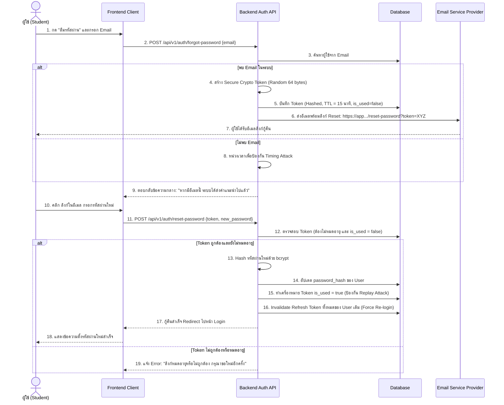

---

## 9. บทวิเคราะห์และความจำเป็นของระบบฝั่งผู้ดูแลระบบ (Admin Systems)

### 9.1 Connection Monitoring : มีไว้ทำอะไร? มีประโยชน์อย่างไร?

| ประเด็น | คำอธิบายเชิงลึก |
|---|---|
| **หน้าที่ (What it does)** | แสดงสถานะการเชื่อมต่อ OAuth ของนักศึกษาทุกคนในระบบแบบ Real-time (Connected, Expired, Revoked, Rate Limited, Error) |
| **ประโยชน์ต่อ Admin** | **1. Proactive Troubleshooting**: Admin สามารถเห็นได้ทันทีว่านักศึกษากลุ่มใด Token หมดอายุ หรือหลุดการเชื่อมต่อ ก่อนที่นักศึกษาจะรู้ตัว<br/>**2. Visibility on Platform Health**: วิเคราะห์ได้ว่าเกิดปัญหาที่ฝั่ง Google Classroom API หรือ Microsoft Graph API หรือไม่ (เช่น หลุดพร้อมกันทั้งสถาบัน)<br/>**3. Support Efficiency**: เมื่อนักศึกษาแจ้งว่า "งานไม่อัปเดต" Admin ตรวจสอบได้ทันทีในหน้าเดียว ไม่ต้องเดา |
| **ประโยชน์ต่อ User** | ได้รับการแจ้งเตือนให้ Re-authorize อย่างทันท่วงที งานไม่ตกหล่น |

---

### 9.2 System Monitoring : มีไว้ทำอะไร? ควรมีไหม? ช่วยอะไร Admin ได้บ้าง?

| ประเด็น | คำอธิบายเชิงลึก |
|---|---|
| **ข้อสรุปความจำเป็น** | **"จำเป็นต้องมีอย่างยิ่ง" (Critical Must-Have)** |
| **หน้าที่ (What it does)** | ตรวจสอบมาตรวัดสุขภาพของระบบ (System Health Metrics): อัตราความสำเร็จของการ Sync ข้อมูล (Sync Success Rate), ความลึกของคิวแจ้งเตือน (Notification Queue Depth), อัตราการใช้งาน API Quota ต่อ Provider, Database Connection Pool, และ Response Time |
| **ช่วยอะไร Admin ได้บ้าง?** | **1. ป้องกัน System Blindness**: หากไม่มี System Monitoring แล้ว Sync Engine ค้างหรือล่ม Admin จะไม่มีทางทราบเลยจนกว่าผู้ใช้ทั้งมหาวิทยาลัยจะโวยวาย<br/>**2. Early Warning on Quota Exhaustion**: แจ้งเตือนเมื่อ API Quota ของ Google/Microsoft กำลังจะเต็ม เพื่อวางแผนขยาย Quota ทัน<br/>**3. Capacity Planning**: ทราบว่าช่วงเวลาใดที่นักศึกษาใช้งานหนัก (Peak Hour) เพื่อปรับขนาด Worker ให้เหมาะสม |

---

### 9.3 Server Log & Audit Log : มีไว้ทำไม?

การเก็บ Server Log และ Audit Log มีความจำเป็นทางวิศวกรรม 4 มิติ:

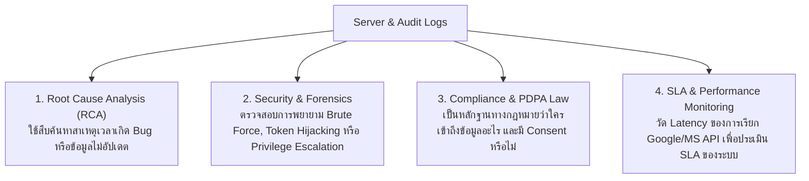

1. **Root Cause Analysis (RCA)**: เมื่อนักศึกษาแจ้งว่า "งานวิชานี้ไม่เข้า" Server Log จะบอกได้ทันทีว่า Google API ตอบ error รหัสอะไรกลับมา
2. **Security & Accountability**: Audit Log บันทึกว่า Admin คนใดเปลี่ยนสิทธิ์ของใคร หรือใครขอ Export ข้อมูล ป้องกันการทุจริตและการใช้อำนาจมิชอบ
3. **Legal Compliance (PDPA)**: กฎหมายคุ้มครองข้อมูลส่วนบุคคลกำหนดให้ระบบต้องมี Audit Trail บันทึกการยินยอม (Consent) และประวัติการเข้าถึงข้อมูลส่วนบุคคล
4. **Performance Tuning**: รู้ว่าจุดใดในระบบที่เป็นคอขวด (Bottleneck) จากเวลาประมวลผลใน Request Log

---

## 10. แผนภาพกระบวนการทำงานแบบละเอียด (Detailed Step-by-Step Workflows)

### 10.1 End-to-End Core Lifecycle Workflow

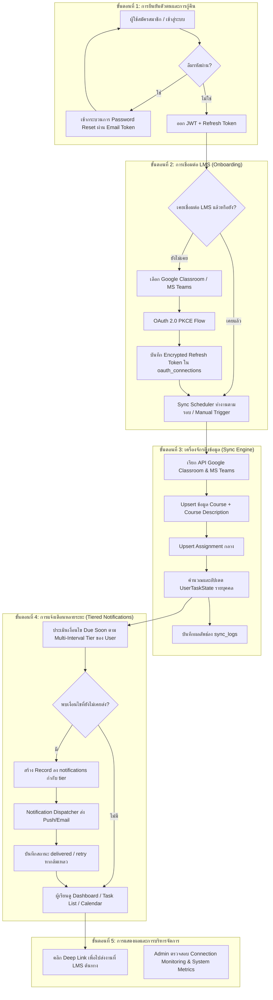

---

## 11. ตารางสรุปการตัดสินใจเชิงสถาปัตยกรรม (Architectural Decision Record - ADR)

| ประเด็นการปรับปรุง | ข้อสรุปและเหตุผลเชิงสถาปัตยกรรม |
|---|---|
| **1. การแยก Assignment และ UserTaskState** | **เลือกแยก Entity 1:N**: เพื่อความถูกต้องตามหลัก Normalization (3NF) ลดความซ้ำซ้อนของข้อมูล และรองรับการจัดการสถานะ/โน้ตส่วนตัวของนักศึกษาแต่ละคนได้อย่างอิสระ |
| **2. โครงสร้าง Multi-Interval Notification** | **เลือกใช้ JSON Array หรือ Relational Tiers**: เพื่อเปิดโอกาสให้นักศึกษาตั้งการแจ้งเตือนได้หลายระยะเวลาตามพฤติกรรมการเรียนจริง |
| **3. การติดตาม State การแจ้งเตือน** | **เลือกใช้ Unique Constraint `(user_id, assignment_id, type, tier)`**: ป้องกันการส่งซ้ำในระดับ Database Level และตรวจสอบได้ทันทีว่า Tier ใดถูกส่งไปแล้ว |
| **4. ระบบ Account Recovery** | **เลือกใช้อีเมล Token แบบ Time-limited (15-30 นาที)**: ปลอดภัยตามมาตรฐาน OWASP และปิดช่องว่างด้านการให้บริการผู้ใช้ |
| **5. การคงระบบ Monitoring & Logging ของ Admin** | **คงไว้ครบถ้วนทั้ง 3 ตัว**: เนื่องจากเป็นหัวใจของการดูแลรักษาระบบ (Observability), ความปลอดภัย (Security), และการปฏิบัติตามกฎหมาย (PDPA) ขาดตัวใดตัวหนึ่งไม่ได้ |

---

## 12. การตรวจสอบความสอดคล้องกับฐานข้อมูลจริง (Physical Database Schema Audit & Mapping)

จากการตรวจสอบ Source Code ของ Database Models (`backend/app/models/*.py`), Alembic Migrations (`0f9f537f2d5a_init_schema.py` & `7a8b9c0d1e2f_add_recovery_tokens_and_tiers.py`) และ Neon PostgreSQL Database Schema พบผลการตรวจสอบดังนี้:

| ตาราง (Table) | คอลัมน์และข้อกำหนดใน Database จริง | สถานะความสอดคล้อง | หมายเหตุการใช้งาน |
|---|---|:---:|---|
| **`platforms`** | `id` (SmallInt PK), `name` (String(50) Unique) | ✅ **100% สอดคล้อง** | รองรับ Seed: `google_classroom`, `microsoft_teams` |
| **`roles`** | `id` (SmallInt PK), `name` (String(50) Unique) | ✅ **100% สอดคล้อง** | รองรับ Seed: `student`, `admin` |
| **`users`** | `id` (UUID PK), `email` (String(255) Unique), `password_hash` (String(255) Nullable), `display_name` (String(150)), `is_active` (Boolean), `created_at`, `updated_at` | ✅ **100% สอดคล้อง** | รองรับการเข้าสู่ระบบทั้งแบบ Local และ SSO |
| **`user_roles`** | `user_id` (UUID PK FK), `role_id` (SmallInt PK FK) | ✅ **100% สอดคล้อง** | Composite PK รองรับสิทธิ์ผู้ใช้แบบ RBAC |
| **`password_recovery_tokens`** | `id` (UUID PK), `user_id` (UUID FK ondelete CASCADE), `token_hash` (VARCHAR(255)), `expires_at` (TIMESTAMPTZ), `is_used` (Boolean), `created_at` (TIMESTAMPTZ) | ✅ **100% อัปเดตแล้ว** | ระบบ Password Reset Token (TTL 15 นาที, One-time use) |
| **`oauth_connections`** | `id` (UUID PK), `user_id` (UUID FK), `platform_id` (SmallInt FK), `access_token_enc` (Text), `refresh_token_enc` (Text Nullable), `token_expires_at` (DateTime Nullable), `status` (String(20)), `connected_at`, `Unique(user_id, platform_id)` | ✅ **100% สอดคล้อง** | สถานะ: `connected`, `expired`, `broken` |
| **`courses`** | `id` (UUID PK), `user_id` (UUID FK), `platform_id` (SmallInt FK), `external_course_id` (String(255)), `name` (String(255)), `description` (Text), `instructor_name` (VARCHAR(150)), `is_deleted` (Boolean), `Unique(platform_id, external_course_id, user_id)` | ✅ **100% อัปเดตแล้ว** | มีข้อมูลคำอธิบายรายวิชาและชื่ออาจารย์ผู้สอน |
| **`assignments`** | `id` (UUID PK), `course_id` (UUID FK), `external_assignment_id` (String(255)), `title` (String(255)), `description` (Text Nullable), `due_at` (DateTime Nullable Index), `source_status` (String(30)), `computed_status` (String(20) Index), `source_url` (Text), `is_deleted` (Boolean), `last_synced_at`, `Unique(course_id, external_assignment_id)` | ✅ **100% สอดคล้อง** | สถานะ: `not_submitted`, `submitted`, `overdue` |
| **`notification_settings`** | `id` (UUID PK), `user_id` (UUID FK Unique), `lead_time_minutes` (Integer), `reminder_intervals` (JSONB), `new_assignment_enabled` (Boolean), `due_soon_enabled` (Boolean), `overdue_enabled` (Boolean), `channel` (String(20)) | ✅ **100% อัปเดตแล้ว** | รองรับการตั้งเวลาแจ้งเตือนหลายระยะ (Multi-tier Schedule) |
| **`notifications`** | `id` (UUID PK), `user_id` (UUID FK), `assignment_id` (UUID FK Nullable), `type` (String(20)), `tier` (SmallInt default 1), `status` (String(20) Index), `retry_count` (SmallInt), `scheduled_at` (DateTime Index), `delivered_at` (DateTime Nullable), `Unique(user_id, assignment_id, type, tier)` | ✅ **100% อัปเดตแล้ว** | มีฟิลด์ `tier` และ Constraint ป้องกันการแจ้งเตือนซ้ำ |
| **`sync_logs`** | `id` (UUID PK), `user_id` (UUID FK), `platform_id` (SmallInt FK), `status` (String(20)), `items_synced` (Integer), `error_detail` (JSONB Nullable), `started_at`, `finished_at` | ✅ **100% สอดคล้อง** | ใช้บันทึกผลการทำงานของ Sync Engine สำหรับ Admin |
| **`audit_logs`** | `id` (UUID PK), `actor_user_id` (UUID FK Nullable), `action` (String(100) Index), `target` (String(255) Nullable), `metadata` (JSONB Nullable), `created_at` (DateTime Index) | ✅ **100% สอดคล้อง** | ใช้สำหรับ Audit Trail ตรวจสอบความปลอดภัยและ PDPA |

---

## 13. แผนภาพภาพรวมฐานข้อมูลทั้งระบบ (System-wide Physical ER Diagram)

แผนภาพแสดงโครงสร้างตาราง ข้อมูล Attributes, Primary Keys (PK), Foreign Keys (FK), และเส้นความสัมพันธ์ Cardinality ครบถ้วนทั้ง 12 ตารางตามฐานข้อมูลจริง:

```mermaid
erDiagram
    USERS ||--o{ USER_ROLES : "assigned_roles"
    ROLES ||--o{ USER_ROLES : "granted_via"

    USERS ||--o{ PASSWORD_RECOVERY_TOKENS : "has_tokens"

    USERS ||--o{ OAUTH_CONNECTIONS : "authorizes"
    PLATFORMS ||--o{ OAUTH_CONNECTIONS : "connected_to"

    USERS ||--o{ COURSES : "owns_courses"
    PLATFORMS ||--o{ COURSES : "origin_platform"

    COURSES ||--o{ ASSIGNMENTS : "contains"

    USERS ||--|| NOTIFICATION_SETTINGS : "configures"
    USERS ||--o{ NOTIFICATIONS : "receives"
    ASSIGNMENTS ||--o{ NOTIFICATIONS : "triggers"

    USERS ||--o{ SYNC_LOGS : "subject_of"
    PLATFORMS ||--o{ SYNC_LOGS : "sync_from"

    USERS ||--o{ AUDIT_LOGS : "performed_by"

    USERS {
        uuid id PK
        varchar email UK
        varchar password_hash
        varchar display_name
        boolean is_active
        timestamptz created_at
        timestamptz updated_at
    }

    ROLES {
        smallint id PK
        varchar name UK
    }

    USER_ROLES {
        uuid user_id PK_FK
        smallint role_id PK_FK
    }

    PASSWORD_RECOVERY_TOKENS {
        uuid id PK
        uuid user_id FK
        varchar token_hash
        timestamptz expires_at
        boolean is_used
        timestamptz created_at
    }

    PLATFORMS {
        smallint id PK
        varchar name UK
    }

    OAUTH_CONNECTIONS {
        uuid id PK
        uuid user_id FK
        smallint platform_id FK
        text access_token_enc
        text refresh_token_enc
        timestamptz token_expires_at
        varchar status
        timestamptz connected_at
    }

    COURSES {
        uuid id PK
        uuid user_id FK
        smallint platform_id FK
        varchar external_course_id
        varchar name
        text description
        varchar instructor_name
        boolean is_deleted
    }

    ASSIGNMENTS {
        uuid id PK
        uuid course_id FK
        varchar external_assignment_id
        varchar title
        text description
        timestamptz due_at
        varchar source_status
        varchar computed_status
        text source_url
        boolean is_deleted
        timestamptz last_synced_at
    }

    NOTIFICATION_SETTINGS {
        uuid id PK
        uuid user_id FK_UK
        integer lead_time_minutes
        jsonb reminder_intervals
        boolean new_assignment_enabled
        boolean due_soon_enabled
        boolean overdue_enabled
        varchar channel
    }

    NOTIFICATIONS {
        uuid id PK
        uuid user_id FK
        uuid assignment_id FK
        varchar type
        smallint tier
        varchar status
        smallint retry_count
        timestamptz scheduled_at
        timestamptz delivered_at
    }

    SYNC_LOGS {
        uuid id PK
        uuid user_id FK
        smallint platform_id FK
        varchar status
        integer items_synced
        jsonb error_detail
        timestamptz started_at
        timestamptz finished_at
    }

    AUDIT_LOGS {
        uuid id PK
        uuid actor_user_id FK
        varchar action
        varchar target
        jsonb metadata
        timestamptz created_at
    }
```

---

## 14. สถาปัตยกรรมระบบเชิงลึก (Deep-Dive System Architecture & Component Blueprint)

เพื่อให้สถาปัตยกรรมระบบมีความชัดเจนในระดับวิศวกรรมซอฟต์แวร์ระดับสูง จึงได้แจกแจงโครงสร้างตามมาตรฐาน **C4 Model** และ **Data Pipeline Mechanics** ดังนี้:

### 14.1 แผนภาพ C4 Container Architecture (ภาพรวมระบบและเทคโนโลยี)

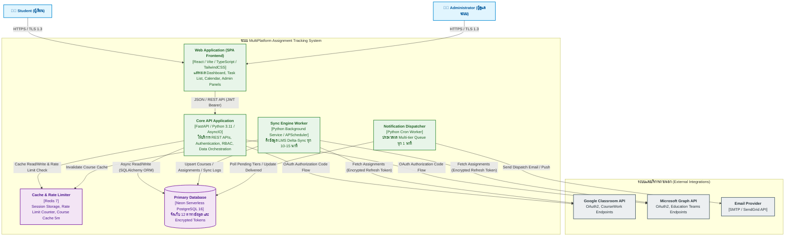

---

### 14.2 โครงสร้างเลเยอร์ภายใน Backend (Clean Architecture / Layered Pattern)

โครงสร้าง Backend แบ่งออกเป็น 4 ชั้นความรับผิดชอบ เพื่อให้ง่ายต่อการทดสอบและบำรุงรักษา (Maintainability & Testability):

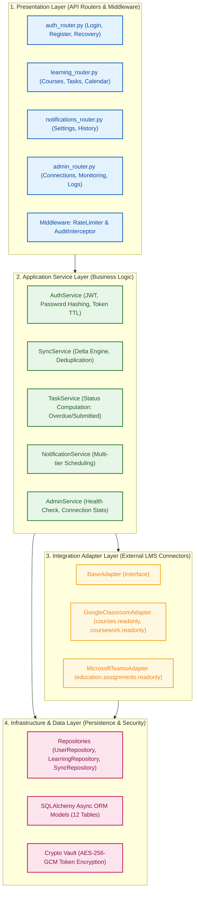

---

### 14.3 ไปป์ไลน์การทำงานของระบบ (Core Data & Processing Pipelines)

#### ก) ไปป์ไลน์การดึงข้อมูลอัจฉริยะ (LMS Delta-Sync Pipeline)
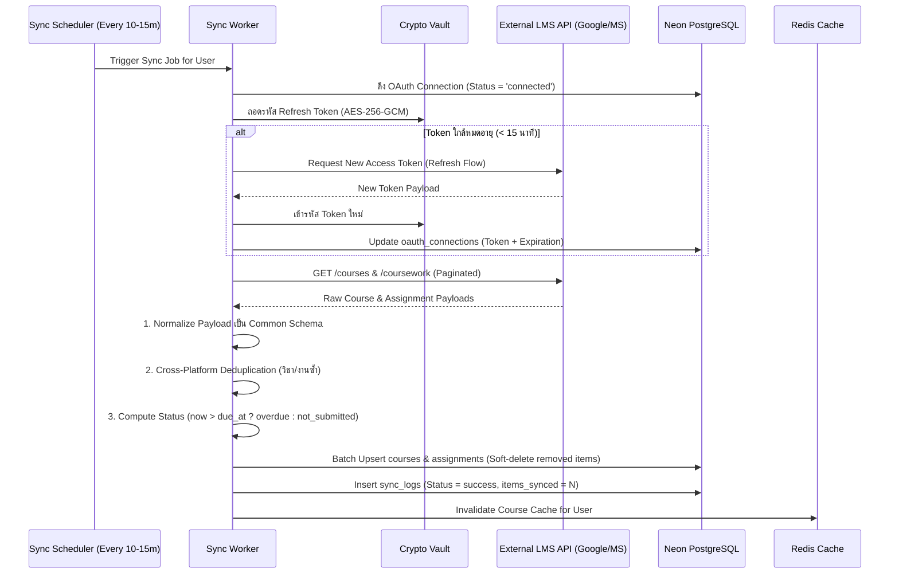

#### ข) ไปป์ไลน์การแจ้งเตือนหลายระยะแบบการันตีไม่ส่งซ้ำ (Multi-Tier Notification Pipeline)
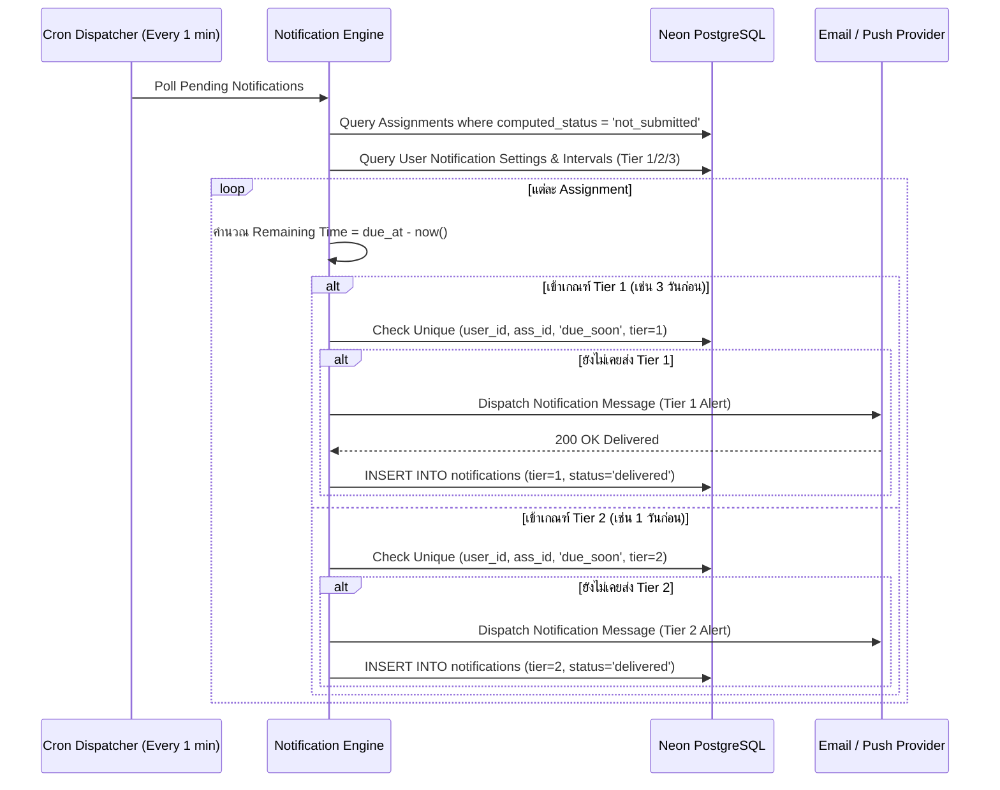

---

### 14.4 มาตรการความมั่นคงปลอดภัยและสถาปัตยกรรมป้องกันข้อผิดพลาด (Security & Resilience Patterns)

| หมวดหมู่ | รูปแบบและกลไก (Architectural Pattern) | การทำงานในระบบ |
|---|---|---|
| **Token Security** | **AES-256-GCM at Rest** | Access/Refresh Token จาก Google/MS จะไม่ถูกเก็บเป็น Plaintext ใน DB โดยเด็ดขาด |
| **API Resilience** | **Circuit Breaker & Backoff** | เมื่อ Google/Microsoft API เกิด Error 503 หรือ Rate Limit ระบบจะเข้าสู่ Backoff State (1m $\rightarrow$ 5m $\rightarrow$ 15m) และหยุดยิงซ้ำชั่วคราวเพื่อป้องกัน IP ถูกแบน |
| **High Availability** | **Graceful Cache Degradation** | หากการเชื่อมต่อ LMS ล้มเหลว หน้า Dashboard จะเสิร์ฟข้อมูลล่าสุดจาก Redis Cache พร้อมติด Tag *"ข้อมูลอาจไม่อัปเดต"* แทนการแสดงหน้า Error |
| **Idempotency** | **Idempotent Sync Trigger** | ป้องกันการกดปุ่ม Manual Refresh รัวๆ โดยใช้ Redis Rate Limiter (จำกัด 1 ครั้ง/นาที/ผู้ใช้) |
| **Audit & Compliance** | **Immutable Audit Interceptor** | Middleware ดักจับและบันทึกทุกการกระทำสำคัญของ Admin (เปลี่ยนสิทธิ์, Deactivate) ลงตาราง `audit_logs` อัตโนมัติ |


