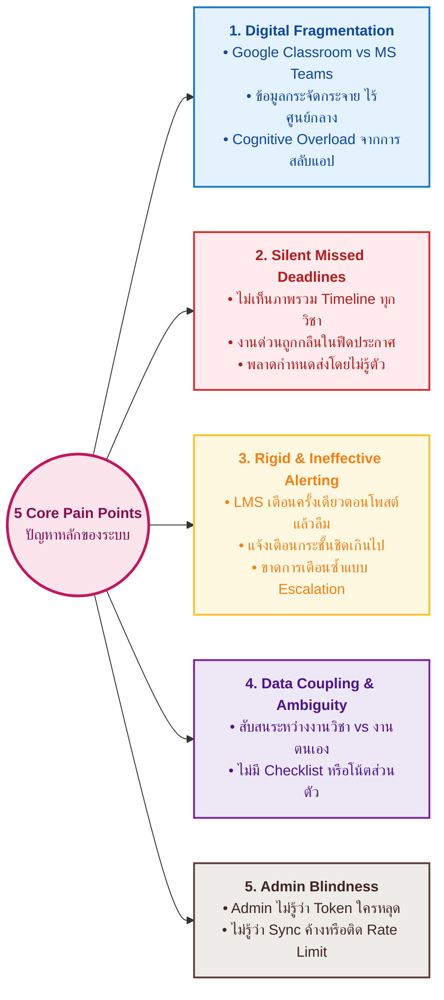
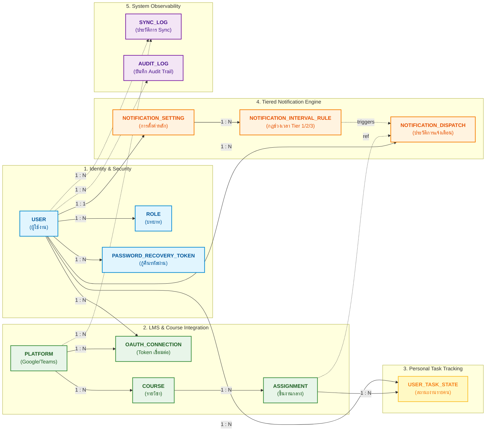
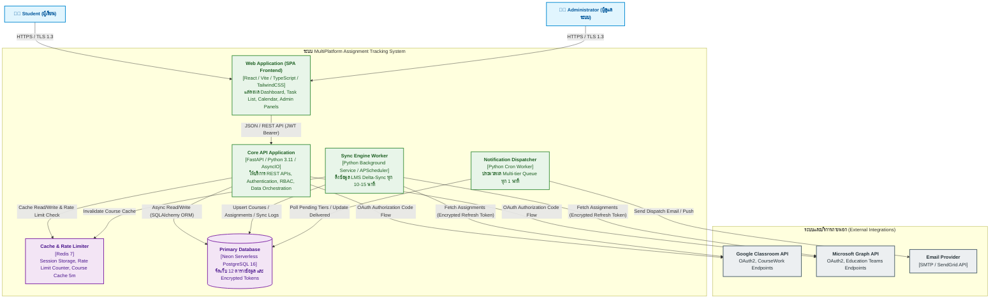
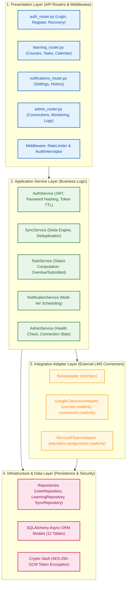

# แกลเลอรีแผนภาพสถาปัตยกรรมและแบบจำลองระบบ (System Architecture & Diagram Gallery)
### โครงการ: ระบบติดตามงานและแจ้งเตือนการเรียนจากหลายแพลตฟอร์ม (MultiPlatform Assignment Tracking)

โฟลเดอร์นี้รวบรวมแผนภาพทางวิศวกรรมทั้งหมดของระบบแยกเป็นไฟล์ `.mmd` (Mermaid Source) และแสดงผลเป็นพรีวิวในเอกสารนี้ เพื่อความสะดวกในการนำไปใช้ทำสไลด์ เอกสาร หรือรายงานโครงงาน

---

## สารบัญแผนภาพ (Diagram Catalog)

| # | ชื่อไฟล์แผนภาพ | หมวดหมู่ | คำอธิบาย |
|---|---|---|---|
| 01 | [`01_core_pain_points.mmd`](./01_core_pain_points.mmd) | Problem Analysis | แผนภาพวิเคราะห์ 5 ปัญหาหลักของผู้เรียนและ Admin |
| 02 | [`02_unified_conceptual_data_model_cdm.mmd`](./02_unified_conceptual_data_model_cdm.mmd) | Data Model | แบบจำลองแนวคิดภาพรวมทั้งระบบ (Unified CDM) |
| 03 | [`03_domain_iam_security.mmd`](./03_domain_iam_security.mmd) | Conceptual Domain | โดเมนที่ 1: ระบบจัดการผู้ใช้และความปลอดภัย |
| 04 | [`04_domain_lms_courses_assignments.mmd`](./04_domain_lms_courses_assignments.mmd) | Conceptual Domain | โดเมนที่ 2: ระบบเชื่อมต่อ LMS และการรวมงาน |
| 05 | [`05_domain_personal_task_tracking.mmd`](./05_domain_personal_task_tracking.mmd) | Conceptual Domain | โดเมนที่ 3: ระบบติดตามงานรายบุคคล |
| 06 | [`06_domain_tiered_notifications.mmd`](./06_domain_tiered_notifications.mmd) | Conceptual Domain | โดเมนที่ 4: ระบบการตั้งค่าและแจ้งเตือนหลายระยะ |
| 07 | [`07_domain_observability_audit.mmd`](./07_domain_observability_audit.mmd) | Conceptual Domain | โดเมนที่ 5: ระบบบันทึกประวัติการทำงาน (Audit/Sync) |
| 08 | [`08_assignment_vs_task_class_diagram.mmd`](./08_assignment_vs_task_class_diagram.mmd) | Object Design | การแยกความรับผิดชอบ Assignment vs UserTaskState |
| 09 | [`09_notification_tiered_intervals.mmd`](./09_notification_tiered_intervals.mmd) | Feature Design | แผนภาพโครงสร้างช่วงเวลาแจ้งเตือน Multi-tier |
| 10 | [`10_notification_dispatch_algorithm.mmd`](./10_notification_dispatch_algorithm.mmd) | Algorithm | อัลกอริทึมตรวจสอบการเตือนรอบที่ 2/3 ป้องกันส่งซ้ำ |
| 11 | [`11_password_recovery_sequence.mmd`](./11_password_recovery_sequence.mmd) | Sequence Diagram | กระบวนการกู้คืนรหัสผ่านด้วย Secure Email Token |
| 12 | [`12_admin_logging_rationale.mmd`](./12_admin_logging_rationale.mmd) | Architecture | เหตุผลความจำเป็น 4 ด้านของการเก็บ Server/Audit Log |
| 13 | [`13_end_to_end_system_lifecycle.mmd`](./13_end_to_end_system_lifecycle.mmd) | Workflow | ลำดับการทำงานตั้งแต่ต้นจนจบ (Lifecycle 5 ขั้นตอน) |
| 14 | [`14_system_wide_physical_erd_12_tables.mmd`](./14_system_wide_physical_erd_12_tables.mmd) | Database | แผนภาพ ERD กายภาพทั้ง 12 ตารางบน Neon PostgreSQL |
| 15 | [`15_c4_container_architecture.mmd`](./15_c4_container_architecture.mmd) | Architecture | C4 Model: สถาปัตยกรรมระดับ Container ทั้งระบบ |
| 16 | [`16_clean_architecture_backend_layers.mmd`](./16_clean_architecture_backend_layers.mmd) | Architecture | โครงสร้างเลเยอร์ภายใน Backend (Clean Architecture) |
| 17 | [`17_lms_delta_sync_pipeline.mmd`](./17_lms_delta_sync_pipeline.mmd) | Data Pipeline | ไปป์ไลน์ดึงข้อมูลและ Refresh Token ของ Sync Engine |
| 18 | [`18_multi_tier_notification_pipeline.mmd`](./18_multi_tier_notification_pipeline.mmd) | Data Pipeline | ไปป์ไลน์การส่งแจ้งเตือนหลายระยะแบบ Idempotent |

---

## พรีวิวแผนภาพทั้งหมด (Visual Gallery)

### 01. ปัญหาหลักของระบบ (5 Core Pain Points)


---

### 02. แบบจำลองแนวคิดภาพรวมทั้งระบบ (Unified Conceptual Data Model - CDM)


---

### 14. แผนภาพภาพรวมฐานข้อมูลทั้งระบบ (System-wide Physical ER Diagram - 12 Tables)
```mermaid
erDiagram
    USERS ||--o{ USER_ROLES : "assigned_roles"
    ROLES ||--o{ USER_ROLES : "granted_via"

    USERS ||--o{ PASSWORD_RECOVERY_TOKENS : "has_tokens"

    USERS ||--o{ OAUTH_CONNECTIONS : "authorizes"
    PLATFORMS ||--o{ OAUTH_CONNECTIONS : "connected_to"

    USERS ||--o{ COURSES : "owns_courses"
    PLATFORMS ||--o{ COURSES : "origin_platform"

    COURSES ||--o{ ASSIGNMENTS : "contains"

    USERS ||--|| NOTIFICATION_SETTINGS : "configures"
    USERS ||--o{ NOTIFICATIONS : "receives"
    ASSIGNMENTS ||--o{ NOTIFICATIONS : "triggers"

    USERS ||--o{ SYNC_LOGS : "subject_of"
    PLATFORMS ||--o{ SYNC_LOGS : "sync_from"

    USERS ||--o{ AUDIT_LOGS : "performed_by"

    USERS {
        uuid id PK
        varchar email UK
        varchar password_hash
        varchar display_name
        boolean is_active
        timestamptz created_at
        timestamptz updated_at
    }

    ROLES {
        smallint id PK
        varchar name UK
    }

    USER_ROLES {
        uuid user_id PK_FK
        smallint role_id PK_FK
    }

    PASSWORD_RECOVERY_TOKENS {
        uuid id PK
        uuid user_id FK
        varchar token_hash
        timestamptz expires_at
        boolean is_used
        timestamptz created_at
    }

    PLATFORMS {
        smallint id PK
        varchar name UK
    }

    OAUTH_CONNECTIONS {
        uuid id PK
        uuid user_id FK
        smallint platform_id FK
        text access_token_enc
        text refresh_token_enc
        timestamptz token_expires_at
        varchar status
        timestamptz connected_at
    }

    COURSES {
        uuid id PK
        uuid user_id FK
        smallint platform_id FK
        varchar external_course_id
        varchar name
        text description
        varchar instructor_name
        boolean is_deleted
    }

    ASSIGNMENTS {
        uuid id PK
        uuid course_id FK
        varchar external_assignment_id
        varchar title
        text description
        timestamptz due_at
        varchar source_status
        varchar computed_status
        text source_url
        boolean is_deleted
        timestamptz last_synced_at
    }

    NOTIFICATION_SETTINGS {
        uuid id PK
        uuid user_id FK_UK
        integer lead_time_minutes
        jsonb reminder_intervals
        boolean new_assignment_enabled
        boolean due_soon_enabled
        boolean overdue_enabled
        varchar channel
    }

    NOTIFICATIONS {
        uuid id PK
        uuid user_id FK
        uuid assignment_id FK
        varchar type
        smallint tier
        varchar status
        smallint retry_count
        timestamptz scheduled_at
        timestamptz delivered_at
    }

    SYNC_LOGS {
        uuid id PK
        uuid user_id FK
        smallint platform_id FK
        varchar status
        integer items_synced
        jsonb error_detail
        timestamptz started_at
        timestamptz finished_at
    }

    AUDIT_LOGS {
        uuid id PK
        uuid actor_user_id FK
        varchar action
        varchar target
        jsonb metadata
        timestamptz created_at
    }
```

---

### 15. สถาปัตยกรรม C4 Container Architecture


---

### 16. โครงสร้างเลเยอร์ภายใน Backend (Clean Architecture)

