# วิเคราะห์ขีดความสามารถของระบบ (System Capability Analysis)
## ระบบติดตามงานและแจ้งเตือนการเรียนจากหลายแพลตฟอร์ม
### MultiPlatform Assignment Tracking and Notification System

> วิเคราะห์จากเอกสาร "แบบขออนุมัติหัวข้อโครงงาน PD01" — โดยทีม Senior SA / Solution Architect / Enterprise Architect / PO / BA / UX / DB Architect / Backend Architect / Frontend Architect / Security Architect / QA Engineer

---

## 1. Executive Summary

**วัตถุประสงค์ระบบ**
พัฒนาระบบกลาง (Single Pane of Glass) ที่ดึงข้อมูลรายวิชาและงานที่ได้รับมอบหมายจาก Google Classroom และ Microsoft Teams มารวมไว้ในที่เดียว พร้อมระบบแจ้งเตือนที่ผู้เรียนกำหนดเองได้ เพื่อลดภาระทางดิจิทัล (Digital Overload) และลดการพลาดกำหนดส่งงาน

**ปัญหาที่แก้ไข**: ข้อมูลการเรียนกระจัดกระจายหลายแพลตฟอร์ม, ภาระการสลับระบบ, ภาวะดิจิทัลล้นเกิน, การพลาดกำหนดส่ง, ประสิทธิภาพการเรียนรู้ลดลง, การบริหารเวลาที่ยากขึ้น

**ขอบเขตระบบ (Scope)**
- รวมข้อมูล (Aggregate) แบบอ่านอย่างเดียว (Read-only) จาก Google Classroom และ Microsoft Teams ผ่าน OAuth2
- ไม่มีการส่งงาน/ให้เกรดผ่านระบบนี้ (Deep-link กลับไปยังต้นทางเท่านั้น)
- รองรับผู้ใช้ 2 กลุ่ม: นักเรียน (Student) และผู้ดูแลระบบ (Admin)

**Stakeholders**: นักศึกษา (ผู้ใช้หลัก), อาจารย์ผู้สอน (เจ้าของข้อมูลต้นทางใน LMS, ผู้ใช้ทางอ้อม), ผู้ดูแลระบบ, สถาบันการศึกษา (เจ้าของนโยบาย), ทีมพัฒนา, Google/Microsoft (ผู้ให้บริการ API)

**Business Value**: ลด Cognitive Load ของผู้เรียน, เพิ่มอัตราการส่งงานตรงเวลา, สร้างข้อมูลเชิงพฤติกรรมการเรียนที่นำไปต่อยอดวิเคราะห์ได้ในอนาคต

---

## 2. Functional Modules

| # | Module | คำอธิบาย |
|---|---|---|
| M1 | Authentication | ล็อกอิน/ล็อกเอาต์/จัดการ session ของผู้ใช้ในระบบเอง |
| M2 | Authorization | สิทธิ์การเข้าถึงตามบทบาท (Student / Admin) |
| M3 | Platform Integration (LMS Connector) | เชื่อมต่อ OAuth2 กับ Google Classroom, Microsoft Teams |
| M4 | Sync Engine | ดึง/รวม/อัปเดตข้อมูลรายวิชาและงานจากหลายแพลตฟอร์มเป็นระยะ |
| M5 | Course & Assignment Aggregation | แสดงรายวิชาและงานที่รวมแล้วในโครงสร้างเดียว |
| M6 | Task Tracking | ติดตามสถานะงาน (ยังไม่ส่ง/ส่งแล้ว/เกินกำหนด) |
| M7 | Dashboard | สรุปภาพรวมภาระงานด้วยกราฟ |
| M8 | Calendar | ปฏิทินกำหนดส่งงาน |
| M9 | Search & Filter & Sort | ค้นหา/กรอง/เรียงลำดับรายวิชาและงาน |
| M10 | Notification | ตั้งค่าและรับการแจ้งเตือนงานใหม่/ใกล้ครบกำหนด/เกินกำหนด |
| M11 | Deep Link Navigation | ลิงก์กลับไปยังแพลตฟอร์มต้นทาง |
| M12 | Administration (User & Role Management) | จัดการสิทธิ์ผู้ใช้ |
| M13 | Connection Monitoring | ตรวจสอบสถานะการเชื่อมต่อ LMS ของผู้ใช้ทั้งระบบ |
| M14 | Audit Logging | ประวัติการใช้งานระบบ |
| M15 | System Monitoring | ภาพรวมสถานะระบบและข้อมูล |
| M16 | Background Jobs / Scheduler | งานเบื้องหลังสำหรับ sync และแจ้งเตือน |
| M17 | Settings | ตั้งค่าบัญชีผู้ใช้และค่ากำหนดการแจ้งเตือน |

*(หมายเหตุ: Reporting/Analytics ไม่ได้ระบุในเอกสารต้นทาง แต่เสนอเพิ่มใน §31 Future Features เนื่องจากมีคุณค่าทางธุรกิจสูงและสอดคล้องกับ Dashboard ที่มีอยู่แล้ว)*

---

## 3. Features (แตกจาก Module)

### M3 Platform Integration
- Connect Google Classroom (OAuth2 consent)
- Connect Microsoft Teams (OAuth2 consent, Microsoft Graph)
- Disconnect Platform
- Reconnect / Re-authorize เมื่อ Token หมดอายุ
- View Connection Status per Platform

### M5 Course & Assignment Aggregation
- Course List (รวมจากทุกแพลตฟอร์มที่เชื่อมต่อเเต่มีการเเยกส่วนโดยมีสัญลักษณ์ของเเต่ละ platform เเสดงกำกับไว้)
- Course Detail
- Assignment List (รวมทุกวิชาเเต่มีชื่อวิชากำกับ)
- Assignment Detail (ข้อมูล metadata, ไม่ใช่เนื้อหาการส่งงาน)
- Platform Source Badge (ระบุว่าที่มาจากแพลตฟอร์มใด)

### M6 Task Tracking
- Task List (Not Submitted / Submitted / Overdue)
- Task Status Indicator
- Task History (สถานะย้อนหลัง)
- Task Count Summary

### M7 Dashboard
- Workload Overview Chart (กราฟภาระงานรวม)
- Status Breakdown Chart (สัดส่วนสถานะงาน ส่งเเล้ว-ยังไม่ส่ง-เลยกำหนด)
- Upcoming Deadlines Widget
- Per-course Summary

### M8 Calendar
- Month View
- Day Detail View
- Assignment Marker on Date
- Navigate to Assignment Detail from Calendar

### M9 Search & Filter & Sort
- Search by Course Name
- Search by Assignment Name
- Sort A-Z / ก-ฮ (ตามที่ระบุในเอกสาร — เฉพาะตัวอักษร ไม่รองรับเรียงตามวันที่/สถานะในสเปกต้นฉบับ)
- Filter by Status (เสนอเพิ่ม — ดู FR แฝง)
- Filter by Platform Source (เสนอเพิ่ม)

### M10 Notification
- Notification Settings (กำหนดเวลาล่วงหน้า: นาที/ชั่วโมง/วัน)
- New Assignment Alert
- Due-soon Alert
- Overdue Alert
- Notification Center / History (เสนอเพิ่ม)

### M12 Administration
- User List & Search
- Assign/Revoke Role
- Permission Matrix Management

### M13 Connection Monitoring (Admin)
- View All Users' LMS Connection Status
- Flag Broken/Expired Connections

### M14 Audit Logging (Admin)
- View User Activity Log
- Filter Log by User/Date/Action

### M15 System Monitoring (Admin)
- System Health Overview
- Data Sync Status Overview
- Error/Failure Summary

---

## 4. Functions (แตกจาก Feature ถึงระดับ Function)

| Feature | Functions |
|---|---|
| Assignment List (Aggregated) | Load, Refresh (manual re-sync), Search, Filter by status, Filter by platform, Sort A-Z/ก-ฮ, Pagination/Infinite scroll, Cache (local state), Background Sync, Empty State, Skeleton Loading, Error State + Retry |
| Task Status | Compute status (Not Submitted/Submitted/Overdue) from due date + source status, Auto-refresh on sync, Manual status recheck, Visual badge/tag |
| Dashboard | Aggregate counts, Render chart (bar/donut), Date-range filter, Drill-down to filtered list, Refresh, Loading skeleton |
| Calendar | Render month grid, Map assignments to dates, Navigate month, Click-to-detail, Highlight today, Highlight overdue dates |
| Notification Settings | Set lead time (minute/hour/day picker), Enable/disable per type, Save preference, Validate input range, Preview next trigger time |
| Notification Delivery | Trigger evaluation (cron check), Queue message, Send (push/email), Retry on fail, Mark delivered, Dead-letter after max retries, Deduplicate |
| OAuth Connect | Redirect to consent screen, Handle callback, Exchange code for token, Encrypt & store refresh token, Handle consent-denied, Handle callback error, Show connected state |
| Sync Engine | Fetch course list, Fetch assignment list per course, Diff against local cache (create/update/delete detect), Upsert to DB, Handle pagination from provider API, Handle rate-limit backoff, Log sync result, Refresh access token if expired |
| Search | Parse query, Match course name / assignment name, Highlight match (optional), Debounce input, Empty result state |
| Admin User Management | List, Search, View detail, Assign role, Revoke role, Deactivate user |
| Admin Connection Monitoring | List all connections, Filter by status, Force-flag stale token, Export list (เสนอเพิ่ม) |
| Audit Log | Record action, List, Filter by user/date/action type, Export (เสนอเพิ่ม) |

---

## 5. Functional Requirements (FR)

### กลุ่มนักเรียน (Student)

| ID | Requirement |
|---|---|
| FR-001 | ผู้ใช้ (นักเรียน) สามารถสมัครสมาชิก/เข้าสู่ระบบด้วยบัญชีของระบบ |
| FR-002 | ผู้ใช้สามารถออกจากระบบ (Logout) และระบบต้องล้าง session/token ฝั่ง client |
| FR-003 | ผู้ใช้สามารถจัดการข้อมูลบัญชีของตนเอง (โปรไฟล์, รหัสผ่าน) |
| FR-004 | ผู้ใช้สามารถเชื่อมต่อบัญชี Google Classroom ผ่าน OAuth2 |
| FR-005 | ผู้ใช้สามารถเชื่อมต่อบัญชี Microsoft Teams ผ่าน OAuth2 (Microsoft Graph) |
| FR-006 | ผู้ใช้สามารถยกเลิกการเชื่อมต่อ (Disconnect) แพลตฟอร์มที่เชื่อมไว้ |
| FR-007 | ผู้ใช้สามารถเชื่อมต่อใหม่ (Reconnect) เมื่อ token หมดอายุ |
| FR-008 | ระบบต้องดึงและรวมข้อมูลรายวิชาจากทุกแพลตฟอร์มที่เชื่อมต่อมาแสดงในหน้าเดียว |
| FR-009 | ผู้ใช้สามารถดูรายละเอียดของแต่ละรายวิชา |
| FR-010 | ระบบต้องดึงและรวมรายการงานที่ได้รับมอบหมายจากทุกรายวิชา/แพลตฟอร์ม |
| FR-011 | ผู้ใช้สามารถดูรายละเอียดของงานแต่ละชิ้น (ชื่อ วิชา กำหนดส่ง คำอธิบาย) |
| FR-012 | ระบบต้องคำนวณและแสดงสถานะงาน: ยังไม่ส่ง / ส่งแล้ว / เกินกำหนด |
| FR-013 | ผู้ใช้สามารถดูรายการงานเป็น Task List พร้อมสถานะ |
| FR-014 | ผู้ใช้สามารถดูภาพรวมภาระงานทั้งหมดผ่าน Dashboard แบบกราฟ |
| FR-015 | ผู้ใช้สามารถดูกำหนดส่งงานในรูปแบบปฏิทิน (รายวัน/รายเดือน) |
| FR-016 | ผู้ใช้สามารถค้นหารายวิชาและงานด้วยคำสำคัญ (ชื่อวิชา/ชื่องาน) |
| FR-017 | ผู้ใช้สามารถเรียงลำดับผลลัพธ์ตามตัวอักษร ก-ฮ และ A-Z |
| FR-018 | ผู้ใช้สามารถตั้งค่าเวลาการแจ้งเตือนล่วงหน้าได้เอง (นาที/ชั่วโมง/วัน) |
| FR-019 | ระบบต้องแจ้งเตือนเมื่อมีงานใหม่ |
| FR-020 | ระบบต้องแจ้งเตือนเมื่องานใกล้ครบกำหนดตามเวลาที่ผู้ใช้ตั้งไว้ |
| FR-021 | ระบบต้องแจ้งเตือนเมื่องานเกินกำหนดส่ง |
| FR-022 | ผู้ใช้สามารถเข้าถึงรายละเอียดงานผ่านลิงก์เชื่อมโยงไปแพลตฟอร์มต้นทาง |
| FR-023 | ระบบต้อง sync ข้อมูลจากแพลตฟอร์มภายนอกเป็นระยะโดยอัตโนมัติ (Background) |
| FR-024 | ผู้ใช้สามารถสั่ง Refresh ข้อมูลด้วยตนเอง (Manual sync) |

### กลุ่มผู้ดูแลระบบ (Admin)

| ID | Requirement |
|---|---|
| FR-025 | ผู้ดูแลระบบสามารถเข้าสู่ระบบเพื่อจัดการข้อมูลภายในระบบ |
| FR-026 | ผู้ดูแลระบบสามารถกำหนดสิทธิ์การเข้าถึงข้อมูลของผู้ใช้งานตามบทบาท |
| FR-027 | ผู้ดูแลระบบสามารถตรวจสอบและติดตามสถานะการเชื่อมต่อ Google Classroom/Microsoft Teams ของผู้ใช้ทั้งหมด |
| FR-028 | ผู้ดูแลระบบสามารถตรวจสอบประวัติการใช้งานระบบ (Audit Log) |
| FR-029 | ผู้ดูแลระบบสามารถตรวจสอบภาพรวมการทำงานของระบบและสถานะข้อมูล |

### Requirement แฝงที่จำเป็น (เพิ่มพร้อมเหตุผลทางวิศวกรรม)

| ID | Requirement | เหตุผล |
|---|---|---|
| FR-030 | ระบบต้องมีหน้า Empty State เมื่อยังไม่เชื่อมต่อแพลตฟอร์มใดเลย | UX ต้องสื่อสารสถานะเริ่มต้นให้ผู้ใช้ทราบขั้นตอนถัดไป มิฉะนั้นจะเกิด Dead-end UI |
| FR-031 | ระบบต้องรองรับ Token Refresh อัตโนมัติก่อนหมดอายุ | ป้องกัน sync ล้มเหลวกลางคันซึ่งกระทบ Reliability |
| FR-032 | ระบบต้อง Deduplicate งานที่ปรากฏซ้ำ (กรณีวิชาเดียวเชื่อมทั้งสองแพลตฟอร์ม) | ป้องกันข้อมูลซ้ำซ้อนที่ทำลายความน่าเชื่อถือของ Dashboard/Task List |
| FR-033 | ระบบต้องแจ้งผู้ใช้เมื่อการเชื่อมต่อแพลตฟอร์มขาดหาย (Connection Broken) พร้อมปุ่ม Reconnect | ผู้ใช้ต้องรู้ทันทีว่าเหตุใดข้อมูลไม่อัปเดต ไม่เช่นนั้นจะเข้าใจผิดว่าไม่มีงาน |
| FR-034 | ผู้ใช้ต้องสามารถยินยอม/เพิกถอนสิทธิ์ (Consent) การเข้าถึงข้อมูลส่วนตัวตาม OAuth Scope ได้ | ข้อกำหนดทาง Privacy/Compliance (PDPA) |
| FR-035 | ระบบต้องบันทึก Sync Log ทุกครั้งที่ดึงข้อมูล พร้อมผลลัพธ์สำเร็จ/ล้มเหลว | จำเป็นต่อการ Debug และ Monitoring §27 |
| FR-036 | ผู้ใช้ Admin ต้องสามารถ Deactivate/Reactivate บัญชีผู้ใช้ | จำเป็นสำหรับ Lifecycle Management ของบัญชี (นักศึกษาจบ/พ้นสภาพ) |
| FR-037 | ระบบต้องรองรับการแจ้งเตือนผ่านอย่างน้อย 2 ช่องทาง (In-app + Email/Push) | ความเสี่ยงเดี่ยว (Single point of failure) หากมีช่องทางเดียว |
| FR-038 | ระบบต้องมี Notification History ให้ผู้ใช้ย้อนดูการแจ้งเตือนที่เคยได้รับ | ผู้ใช้พลาดดูแจ้งเตือน ณ เวลาที่ส่งได้บ่อย ต้องมีที่ให้ย้อนดู |
| FR-039 | ระบบต้องกำหนด Rate Limit การเรียก API ต้นทางเพื่อไม่ให้ถูกบล็อกโดย Google/Microsoft | ทั้งสอง Provider มี Quota; ผิดเงื่อนไขจะทำให้บัญชีองค์กรถูกระงับ |

---

## 6. Non-Functional Requirements (NFR)

| หมวด | ข้อกำหนด |
|---|---|
| Performance | หน้า Dashboard/Task List โหลดเสร็จภายใน ≤ 2 วินาที (P95) ที่ 500 concurrent users |
| Availability | Uptime ≥ 99.5% ต่อเดือน (ไม่รวม maintenance window) |
| Scalability | รองรับผู้ใช้เพิ่มจากหลักร้อยเป็นหลักหมื่นโดยปรับ Horizontal Scaling ที่ Sync Worker และ API layer แยกกัน |
| Maintainability | โค้ด Backend แยก Layer (API / Service / Repository) เพื่อรองรับการเพิ่มแพลตฟอร์มใหม่ในอนาคตโดยไม่แก้ Core |
| Reliability | Sync Job ต้อง Retry ได้อัตโนมัติ (Exponential backoff) สูงสุด 3 ครั้งก่อนเข้า Dead Letter Queue |
| Security | เข้ารหัส Token/Refresh Token แบบ AES-256 at rest, TLS 1.2+ in transit |
| Usability | ใช้งานได้โดยไม่ต้อง Training, Time-to-first-connect ≤ 3 ขั้นตอน |
| Accessibility | รองรับ WCAG 2.1 AA อย่างน้อยระดับ contrast/keyboard navigation |
| Backup | Database Backup อัตโนมัติทุกวัน เก็บย้อนหลัง ≥ 30 วัน |
| Monitoring | มี Health Check Endpoint และ Alert เมื่อ Sync Failure Rate > 5% ใน 15 นาที |
| Logging | เก็บ Log แบบ Structured (JSON) พร้อม Correlation ID ตลอด request/sync chain |
| Disaster Recovery | RPO ≤ 24 ชม., RTO ≤ 4 ชม. |
| API Response Time | Internal API P95 ≤ 300ms (ไม่รวมเวลารอ Provider API) |
| Rate Limit | จำกัด Manual Refresh ของผู้ใช้ ≤ 1 ครั้ง/นาที เพื่อป้องกัน abuse ต่อ Google/Microsoft Quota |
| Cache | Cache รายวิชา/งานฝั่ง Server อย่างน้อย 5 นาทีเพื่อลดการยิง Provider API ซ้ำ |
| Encryption | Secret/Token เก็บใน Secret Manager หรือ encrypted column เท่านั้น ห้าม plaintext |
| Authentication | รองรับ JWT + Refresh Token Rotation |
| Authorization | ตรวจสิทธิ์ระดับ API (RBAC) ทุก endpoint |
| Audit Trail | บันทึกการกระทำสำคัญทุกครั้ง (login, connect/disconnect, admin action) พร้อม timestamp/actor |
| Compliance | สอดคล้อง PDPA (ไทย) ด้านการเก็บ/ลบข้อมูลส่วนบุคคลตามคำขอผู้ใช้ |

---

## 7. Actors

| Actor | ประเภท | บทบาท |
|---|---|---|
| Student (นักเรียน) | Human | ผู้ใช้หลัก เชื่อมต่อแพลตฟอร์ม ติดตามงาน รับแจ้งเตือน |
| Admin (ผู้ดูแลระบบ) | Human | จัดการสิทธิ์ผู้ใช้ ตรวจสอบสถานะระบบและการเชื่อมต่อ |
| Sync Scheduler | Background Service | สั่งดึงข้อมูลจาก LMS เป็นรอบ |
| Notification Dispatcher | Background Service | ประมวลผลและส่งการแจ้งเตือน |
| Google Classroom API | External System | แหล่งข้อมูลรายวิชา/งาน |
| Microsoft Graph (Teams) API | External System | แหล่งข้อมูลรายวิชา/งาน |
| Email/Push Provider | External System | ช่องทางส่งการแจ้งเตือน |

---

## 8. Use Case

### 8.1 Use Case Diagram

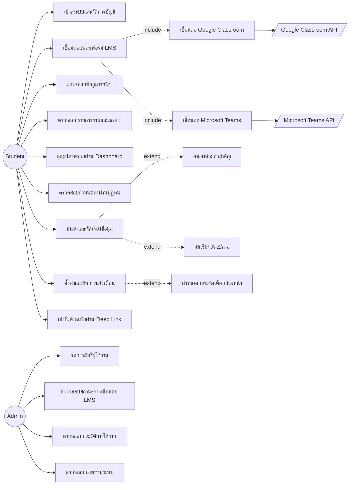

### 8.2 Use Case Description (ตัวแทนเคสหลัก)

| UC ID | ชื่อ | Actor | Precondition | Main Flow | Alternative Flow | Exception Flow | Postcondition |
|---|---|---|---|---|---|---|---|
| UC-02 | เชื่อมต่อแพลตฟอร์ม LMS | Student | ผู้ใช้ล็อกอินแล้ว | 1) เลือกแพลตฟอร์ม 2) Redirect ไป OAuth Consent 3) ผู้ใช้ยินยอม 4) Callback กลับระบบ 5) แลก token 6) บันทึกการเชื่อมต่อ | ผู้ใช้ยกเลิก consent → กลับหน้าก่อนหน้าพร้อมข้อความแจ้ง | Callback error / token exchange ล้มเหลว → แสดง error พร้อมปุ่มลองใหม่ | สถานะ Connected + เริ่ม sync ครั้งแรก |
| UC-04 | ตรวจสอบรายการงานและสถานะ | Student | เชื่อมต่ออย่างน้อย 1 แพลตฟอร์ม | 1) ระบบดึงข้อมูลจาก cache/sync ล่าสุด 2) คำนวณสถานะ 3) แสดง Task List | ไม่มีงาน → แสดง Empty State | Sync ล่าสุดล้มเหลว → แสดง banner ข้อมูลอาจไม่อัปเดต | ผู้ใช้เห็นสถานะงานล่าสุด |
| UC-08 | ตั้งค่าและรับการแจ้งเตือน | Student, Notification Dispatcher | มีงานที่ใกล้ครบกำหนด | 1) ผู้ใช้ตั้งเวลาล่วงหน้า 2) Scheduler ตรวจพบเงื่อนไขตรงเวลา 3) สร้างและส่งแจ้งเตือน | ผู้ใช้ปิดการแจ้งเตือนบางประเภท → ข้ามการส่ง | ส่งไม่สำเร็จ → เข้า retry queue สูงสุด 3 ครั้ง แล้วบันทึก failed | ผู้ใช้ได้รับแจ้งเตือนตามเวลาที่กำหนด |
| UC-11 | ตรวจสอบสถานะการเชื่อมต่อ LMS | Admin | Admin ล็อกอินแล้ว | 1) เปิดหน้า Connection Monitoring 2) ระบบแสดงรายการผู้ใช้พร้อมสถานะ | กรองตามสถานะ (Connected/Expired/Broken) | โหลดข้อมูลล้มเหลว → แสดง error + retry | Admin ทราบภาพรวมสถานะการเชื่อมต่อทั้งระบบ |

---

## 9. User Stories (ตัวแทนฟีเจอร์หลัก)

| Feature | User Story | Acceptance Criteria (Given/When/Then) |
|---|---|---|
| เชื่อมต่อ Google Classroom | As a student, I want to connect my Google Classroom account, so that my courses/assignments appear in this system automatically. | Given ผู้ใช้ล็อกอินแล้วและยังไม่เชื่อมต่อ, When กดปุ่ม "เชื่อมต่อ Google Classroom" และยินยอม OAuth, Then ระบบแสดงสถานะ "เชื่อมต่อแล้ว" และเริ่ม sync ข้อมูลภายใน 1 นาที |
| ติดตามสถานะงาน | As a student, I want to see the status of each assignment, so that I know what still needs to be submitted. | Given มีงานที่ยังไม่ถึงกำหนดส่ง, When เปิดหน้า Task List, Then ระบบแสดง tag "ยังไม่ส่ง" ตามสถานะจริงจากแพลตฟอร์มต้นทาง |
| ตั้งเวลาแจ้งเตือน | As a student, I want to set how far in advance I get notified, so that I have enough time to prepare. | Given ผู้ใช้เปิดหน้าตั้งค่าแจ้งเตือน, When กำหนด "แจ้งล่วงหน้า 2 ชั่วโมง" และบันทึก, Then ระบบส่งแจ้งเตือนที่เวลา due_date−2h พอดี |
| ดูปฏิทินกำหนดส่ง | As a student, I want to view deadlines in a calendar, so that I can plan my time. | Given มีงานหลายชิ้นในเดือนนี้, When เปิดหน้าปฏิทิน, Then แต่ละวันที่มีกำหนดส่งแสดง marker และคลิกดูรายละเอียดได้ |
| ค้นหา/เรียงลำดับ | As a student, I want to search and sort courses/assignments, so that I can find items quickly. | Given มีรายวิชา ≥ 10 รายการ, When พิมพ์คำค้นหรือเลือกเรียง A-Z, Then ผลลัพธ์กรอง/เรียงตามเงื่อนไขทันที (debounce ≤ 300ms) |
| Admin ตรวจสอบสถานะเชื่อมต่อ | As an admin, I want to see which users have broken LMS connections, so that I can proactively support them. | Given มีผู้ใช้ที่ token หมดอายุ, When เปิดหน้า Connection Monitoring, Then ผู้ใช้นั้นแสดงสถานะ "Expired" พร้อมวันที่หมดอายุ |
| Admin จัดการสิทธิ์ | As an admin, I want to assign roles to users, so that access control is enforced correctly. | Given เลือกผู้ใช้ 1 ราย, When เปลี่ยน role เป็น Admin และบันทึก, Then สิทธิ์มีผลทันทีในการเรียก API ครั้งถัดไป |

---

## 10. User Flow (ตัวแทนฟีเจอร์หลัก)

### 10.1 Flow: เชื่อมต่อแพลตฟอร์ม LMS ครั้งแรก
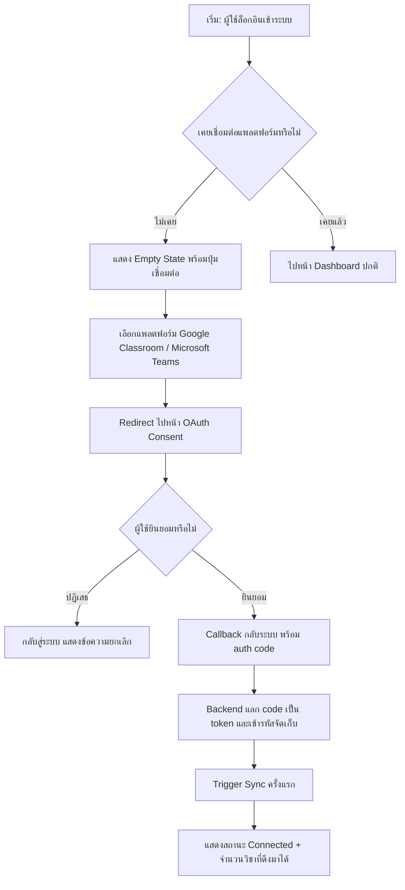

### 10.2 Flow: ติดตามและรับแจ้งเตือนงาน
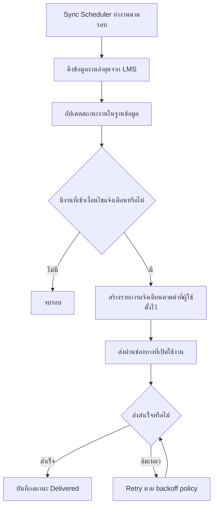

---

## 11. Activity Diagram: กระบวนการ Sync ข้อมูลจาก LMS

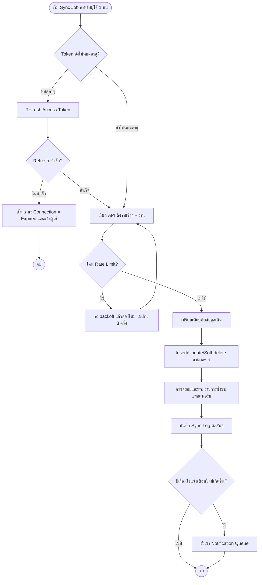

---

## 12. Sequence Diagram

### 12.1 OAuth Connect
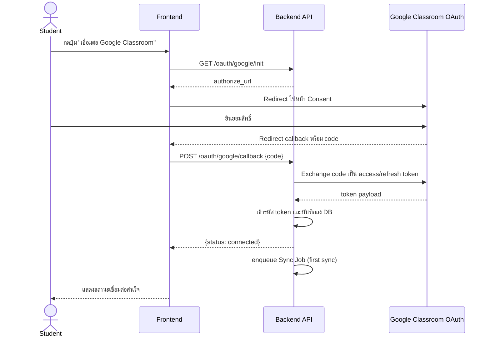

### 12.2 Sync Engine ดึงข้อมูล
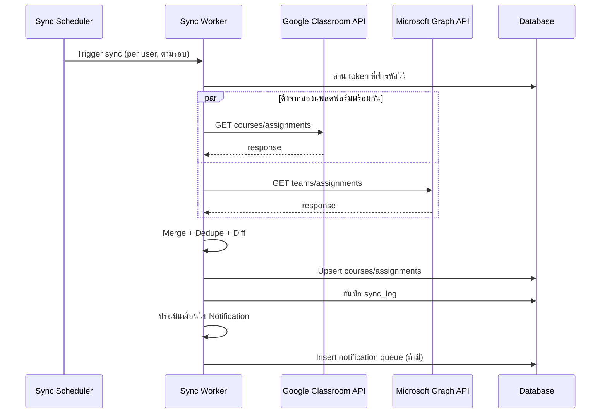

### 12.3 Notification Dispatch
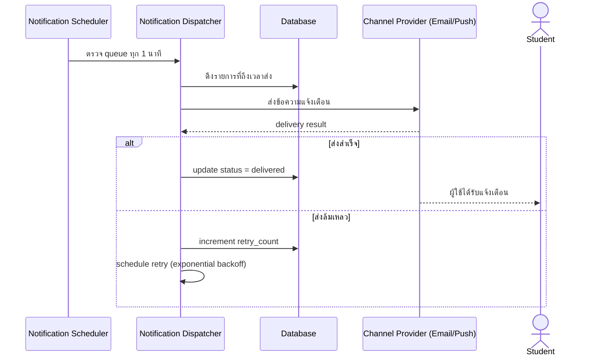

---

## 13. State Diagram

### 13.1 Assignment Status
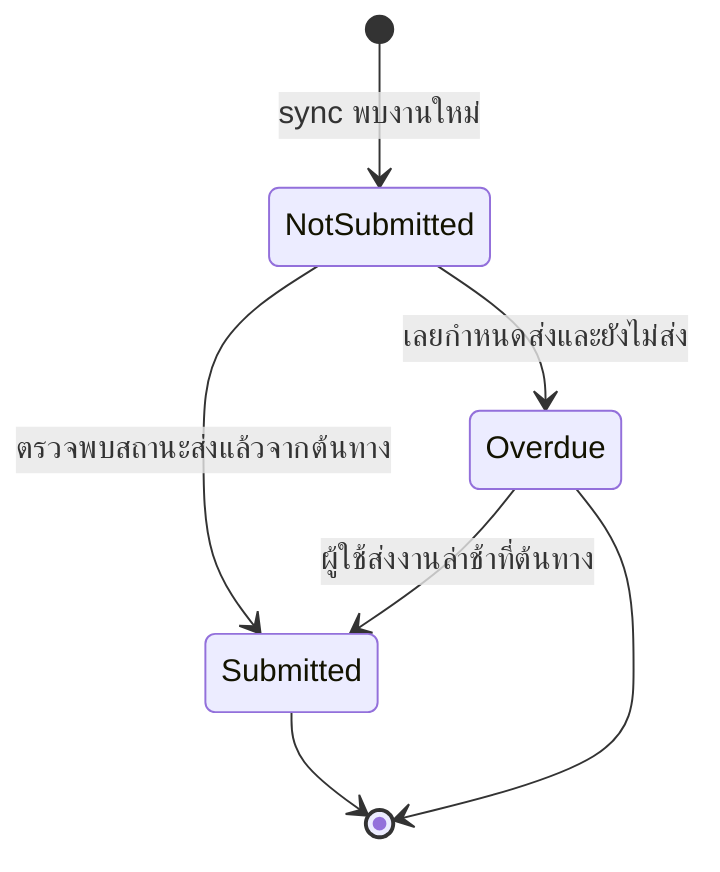

### 13.2 Notification Status
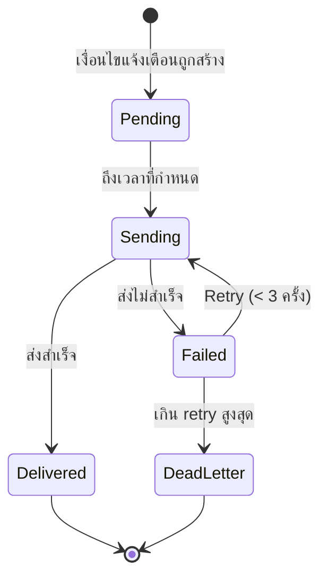

### 13.3 Connection Status
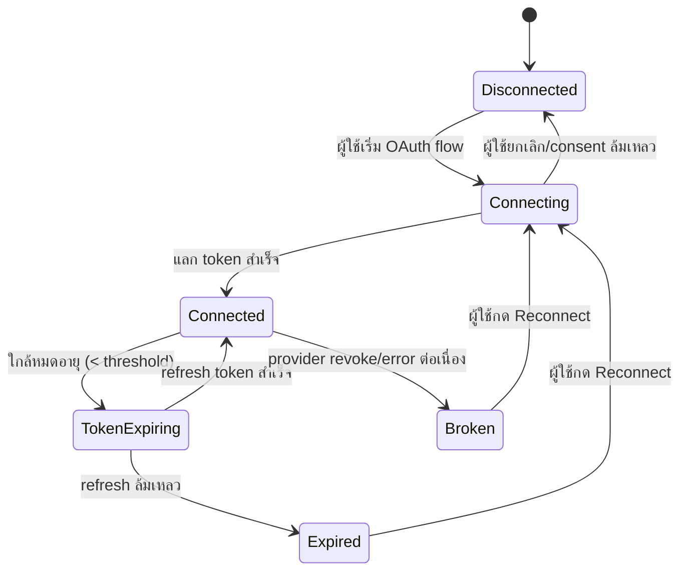

### 13.4 Synchronization Status
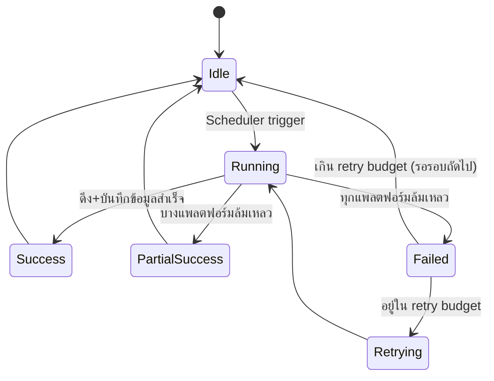

---

## 14. Database Design

> RDBMS: PostgreSQL แนะนำ (รองรับ JSONB สำหรับ raw payload ต้นทาง และ Row-Level constraints ที่แข็งแรง) — Normalized ถึง 3NF ยกเว้นตาราง log ที่เก็บ payload แบบ JSONB เพื่อความยืดหยุ่นในการ debug

| Table | Column | Datatype | Nullable | Default | PK/FK | Unique | หมายเหตุ |
|---|---|---|---|---|---|---|---|
| **users** | id | UUID | No | gen_random_uuid() | PK | - | |
| | email | VARCHAR(255) | No | - | - | Unique | |
| | password_hash | VARCHAR(255) | Yes | - | - | - | Null ได้ถ้าใช้ SSO ล้วน |
| | display_name | VARCHAR(150) | No | - | - | - | |ทก
| | is_active | BOOLEAN | No | true | - | - | สำหรับ FR-036 |
| | created_at | TIMESTAMPTZ | No | now() | - | - | |
| | updated_at | TIMESTAMPTZ | No | now() | - | - | |
| **roles** | id | SMALLINT | No | - | PK | - | seed: student, admin |
| | name | VARCHAR(50) | No | - | - | Unique | |
| **user_roles** | user_id | UUID | No | - | PK, FK→users.id | - | Composite PK (user_id, role_id) |
| | role_id | SMALLINT | No | - | PK, FK→roles.id | - | |
| **platforms** | id | SMALLINT | No | - | PK | - | seed: google_classroom, microsoft_teams |
| | name | VARCHAR(50) | No | - | - | Unique | |
| **oauth_connections** | id | UUID | No | gen_random_uuid() | PK | - | |
| | user_id | UUID | No | - | FK→users.id | - | |
| | platform_id | SMALLINT | No | - | FK→platforms.id | - | |
| | access_token_enc | TEXT | No | - | - | - | เข้ารหัส AES-256 |
| | refresh_token_enc | TEXT | Yes | - | - | - | เข้ารหัส AES-256 |
| | token_expires_at | TIMESTAMPTZ | Yes | - | - | - | |
| | status | VARCHAR(20) | No | 'connected' | - | - | connected/expired/broken |
| | connected_at | TIMESTAMPTZ | No | now() | - | - | |
| | | | | | | Unique(user_id, platform_id) | ผู้ใช้เชื่อมต่อได้ 1 บัญชี/แพลตฟอร์ม |
| **courses** | id | UUID | No | gen_random_uuid() | PK | - | |
| | user_id | UUID | No | - | FK→users.id | - | |
| | platform_id | SMALLINT | No | - | FK→platforms.id | - | |
| | external_course_id | VARCHAR(255) | No | - | - | Unique(platform_id, external_course_id, user_id) | ID จากต้นทาง |
| | name | VARCHAR(255) | No | - | - | - | |
| | is_deleted | BOOLEAN | No | false | - | - | soft delete เมื่อหายจากต้นทาง |
| **assignments** | id | UUID | No | gen_random_uuid() | PK | - | |
| | course_id | UUID | No | - | FK→courses.id | - | |
| | external_assignment_id | VARCHAR(255) | No | - | - | Unique(course_id, external_assignment_id) | |
| | title | VARCHAR(255) | No | - | - | - | |
| | description | TEXT | Yes | - | - | - | |
| | due_at | TIMESTAMPTZ | Yes | - | Index | - | อาจไม่มีกำหนดส่ง |
| | source_status | VARCHAR(30) | No | - | - | - | สถานะดิบจากต้นทาง |
| | computed_status | VARCHAR(20) | No | - | Index | - | not_submitted/submitted/overdue |
| | source_url | TEXT | No | - | - | - | Deep link |
| | is_deleted | BOOLEAN | No | false | - | - | |
| | last_synced_at | TIMESTAMPTZ | No | now() | - | - | |
| **notification_settings** | id | UUID | No | gen_random_uuid() | PK | - | |
| | user_id | UUID | No | - | FK→users.id | Unique | 1:1 กับ users |
| | lead_time_minutes | INTEGER | No | 60 | - | - | แปลงหน่วยนาที/ชม./วันเป็นนาทีตอนบันทึก |
| | new_assignment_enabled | BOOLEAN | No | true | - | - | |
| | due_soon_enabled | BOOLEAN | No | true | - | - | |
| | overdue_enabled | BOOLEAN | No | true | - | - | |
| | channel | VARCHAR(20) | No | 'push' | - | - | push/email/both |
| **notifications** | id | UUID | No | gen_random_uuid() | PK | - | |
| | user_id | UUID | No | - | FK→users.id | - | |
| | assignment_id | UUID | Yes | - | FK→assignments.id | - | |
| | type | VARCHAR(20) | No | - | - | - | new/due_soon/overdue |
| | status | VARCHAR(20) | No | 'pending' | Index | - | pending/sending/delivered/failed/dead_letter |
| | retry_count | SMALLINT | No | 0 | - | - | |
| | scheduled_at | TIMESTAMPTZ | No | - | Index | - | |
| | delivered_at | TIMESTAMPTZ | Yes | - | - | - | |
| **sync_logs** | id | UUID | No | gen_random_uuid() | PK | - | |
| | user_id | UUID | No | - | FK→users.id | - | |
| | platform_id | SMALLINT | No | - | FK→platforms.id | - | |
| | status | VARCHAR(20) | No | - | - | success/partial/failed | 
| | items_synced | INTEGER | No | 0 | - | - | |
| | error_detail | JSONB | Yes | - | - | - | |
| | started_at | TIMESTAMPTZ | No | - | - | - | |
| | finished_at | TIMESTAMPTZ | Yes | - | - | - | |
| **audit_logs** | id | UUID | No | gen_random_uuid() | PK | - | |
| | actor_user_id | UUID | Yes | - | FK→users.id | - | |
| | action | VARCHAR(100) | No | - | Index | - | เช่น login, connect_platform, role_change |
| | target | VARCHAR(255) | Yes | - | - | - | |
| | metadata | JSONB | Yes | - | - | - | |
| | created_at | TIMESTAMPTZ | No | now() | Index | - | |

**Relationships**: users 1—N oauth_connections; users 1—N courses; courses 1—N assignments; users 1—1 notification_settings; users 1—N notifications; assignments 1—N notifications; users 1—N sync_logs; users 1—N audit_logs (as actor); users M—N roles ผ่าน user_roles

**Normalization**: ออกแบบถึง 3NF — แยก `platforms`/`roles` เป็น lookup table เพื่อลด redundancy และรองรับการเพิ่มแพลตฟอร์ม/บทบาทใหม่โดยไม่แก้ schema; ตาราง log คง JSONB สำหรับ payload ที่ไม่ fix โครงสร้าง (denormalized โดยตั้งใจเพื่อ debug/analytics)

---

## 15. Data Dictionary (ตัวแทนฟิลด์สำคัญ)

| Field | ความหมาย | Datatype | Validation | ตัวอย่าง |
|---|---|---|---|---|
| users.email | อีเมลสำหรับล็อกอิน | VARCHAR(255) | รูปแบบ email, unique | student01@example.ac.th |
| oauth_connections.status | สถานะการเชื่อมต่อ | ENUM-like VARCHAR | ค่าที่อนุญาต: connected, expired, broken | connected |
| assignments.computed_status | สถานะงานที่คำนวณแล้ว | VARCHAR(20) | ค่าที่อนุญาต: not_submitted, submitted, overdue | overdue |
| assignments.due_at | กำหนดส่งงาน | TIMESTAMPTZ | ต้องเป็น ISO8601, timezone-aware | 2026-08-15T23:59:00+07:00 |
| notification_settings.lead_time_minutes | เวลาล่วงหน้าก่อนแจ้งเตือน | INTEGER | 1 ≤ ค่า ≤ 43200 (30 วัน) | 120 |
| notifications.status | สถานะการส่งแจ้งเตือน | VARCHAR(20) | pending/sending/delivered/failed/dead_letter | delivered |
| sync_logs.error_detail | รายละเอียด error เชิงลึก | JSONB | โครงสร้างอิสระ ต้องมี key `message` | {"message":"rate_limited","retry_after":30} |

---

## 16. ER Diagram

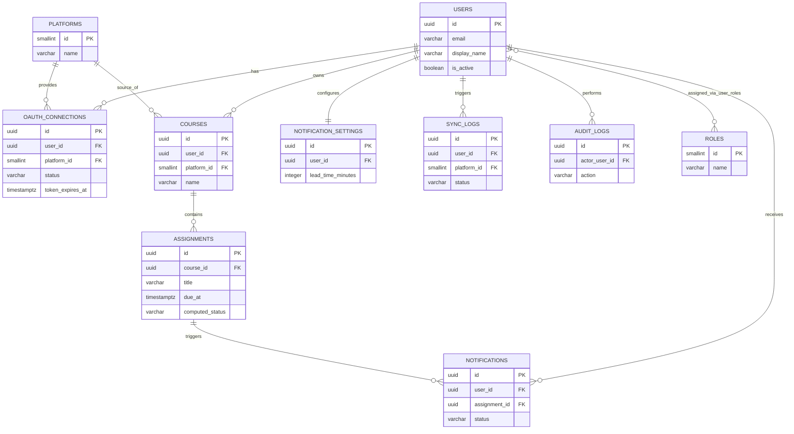

---

## 17. API Design (ตัวแทน Endpoint หลัก)

| Method | Endpoint | Auth | Request | Response | Status Code | หมายเหตุ |
|---|---|---|---|---|---|---|
| POST | /api/v1/auth/login | Public | {email, password} | {access_token, refresh_token} | 200, 401 | Rate limit 5 req/min/IP |
| POST | /api/v1/auth/logout | Bearer | - | {} | 204 | invalidate refresh token |
| GET | /api/v1/me | Bearer | - | {user profile} | 200, 401 | |
| GET | /api/v1/oauth/google/init | Bearer | - | {authorize_url} | 200 | |
| POST | /api/v1/oauth/google/callback | Bearer | {code} | {status: connected} | 200, 400, 502 | 502 หาก Google API ล้มเหลว |
| GET | /api/v1/oauth/teams/init | Bearer | - | {authorize_url} | 200 | |
| POST | /api/v1/oauth/teams/callback | Bearer | {code} | {status: connected} | 200, 400, 502 | |
| DELETE | /api/v1/connections/{platform} | Bearer | - | {} | 204, 404 | |
| GET | /api/v1/courses | Bearer | ?search=&sort=asc\|desc | {courses[]} | 200 | Cache 5 นาที |
| GET | /api/v1/assignments | Bearer | ?status=&search=&sort=&page= | {assignments[], pagination} | 200 | Pagination + Filtering + Sorting |
| GET | /api/v1/assignments/{id} | Bearer | - | {assignment detail} | 200, 404 | |
| POST | /api/v1/sync/trigger | Bearer | - | {job_id} | 202, 429 | 429 ถ้าเกิน rate limit manual refresh |
| GET | /api/v1/dashboard/summary | Bearer | ?range= | {counts, chart_data} | 200 | |
| GET | /api/v1/calendar | Bearer | ?month=&year= | {assignments_by_date} | 200 | |
| GET | /api/v1/notifications/settings | Bearer | - | {settings} | 200 | |
| PUT | /api/v1/notifications/settings | Bearer | {lead_time_minutes, channel, ...} | {settings} | 200, 422 | Validation error code 422 |
| GET | /api/v1/notifications | Bearer | ?page= | {notifications[]} | 200 | Notification History |
| GET | /api/v1/admin/users | Bearer(Admin) | ?search=&page= | {users[]} | 200, 403 | |
| PATCH | /api/v1/admin/users/{id}/role | Bearer(Admin) | {role} | {user} | 200, 403, 404 | |
| PATCH | /api/v1/admin/users/{id}/status | Bearer(Admin) | {is_active} | {user} | 200, 403 | |
| GET | /api/v1/admin/connections | Bearer(Admin) | ?status= | {connections[]} | 200, 403 | |
| GET | /api/v1/admin/audit-logs | Bearer(Admin) | ?user_id=&date_from=&date_to= | {logs[]} | 200, 403 | |
| GET | /api/v1/admin/system/health | Bearer(Admin) | - | {status, sync_success_rate, queue_depth} | 200, 403 | |

*(ทุก endpoint ที่ต้อง Authentication ใช้ Bearer JWT ใน Header `Authorization`; Error Response มาตรฐาน: `{code, message, details}`)*

---

## 18. External Integration

| ระบบ | วิธีเชื่อมต่อ | ข้อมูลที่ดึง | ข้อจำกัด |
|---|---|---|---|
| Google Classroom | OAuth2 + Google Classroom API (courses.readonly, coursework.students.readonly) | รายวิชา, งานที่มอบหมาย, สถานะการส่ง | Quota ต่อ project/user; ต้องขอ scope ขั้นต่ำที่จำเป็น |
| Microsoft Teams / Microsoft Graph | OAuth2 (Microsoft identity platform) + Graph API (education endpoints) | Class team, assignments | Throttling ตาม Graph API limits; ต้อง consent จาก Azure AD tenant/admin ในบางสถาบัน |
| Email Provider | SMTP/API (เช่น SendGrid) | ส่งอีเมลแจ้งเตือน | Bounce/Spam handling |
| Push Notification Service | Web Push / FCM | ส่ง push แจ้งเตือน | ต้องขอ permission จากเบราว์เซอร์/อุปกรณ์ |
| OAuth (Google/Microsoft) | Authorization Code Flow + PKCE | Access/Refresh token | Token expiry ต้องจัดการ refresh ล่วงหน้า |
| Webhook (เสนอเพิ่มในอนาคต) | Google Classroom Push Notifications / Graph change notifications | เหตุการณ์เปลี่ยนแปลงแบบ real-time | ลดภาระ polling เมื่อ Provider รองรับ |

---

## 19. Background Jobs

| Job | Trigger | หน้าที่ | Retry/DLQ |
|---|---|---|---|
| Sync Scheduler | Cron ทุก 5-15 นาที ต่อผู้ใช้ที่ active | เรียก Sync Engine ต่อผู้ใช้ที่เชื่อมต่อแพลตฟอร์ม | Retry 3 ครั้ง (exponential backoff) → DLQ + sync_log status=failed |
| Token Refresh Job | Cron ทุก 10 นาที ตรวจ token ที่ใกล้หมดอายุ (< 15 นาที) | Refresh token ล่วงหน้าก่อนหมดอายุจริง | ถ้าล้มเหลว → ตั้ง connection.status=expired และแจ้ง user |
| Notification Dispatcher | Cron ทุก 1 นาที | ดึง notification ที่ scheduled_at ≤ now และยังไม่ delivered แล้วส่ง | Retry 3 ครั้ง → dead_letter |
| Sync Queue Worker | Message Queue (เช่น SQS/RabbitMQ) consumer | ประมวลผล manual/first sync job แบบ async | Dead Letter Queue หลัง retry ครบ |
| Log Retention Cleanup | Cron รายวัน | ลบ/archive sync_logs, notifications เก่ากว่านโยบายเก็บข้อมูล | - |

---

## 20. Notification Flow

| Trigger | Channel | Priority | Retry | Delivery Status |
|---|---|---|---|---|
| งานใหม่ถูก sync เข้ามา | Push/Email ตามที่ผู้ใช้เลือก | Normal | 3 ครั้ง, backoff 1m/5m/15m | pending→sending→delivered/failed |
| ใกล้ครบกำหนด (ตาม lead time ที่ตั้งไว้) | Push/Email | High | 3 ครั้ง | เช่นเดียวกัน |
| เกินกำหนดส่ง | Push/Email | High | 3 ครั้ง | เช่นเดียวกัน |
| Connection Broken (แจ้งผู้ใช้ให้ reconnect) | In-app banner + Email | Critical | ส่งซ้ำทุก 24 ชม.จนกว่าจะแก้ไข | - |

---

## 21. UI Screens

| Screen | Components | Actions | Permissions |
|---|---|---|---|
| Login | Form, Logo | Login, Forgot password | Public |
| Onboarding/Connect Platform | Card ×2 (Google/Teams), Empty State illustration | Connect | Student |
| Dashboard | Chart (bar/donut), Summary Cards, Upcoming list | Drill-down, Refresh | Student |
| Course List | Table/Grid, Search bar | Search, Sort, เปิด Course Detail | Student |
| Assignment List | Table, Filter chips, Status Badge | Search, Filter, Sort, Refresh | Student |
| Assignment Detail | Detail Card, Deep-link Button | เปิดลิงก์ต้นทาง | Student |
| Calendar View | Month Grid, Marker, Day Detail Modal | Navigate month, คลิกดูรายละเอียด | Student |
| Notification Settings | Time Picker, Toggle switches, Channel selector | บันทึกค่ากำหนด | Student |
| Notification History | List, Status Badge | ดูย้อนหลัง | Student |
| Account Settings | Form (โปรไฟล์), Connection status list | แก้ไขโปรไฟล์, Disconnect/Reconnect | Student |
| Admin Login | Form | Login | Admin |
| Admin - User Management | Table, Search, Role selector | Search, Assign role, Deactivate | Admin |
| Admin - Connection Monitoring | Table, Filter by status | Filter, Flag/Reconnect prompt | Admin |
| Admin - Audit Log | Table, Filter (user/date/action) | Filter, (Export - เสนอเพิ่ม) | Admin |
| Admin - System Overview | Health cards, Sync success rate chart | Refresh, Drill-down | Admin |

---

## 22. Reusable Components

| Component | ใช้ในหน้า |
|---|---|
| Button | ทุกหน้า |
| Card | Dashboard, Onboarding |
| Modal/Dialog | Calendar day detail, Confirm disconnect |
| Table | Course List, Assignment List, Admin screens |
| Pagination | Assignment List, Admin User List |
| SearchBar | Course/Assignment List |
| FilterDropdown/Chips | Assignment List (status/platform), Audit Log |
| CalendarWidget | Calendar View |
| Toast | Save success/error ทุกหน้า |
| Skeleton Loading | ทุกหน้าที่โหลดข้อมูลจาก API |
| Badge/StatusTag | Task status, Connection status |
| Avatar | Header/Profile |
| Chart (bar/donut) | Dashboard, Admin System Overview |
| Timeline | Task History (เสนอเพิ่ม) |
| ConnectionStatusIndicator | Onboarding, Account Settings, Admin |

---

## 23. Permissions (Role Matrix)

| Action | Student | Admin |
|---|---|---|
| จัดการบัญชีตนเอง | CRUD (เฉพาะของตน) | - |
| เชื่อมต่อ/ยกเลิกเชื่อมต่อ LMS ของตนเอง | CRUD | - |
| ดูรายวิชา/งานของตนเอง | View | - |
| ตั้งค่าการแจ้งเตือนของตนเอง | CRUD | - |
| จัดการสิทธิ์ผู้ใช้ (Role) | - | Configure |
| ดูสถานะการเชื่อมต่อของผู้ใช้ทั้งหมด | - | View |
| ดู Audit Log | - | View |
| ดูภาพรวมระบบ | - | View |
| Deactivate ผู้ใช้ | - | Configure |
| Export ข้อมูล (เสนอเพิ่ม) | - | Export |

> **ข้อเสนอ**: เอกสารต้นฉบับระบุเพียง 2 บทบาท ทีมแนะนำเพิ่มบทบาท **Super Admin** แยกจาก Admin ทั่วไป เพื่อจำกัดสิทธิ์การจัดการ Admin คนอื่น (ป้องกัน privilege escalation) — เป็น Should-have ไม่ใช่ Must-have ในเวอร์ชันแรก

---

## 24. Business Rules

1. งานจะถูกจัดสถานะ "เกินกำหนด" ก็ต่อเมื่อ `now() > due_at` **และ** `source_status ≠ submitted`
2. หากรายวิชาเดียวกันปรากฏทั้งใน Google Classroom และ Microsoft Teams (กรณีสถาบันใช้คู่ขนาน) ระบบต้องไม่รวมเป็นรายวิชาเดียวโดยอัตโนมัติ เว้นแต่ชื่อ+รหัสวิชาตรงกันตามกฎ matching ที่กำหนด (ป้องกันการรวมผิดวิชา)
3. Lead time การแจ้งเตือนต้องอยู่ในช่วง 1 นาที ถึง 30 วัน
4. การ Sort รองรับเฉพาะ A-Z และ ก-ฮ ตามสเปกต้นฉบับ (ไม่รองรับเรียงตามวันที่ในเวอร์ชันแรก แม้จะเป็นความต้องการโดยนัยที่พบบ่อย — เสนอเป็น Should-have เพิ่มเติม)
5. Token ที่หมดอายุต้องพยายาม Refresh อัตโนมัติก่อนเปลี่ยนสถานะเป็น Expired
6. Admin ไม่สามารถเห็นเนื้อหางาน/ไฟล์แนบของผู้ใช้ ทำได้เพียงเห็น metadata สถานะการเชื่อมต่อ (Privacy by design)
7. การแจ้งเตือนซ้ำสำหรับเหตุการณ์เดียวกัน (เช่น due_soon) ต้องส่งเพียงครั้งเดียวต่อ assignment ต่อ threshold
8. Assignment ที่หายไปจากต้นทาง (ถูกลบ) ต้อง soft-delete ไม่ hard-delete ทันที เพื่อรักษาความสมบูรณ์ของ Notification/Audit History

---

## 25. Security

- **Threat Model**: OAuth token theft, session hijacking, IDOR ระหว่างผู้ใช้ (เข้าถึงข้อมูลผู้ใช้อื่น), Admin privilege escalation, replay attack บน callback URL
- **OWASP Top 10 Mapping**: Broken Access Control → RBAC ทุก endpoint + ทดสอบ IDOR; Injection → parameterized query/ORM; Cryptographic Failures → เข้ารหัส token at rest; SSRF → allowlist domain สำหรับ OAuth callback
- **OAuth2**: Authorization Code + PKCE, ตรวจสอบ `state` parameter ป้องกัน CSRF ระหว่าง OAuth flow
- **JWT**: Access token อายุสั้น (15 นาที), Refresh token rotation พร้อม revoke list
- **CSRF**: ป้องกันในฟอร์ม Admin panel ด้วย CSRF token (สำหรับ cookie-based session ถ้าใช้)
- **XSS**: Escape ข้อมูลจาก LMS (ชื่องาน/รายวิชา) ก่อน render เพราะเป็น user-generated content จากภายนอก
- **SQL Injection**: ใช้ ORM/parameterized queries เท่านั้น
- **Rate Limit**: login, manual refresh, admin endpoints ทั้งหมดมี rate limit
- **Encryption**: token เข้ารหัส AES-256, TLS 1.2+ ทุกการสื่อสาร
- **Secrets Management**: OAuth client secret เก็บใน Secret Manager ไม่ hardcode
- **Audit**: ทุก action ของ Admin ต้องถูกบันทึกใน audit_logs แบบ immutable (append-only)

---

## 26. Logging

| Log Type | เนื้อหา |
|---|---|
| Audit Log | login/logout, connect/disconnect platform, admin role change, deactivate user |
| Application Log | request/response summary, error stack (structured JSON) |
| API/Integration Log | เรียก Google/Microsoft API: endpoint, latency, status code, rate-limit headers |
| Security Log | failed login attempts, token refresh failures, ผิดปกติ (เช่น login จาก IP ใหม่) |
| System Log | health check, resource utilization, job scheduler heartbeat |
| Sync Log | ผลลัพธ์ sync ต่อ user/platform ตามตาราง sync_logs |

---

## 27. Monitoring

- **Health Check**: `/health` endpoint ตรวจ DB, Queue, external API reachability
- **Metrics**: sync success rate, notification delivery rate, API latency (P50/P95/P99), queue depth, active connections per platform
- **Tracing**: Correlation ID ต่อ request/sync job เพื่อ trace ข้าม service (Backend ↔ Sync Worker ↔ Provider API)
- **Alert**: แจ้งทีม DevOps เมื่อ sync failure rate > 5% ใน 15 นาที, queue depth ค้างเกิน threshold, token refresh failure rate สูงผิดปกติ (อาจบ่งชี้ Provider เปลี่ยน API)

---

## 28. Error Handling

| ประเภท | แนวทางจัดการ |
|---|---|
| API Error (Provider ล่ม/timeout) | Retry with backoff, แสดง banner "ข้อมูลอาจไม่เป็นปัจจุบัน" ที่ UI |
| UI Error (render/JS error) | Error Boundary, fallback UI พร้อมปุ่ม reload |
| Retry | Exponential backoff มาตรฐาน 1m/5m/15m สูงสุด 3 ครั้ง |
| Offline (ผู้ใช้ไม่มีเน็ต) | แสดงข้อมูล cache ล่าสุด + indicator "Offline" |
| Timeout | Provider API timeout 10s, internal API timeout 5s |
| Duplicate | Idempotency key สำหรับ manual sync trigger |
| Conflict | Diff-based upsert, last-write-wins ตาม `last_synced_at` |

---

## 29. Edge Cases

| กรณี | ผลกระทบ | แนวทางรับมือ |
|---|---|---|
| Google/Microsoft API ล่ม | Sync ล้มเหลวทั้งชุด | แสดงข้อมูล cache เดิม + retry ตาม schedule ถัดไป |
| Network หลุดระหว่าง OAuth callback | เชื่อมต่อค้างสถานะ pending | Timeout callback → auto-cancel และให้เริ่มใหม่ |
| Token หมดอายุระหว่าง sync กำลังทำงาน | Sync บางส่วนล้มเหลว | Refresh token กลางคัน หากไม่ได้ให้หยุดและ mark partial |
| งานซ้ำข้ามแพลตฟอร์ม (Duplicate) | ผู้ใช้เห็นงานเดิมสองรายการ | Dedup rule ตาม external_id + course matching |
| Sync Job สองรอบทับกัน (Race Condition) | ข้อมูลไม่สอดคล้อง/deadlock | ใช้ Distributed Lock ต่อ user ระหว่าง sync |
| Due date ถูกแก้ไขหลัง notification ถูกจองคิวแล้ว | แจ้งเตือนผิดเวลา | เมื่อ sync พบ due_at เปลี่ยน ให้ re-evaluate/ยกเลิก notification เดิมที่ pending |
| Rate limit จาก Provider เกิน quota | Sync ล่าช้าทั้งระบบ | Backoff + จัดคิว sync แบบ staggered ต่อผู้ใช้ |
| ชื่อวิชา/งานภาษาไทยมีปัญหา encoding | แสดงผลตัวอักษรเพี้ยน | บังคับ UTF-8 ตลอด pipeline, ทดสอบกับ locale ไทย |
| Timezone ต่างกันระหว่างสถาบัน/ผู้ใช้ | กำหนดส่ง/แจ้งเตือนคลาดเคลื่อน | เก็บทุก timestamp เป็น UTC ใน DB, แปลงตาม timezone ผู้ใช้ที่ UI |
| Database Down | ทั้งระบบใช้งานไม่ได้ | Health check + failover/replica, แสดง Maintenance page |
| Cache Miss ต่อเนื่อง | Load Provider API ถี่เกินจำเป็น | Cache warm-up job + monitor cache hit rate |
| ผู้ใช้เพิกถอน Consent จากฝั่ง Google/Microsoft โดยตรง (ไม่ผ่านระบบ) | Sync ครั้งถัดไป error 401/403 | ตรวจจับ error code → ตั้งสถานะ Broken + แจ้งผู้ใช้ให้ reconnect |

---

## 30. Test Cases (ตัวแทน)

| ระดับ | ตัวอย่าง Test Case |
|---|---|
| Unit Test | คำนวณ `computed_status` ถูกต้องตามเงื่อนไข due_at/source_status ทุก combination |
| Unit Test | Validate `lead_time_minutes` ปฏิเสธค่านอกช่วง 1–43200 |
| Integration Test | Mock Google Classroom API แล้วตรวจว่า Sync Engine upsert ข้อมูลถูกต้อง รวมถึง dedupe |
| Integration Test | ทดสอบ Token Refresh Job เมื่อ token ใกล้หมดอายุ ต้อง refresh ก่อน sync จริง |
| System Test | End-to-end: เชื่อมต่อ → sync → เกิด notification → ส่งสำเร็จ ครบ pipeline |
| System Test | Sync ล้มเหลวจาก provider timeout → retry ตาม backoff → เข้า DLQ เมื่อเกิน limit |
| UAT | นักศึกษาเชื่อมต่อบัญชีจริงและยืนยันว่าเห็นงานจริงตรงกับ Classroom/Teams |
| Acceptance Test | Admin มองเห็นสถานะ Connection ของผู้ใช้ทดสอบเปลี่ยนเป็น Expired ภายใน 1 นาทีหลัง token หมดอายุจำลอง |

---

## 31. Future Features

| ฟีเจอร์ | เหตุผล |
|---|---|
| รองรับ Moodle / Canvas LMS เพิ่มเติม | ขยายฐานผู้ใช้ไปยังสถาบันที่ใช้ LMS อื่น |
| แจ้งเตือนผ่าน LINE OA | LINE เป็นช่องทางที่นักศึกษาไทยใช้บ่อยกว่าอีเมล |
| AI จัดลำดับความสำคัญงานอัตโนมัติ | ต่อยอดจาก Cognitive Load Theory ที่กล่าวถึงในเอกสาร เพื่อลดภาระการตัดสินใจของผู้เรียน |
| Analytics พฤติกรรมการเรียน/ส่งงาน | ใช้ข้อมูลสถิติที่สะสมช่วยผู้เรียนวางแผนได้ดีขึ้น |
| Real-time update ผ่าน Webhook แทน Polling | ลด latency และภาระ Provider API |
| Mobile Application (Native) | เพิ่มช่องทาง push notification ที่เสถียรกว่า web push |
| Export ข้อมูล (CSV/PDF) สำหรับ Admin | รองรับการรายงานต่อผู้บริหารสถาบัน |
| Group/Team Assignment Support | เอกสารต้นฉบับยังไม่ครอบคลุมงานกลุ่ม ซึ่งพบได้จริงใน LMS ทั้งสอง |

---

## 32. Priority (MoSCoW)

| ระดับ | รายการ |
|---|---|
| **Must** | Login, OAuth Connect (Google/Teams), Sync Engine, Task List + Status, Dashboard, Notification (setting+delivery), Deep Link, Admin: Role Management, Connection Monitoring |
| **Should** | Calendar View, Search & Sort (A-Z/ก-ฮ), Notification History, Audit Log, System Overview (Admin) |
| **Could** | Filter by status/platform, Multi-channel notification (email+push พร้อมกัน), Export ข้อมูล |
| **Won't (เวอร์ชันแรก)** | การส่งงานผ่านระบบ, การให้เกรด, รองรับ LMS อื่นนอกเหนือ Google/Microsoft, Mobile Native App, AI Prioritization |

---

## 33. Feature Matrix (ตัวแทน)

| Module | Feature | Function | FR | NFR | API | Database | UI | Priority | Complexity | Dependency |
|---|---|---|---|---|---|---|---|---|---|---|
| Platform Integration | Connect Google Classroom | OAuth flow, token store | FR-004 | Security, Reliability | /oauth/google/* | oauth_connections | Onboarding | Must | High | Google API credentials |
| Sync Engine | Background Sync | Fetch/Diff/Upsert/Dedup | FR-023, FR-031, FR-032 | Performance, Reliability | (internal job) | courses, assignments, sync_logs | - | Must | High | OAuth connection ต้องสำเร็จก่อน |
| Task Tracking | Task List | Status compute, list render | FR-012, FR-013 | Performance | /assignments | assignments | Assignment List | Must | Medium | Sync Engine |
| Notification | Notification Settings | Set lead time, channel | FR-018 | Usability | /notifications/settings | notification_settings | Notification Settings | Must | Low | - |
| Notification | Notification Dispatch | Queue+Send+Retry | FR-019~021, FR-037 | Reliability | (internal job) | notifications | Notification History | Must | High | Notification Settings, Sync Engine |
| Dashboard | Workload Overview | Aggregate+Chart | FR-014 | Performance | /dashboard/summary | assignments (aggregate) | Dashboard | Must | Medium | Task Tracking |
| Calendar | Month View | Map dates | FR-015 | Usability | /calendar | assignments | Calendar View | Should | Medium | Task Tracking |
| Search & Sort | Search/Sort | Search, Sort A-Z/ก-ฮ | FR-016, FR-017 | Performance | /courses, /assignments | courses, assignments | List screens | Should | Low | - |
| Administration | Role Management | Assign/revoke role | FR-026 | Authorization, Audit Trail | /admin/users/{id}/role | user_roles | Admin User Mgmt | Must | Medium | RBAC framework |
| Connection Monitoring | View All Connections | List+filter | FR-027 | Monitoring | /admin/connections | oauth_connections | Admin Connection Monitoring | Must | Low | Sync Engine status data |
| Audit Logging | View Audit Log | List+filter | FR-028 | Audit Trail, Compliance | /admin/audit-logs | audit_logs | Admin Audit Log | Should | Low | ต้องมี logging middleware ทุก action |

---

## 34. Requirement Traceability Matrix (ตัวแทน)

| Business Requirement | Functional Requirement | Feature | Function | API | Database | UI | Test Case |
|---|---|---|---|---|---|---|---|
| ลดความกระจัดกระจายของข้อมูลการเรียน | FR-008, FR-010 | Course/Assignment Aggregation | Sync fetch+merge | GET /courses, /assignments | courses, assignments | Course List, Assignment List | Integration Test: Sync merge ถูกต้อง |
| ลดการพลาดกำหนดส่งงาน | FR-018~021 | Notification | Trigger evaluation, dispatch | GET/PUT /notifications/settings | notification_settings, notifications | Notification Settings, History | System Test: end-to-end notification |
| ลดภาระการสลับระบบของผู้เรียน | FR-004, FR-005, FR-022 | Platform Integration, Deep Link | OAuth connect, redirect | /oauth/*/init, /callback | oauth_connections | Onboarding, Assignment Detail | Integration Test: OAuth flow |
| สนับสนุนการบริหารเวลา | FR-014, FR-015 | Dashboard, Calendar | Aggregate, render chart/calendar | /dashboard/summary, /calendar | assignments (aggregate) | Dashboard, Calendar View | UAT: ผู้เรียนวางแผนจาก Dashboard ได้ |
| การกำกับดูแลระบบโดยผู้ดูแล | FR-026~029 | Administration, Monitoring, Audit | Role assign, status view, log view | /admin/* | user_roles, oauth_connections, audit_logs | Admin screens | Acceptance Test: Admin เห็นสถานะครบถ้วน |

---

## หมายเหตุปิดท้าย (Risk & Recommendations)

1. **Scalability Risk**: หากผู้ใช้เพิ่มขึ้นมาก การ Poll ข้อมูลจาก Google/Microsoft เป็นระยะจะชนกับ Rate Limit ได้ง่าย → แนะนำเปลี่ยนไปใช้ Webhook/Push Notification จาก Provider เมื่อรองรับ และแยก Sync Worker เป็น Microservice อิสระจาก Core API เพื่อ scale ตามโหลดที่ต่างกัน
2. **Security Risk**: Token ของผู้ใช้จำนวนมากที่เก็บไว้เป็นเป้าหมายที่มีมูลค่าสูงหากรั่วไหล → บังคับเข้ารหัสระดับ column + หมุนเวียนกุญแจเข้ารหัส (Key Rotation) และจำกัด scope OAuth ให้น้อยที่สุดเท่าที่จำเป็น (Principle of Least Privilege)
3. **Microservice Candidate**: แนะนำแยก **Sync Engine** และ **Notification Dispatcher** ออกเป็น service อิสระจาก Core API เนื่องจากมี lifecycle, scaling pattern และ failure mode ต่างจาก CRUD API ทั่วไปอย่างชัดเจน
4. ขอบเขตเอกสารต้นฉบับยังไม่ระบุ Analytics/Reporting และ Group Assignment — เสนอไว้ใน §31 เพื่อพิจารณาในเฟสถัดไป
