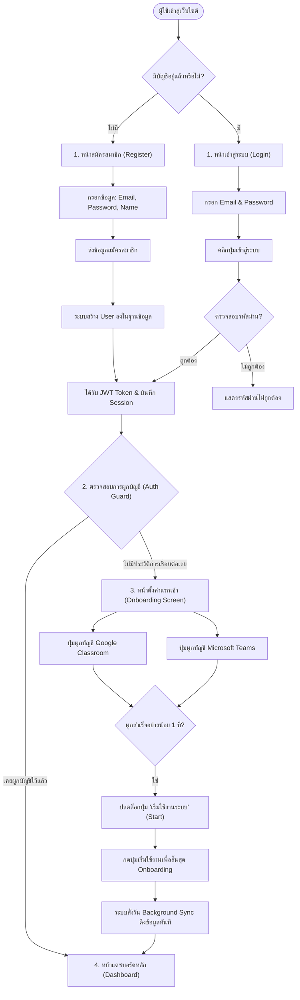
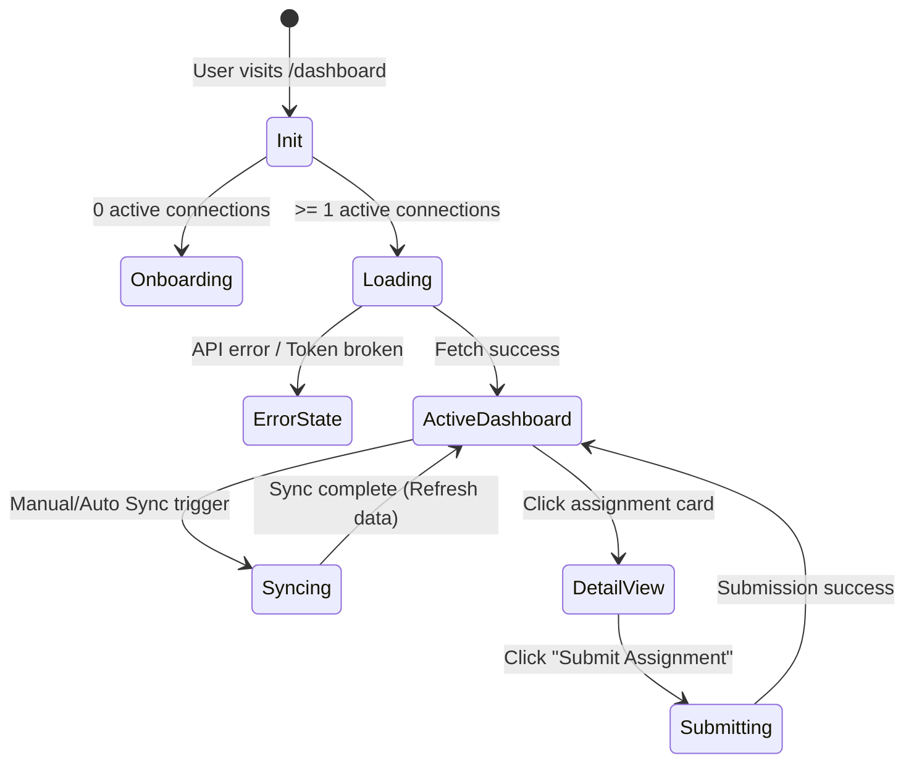
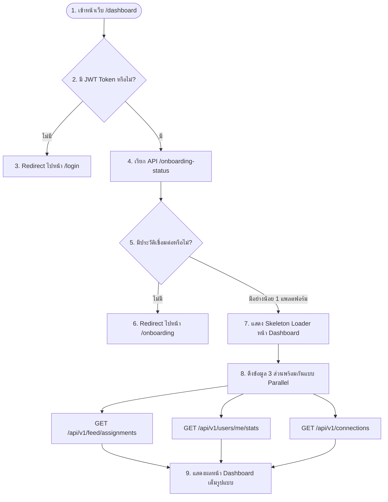
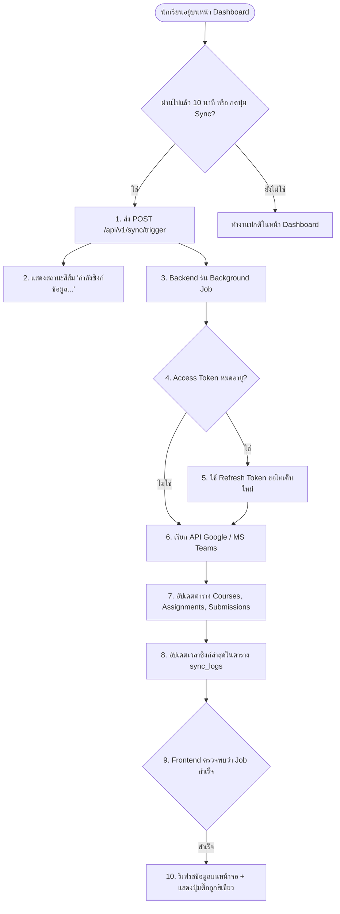

# Dashboard Screen Workflow & Logic Design

This document details the state machine, API interactions, and user flows when navigating and interacting with the Unified Dashboard.

---
## 1. End-to-End User Lifecycle Flow (ตั้งแต่หน้า Login/Register)

นี่คือแผนภาพแสดงขั้นตอนการทำงานทั้งหมด ตั้งแต่ผู้ใช้เปิดเข้ามาที่หน้าแรกของระบบ สมัครสมาชิก เข้าสู่ระบบ ผ่านขั้นตอนการตั้งค่า และเข้าใช้งานหน้า Dashboard



---

## 2. Dashboard State Machine (ภาพรวมสถานะหน้าจอ)

The Dashboard operates on four primary states:



---

## 2. Step-by-Step Flow Diagrams

### Flow A: Initial Page Load (การโหลดหน้าจอครั้งแรก)
This flow ensures the page handles authentication, checks connection status, and loads data with smooth skeletons.



---

### Flow B: Background Synchronization (การซิงก์ข้อมูลการเรียนล่วงหน้า)
To ensure the dashboard always has up-to-date data from Google and Microsoft, we use a smart sync flow:



---

### Flow C: View & Submit Assignment (การดูและการส่งการบ้าน)
When a student interacts with a specific task card to submit homework:

```mermaid
graph TD
    Start([1. คลิกการ์ดการบ้านบน Dashboard]) --> OpenDrawer[2. เปิดสไลด์บาร์ด้านขวาแสดงรายละเอียด]
    OpenDrawer --> ShowDetails[3. แสดงข้อมูลการบ้าน + ลิงก์ไฟล์แนบของครู]
    
    ShowDetails --> CheckSubmit{4. ต้องการอัปโหลดไฟล์ส่งงาน?}
    CheckSubmit -->|ใช่| UploadFile[5. เลือกไฟล์จากเครื่อง -> ส่งไปที่ API Upload]
    UploadFile --> SaveAttachment[6. บันทึกไฟล์ในตาราง submission_attachments]
    SaveAttachment --> ShowFileUploaded[7. แสดงไอคอนไฟล์ที่รอส่ง]
    
    ShowFileUploaded & CheckSubmit --> ClickTurnIn[8. คลิกปุ่ม 'ส่งงาน (Turn In)']
    ClickTurnIn --> BackendSubmit[9. Backend เปลี่ยนสถานะใน DB เป็น 'submitted']
    
    BackendSubmit --> CallLMSAPI{10. ยิงส่งงานกลับไปที่ Google/Teams API}
    CallLMSAPI -->|สำเร็จ| Success[11. แสดงอนิเมชันส่งงานสำเร็จ]
    CallLMSAPI -->|ล้มเหลว| Rollback[12. แจ้งเตือนล้มเหลว และแจ้งให้กดย้ำอีกครั้ง]
```

---

### Flow D: Token Error & Reconnection (กรณีโทเค็นหลุดเชื่อมต่อ)
If a user changes their Google/Microsoft password or revokes app access, the integration breaks. The dashboard must handle this gracefully:

```mermaid
graph TD
    Start([1. เรียก GET /api/v1/connections]) --> CheckStatus{2. มี Connection สถานะ expired หรือ broken?}
    CheckStatus -->|มี| ShowBanner[3. แสดงแถบสีแดงแจ้งเตือน Reconnect บน Dashboard]
    CheckStatus -->|ปกติ| Active[ซิงก์ข้อมูลตามปกติ]
    
    ShowBanner --> ClickReconnect[4. ผู้ใช้กดปุ่ม 'เชื่อมต่อใหม่ (Reconnect)']
    ClickReconnect --> OpenPopup[5. เปิดหน้าต่างป๊อปอัป OAuth Consent ของค่ายนั้นๆ]
    OpenPopup --> UserApprove[6. ผู้ใช้ล็อกอินและกดยอมรับสิทธิ์]
    UserApprove --> Callback[7. Callback อัปเดต Token ชุดใหม่ลงฐานข้อมูล]
    Callback --> HideBanner[8. ซ่อนแถบเตือนสีแดง + เริ่มการซิงก์ใหม่อีกครั้ง]
```
